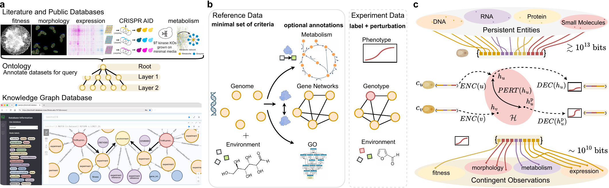

<p align="center">
  
</p>

<p align="center">
  <a href="https://github.com/Mjvolk3/torchcell/actions/workflows/style.yaml"></a>
  <a href="https://github.com/Mjvolk3/torchcell/actions/workflows/test.yaml"></a>
  <a href="https://github.com/Mjvolk3/torchcell/actions/workflows/mypy.yaml"></a>
  <a href="https://github.com/Mjvolk3/torchcell/actions/workflows/docs.yaml"></a>
  <a href="https://codecov.io/gh/Mjvolk3/torchcell"></a>
  <a href="https://github.com/Mjvolk3/torchcell/releases/latest"></a>
  <a href="https://github.com/Mjvolk3/torchcell/blob/main/pyproject.toml"></a>
</p>

<p align="center">
  
</p>

Documentation: <https://mjvolk3.github.io/torchcell/>

Database: <https://torchcell-database.ncsa.illinois.edu:7473/browser/> (Neo4j Browser over the served TorchCell knowledge graph)

Database releases and compatibility: <https://mjvolk3.github.io/torchcell/database/compatibility.html>

Datasets: <https://mjvolk3.github.io/torchcell/datasets/index.html>

Dataset downloads (the tc-data API): <https://mjvolk3.github.io/torchcell/guide/downloads.html>

## Download a dataset

Built datasets are served as versioned archives (the records LMDB plus its build
manifest) by the `tc-data` endpoint on the database host, with Swagger at `/docs`. Each
page below is one supported query over the knowledge graph and bundles the datasets it
returns: what the experiments measured, one stored record each, the value distributions,
the query, and the download commands.

| Page | Datasets (records) |
| :-- | :-- |
| [Gene essentiality and single-mutant fitness](https://mjvolk3.github.io/torchcell/datasets/scerevisiae/essentiality-smf.html) | Gene essentiality, SGD (1,329); single-mutant fitness, Costanzo 2016 (20,484) |
| [Amino acids and betaxanthin](https://mjvolk3.github.io/torchcell/datasets/scerevisiae/amino-acid-betaxanthin.html) | Amino acids, Mulleder 2016 (4,678); amine peaks, Cooper 2010 (4,313); betaxanthin, Cachera 2023 (4,719) |

With an endpoint URL and a key (see [Downloading datasets](https://mjvolk3.github.io/torchcell/guide/downloads.html)),
a loader fetches its archive instead of building:

```bash
export TC_DATA_URL=http://torchcell-database.ncsa.illinois.edu:8724
export TC_DATA_API_KEY=<your key>
```

```python
from torchcell.datasets.scerevisiae.mulleder2016 import AminoAcidMulleder2016Dataset

dataset = AminoAcidMulleder2016Dataset(root="data/torchcell/amino_acid_mulleder2016")
```

The full collection served by the knowledge graph (51 datasets, 52.7 million
experiments at release 2026.09.21) is listed on the
[Datasets](https://mjvolk3.github.io/torchcell/datasets/index.html) page.
