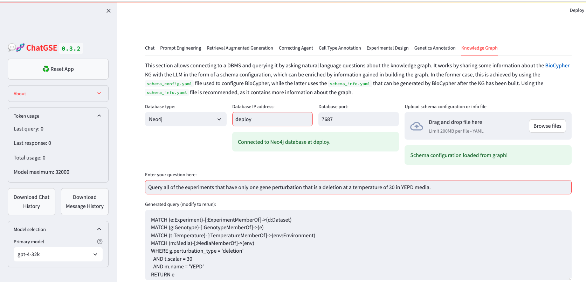

## SMF Costanzo 2016 Query Example




```Cypher
MATCH (g:Genotype)-[:GenotypeMemberOf]->(e:Experiment)
WHERE g.perturbation_type = 'gene deletion'
MATCH (e)-[:ExperimentMemberOf]->(d:Dataset)
MATCH (e)-[:ExperimentMemberOf]->(t:Temperature)
WHERE t.scalar = 30 AND t.description = 'degrees celsius'
RETURN e
```
o