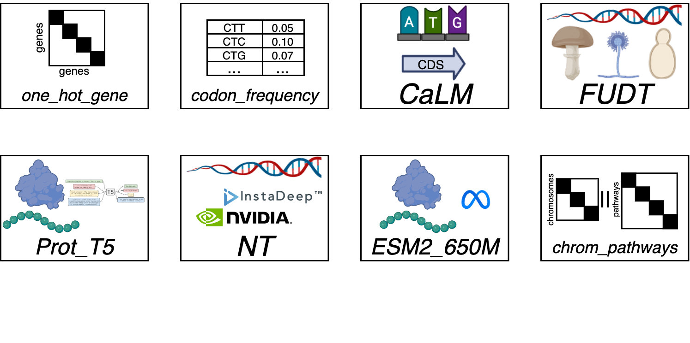
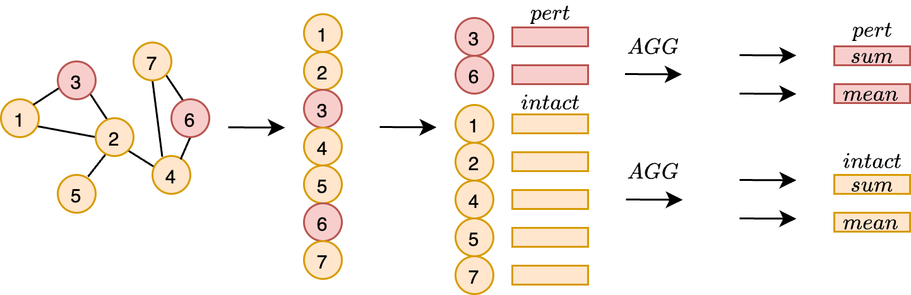

Authors: Michael Volk, Huimin Zhao

We are asking for a supplement of resources on the project Multi-Modal Machine Learning Model for Metabolic Engineering Strain Design in Yeast (BIO230077). The first half of the discover resources were used for three separate tasks: 1. Building a local Neo4j graph database (**Fig 1.**), 2. Training traditional machine learning models to predict yeast cell fitness under multiplexed genetic perturbations (**Fig 2.**, **Fig 3.**, **Fig 4.**), 3. Preliminary benchmarking and testing of deep learning models for fitness prediction.

**Figure 1.** - Our method for building the Neo4j graph database that uses [TorchCell](https://github.com/Mjvolk3/torchcell) software. The primary workflow uses docker, but the pipeline for building the database is contained entirely within the source code for TorchCell. We want to be able to rebuild the database often as the underlying schema, defined TorchCell classes, are subject to changed. Often we don't have enough local compute to rebuild this database quickly so we move the build to Delta using Apptainer. Eventually we plan to find a more permanent home for the database.

We build a graph database to allow for the modular addition of datasets that can then be aggregated via cypher query, deduplicated, and converted to a key value store TorchCell dataset that is more suitable for deep learning applications. The conversion of raw open source data to Neo4j knowledge graph is done via open source software BioCypher. This highlights one of the major thrusts of this work which is to aggregate the complicated mixed data from systems biology into a unified framework that will expedite machine learning studies.

**Figure 2**. - This figure describes the gene vector representation variants prior to aggregation that are used for training machine learning models. From top left to bottom right we have have the following: one hot gene encoding, codon frequency encoding, codon language model (CaLM) embedding, Prot_T5 protein embedding, Nucleotide Transformer embedding, ESM2_650M protein embedding, and one hot encoding of chromosomes concatenated with pathways. Some of theses embeddings have a few variants that shown in **Fig 4**.  

Prior to training deep learning models we have chosen to benchmark traditional shallow machine learning methods across different dataset scales. First we query the database for yeast with 1-3 gene knockouts that have a fitness measurement. There are 13 billion of these data, so we then subset the data into three different dataset sizes 1e03, 1e04, and 1e05. We start small enough so we can complete a grid search over parameters for elastic net, SVR, and random forest. We want to see how much data is needed to perform reasonably well at this task, and whether we can find hyperparameters that transfer in the low data regime to the high data regime that way if we want to construct a model trained on all data we won't need to do hyperparameter search.

**Figure 3.** - Description of the aggregation scheme used over graph nodes that represent genes in the genome. Each genome is represented by the base genome, then we add perturbations on top. We collect both the perturbed nodes and the remaining nodes denoted "intact". For each set of nodes we then aggregate them by either summing or taking their mean. This give a vector of fixed length that can be easily processed by any of the traditional tabular machine learning methods, e.g. linear models, SVR, random forest, etc. In total for each model we train, validate, and test on the four variants, `pert_sum`, `pert_mean`, `intact_sum`, `intact_mean`.

TorchCell software is designed to used graph representations for the genomes to build representations of perturbations. Since it is non trivial to use the edge information with traditional machine learning methods we only use the node representations. Each gene in a genome can be represented by its genes and its ancillary annotations. To get a common representation from sequence we use either summary statistics like codon frequency or a pretrained language model that can embed either the nucleotide sequence or the protein sequence into a fixed length vector representation (**Fig 2.**). There are two views into the perturbed genome, the genes removed and the genes that remain. For 1-3 gene deletions, the size of the representation will change dependent on the number of genes deleted. Following the example given from message passing neural networks we use order invariant aggregation to combine the vectors (**Fig 3.**).

**Figure 4.** - Results from the fitness mutant data 1e04 subset. We show all representations described in both **Fig 2.** and **Fig 3.** and report their spearman correlation. We down selected the best model based on spearman correlation. This figure shows that the one hot gene representation out performs all other representations, but we note that this is the most transductive case making it less generalizable to other base genomes.

From the traditional machine learning study we have found that if you have enough perturbation data you don't need any extra signals for predicting fitness trends (**Fig 4.**). We plan to further benchmark over a dataset size 1.2e03 that use gene expression to predict fitness with a pearson correlation of nearly 0.9. Predicting fitness at this scale without a gene expression profiles could save a lot of resources. In future we plan to further benchmark against state of the art fitness prediction model DCell. Then we will carry out the ultimate goal of the project to do multi-modal prediction. For the first publication we will simultaneous predict fitness, gene-gene interactions, and cell morphology under gene perturbations.

We need additional resources to train deep learning models on the fitness label, but also for training models on gene-gene interactions and cell morphology.
