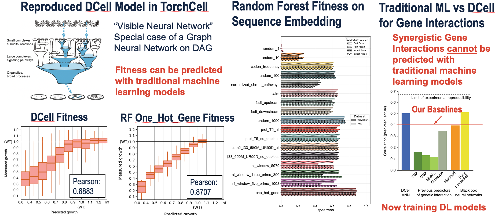

**Authors:** Michael Volk, Huimin Zhao

We are requesting supplemental resources for the project *Multi-Modal Machine Learning Model for Metabolic Engineering Strain Design in Yeast (BIO230077)*. Resources thus far have been utilized for the following:  

1. Building a local Neo4j graph database.  
2. Reimplementing and retraining SOTA DCell Model.
3. Training traditional machine learning models to predict yeast cell fitness and gene interactions under multiplexed genetic perturbations.  
4. Conducting preliminary benchmarking and testing of deep learning models for fitness prediction and gene interaction prediction.  

We have demonstrated that traditional machine learning models are sufficient for predicting cell fitness but are inadequate for predicting gene interactions (**Fig 1**).

**Figure 1** - *Project Status.* The left-hand side of the figure shows that we achieved superior performance compared to the SOTA model on fitness prediction in *S. cerevisiae* using a random forest model trained on less data. The middle section of the figure illustrates testing of multiple different gene representations for fitness label prediction. The right-hand side of the figure shows that, under the same procedure, the prediction of gene interactions continues to underperform. This necessitates more complex methods capable of leveraging cellular networks such as protein-protein interactions and gene regulatory interactions. These methods are the focus of our current efforts, and additional resources are needed to complete this work.

We have attempted to train deep learning models on the joint objective of fitness and gene interaction prediction with limited success. There is evidence that converting regression labels to classification labels can improve performance, as deep learning models consistently perform better on equivalent classification tasks. To pursue this, we are implementing the following regression-to-classification objectives:

### Soft Label Classification:

$$
L_{\text{soft}} = -\frac{1}{N} \sum_{i=1}^N \sum_{k=1}^K s_{ik} \log (\hat{y}_{ik})
$$

- Where $s_{ik}$ represents soft assignments (e.g., Gaussian centered at the true bin).  
- Preserves ordinal relationships through soft bin assignments.

### Ordinal Classification (Binary Cross Entropy per Threshold):

$$
L_{\text{OCE}} = -\frac{1}{N} \sum_{i=1}^N \sum_{k=1}^{K-1} \left[ y_{ik} \log(\hat{p}_{ik}) + (1 - y_{ik}) \log(1 - \hat{p}_{ik}) \right]
$$

- Where $y_{ik} = 1$ if $y_i > k$, and $\hat{p}_{ik} = \sigma(f(x_i) - b_k)$ for monotonicity.  
- Preserves ordinal relationships through architecture.

### Regression with Ordinal Entropy Regularization:

$$
L_{\text{total}} = L_{\text{MSE}} + \lambda_d L_d + \lambda_i L_i
$$

Where:

$$
L_d = -\frac{1}{M(M-1)} \sum_{i=1}^M \sum_{j \neq i} \| y_i - y_j \|^2 \cdot \| z_i^e - z_j^e \|^2
$$

- Pushes apart if different.

$$
L_i = \frac{1}{N} \sum_{i=1}^N \| z_i - z_i^k \|^2
$$

- Pulls together if similar.  
- Preserves ordinal relationships through regularization. This is essentially a contrastive regression loss.

We require additional resources to train deep learning models on fitness and gene interactions. Once this task is complete, we also plan to train models on cell morphology. These models are designed to be multimodal, allowing the continuous addition of new labels. We hypothesize that additional of labels should help improve prediction as some labels correlate. For example if cells do not grow well, it is more likely their morphology is malformed.

We face some unique computational challenges in this work. Training whole-genome models consumes significant memory, requiring smaller batch sizes that lead to longer and more expensive training runs. This setup also necessitates distributed data parallelism across GPUs and nodes, further increasing resource demands. Finally, our entire dataset is large, totaling approximately $2e7$ instances. To date, we have only trained models on a maximum of $1e5$ instances. Scaling up these models will requires more resources.
