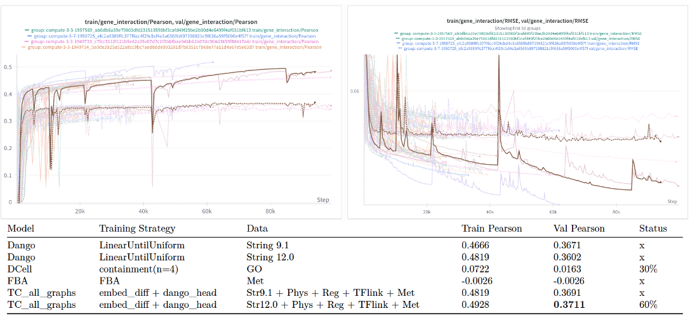

**Authors:** Michael Volk, Huimin Zhao

We are requesting supplemental resources for the project *Multi-Modal Machine Learning Model for Metabolic Engineering Strain Design in Yeast (BIO230077)*. Resources thus far have been utilized for the following:  

1. Building a local Neo4j graph database.  
2. Reimplementing and retraining SOTA DCell Model.
3. Training traditional machine learning models to predict yeast cell fitness and gene interactions under multiplexed genetic perturbations.  
4. Conducting preliminary benchmarking and testing of deep learning models for fitness prediction and gene interaction prediction.
5. Hyperparameter sweeps to identify graphs that provide the most improvement to gene interaction inference.
6. Benchmarking against SOTA DCell Models for gene interaction prediction.

We have demonstrated that traditional machine learning models are sufficient for predicting cell fitness but are inadequate for predicting gene interactions (**Fig 1**). All models discussed implemented in TorchCell follow the general framework for supervised learning.

$$\hat f_\theta: \widetilde{\mathcal G} \times \widetilde{\mathcal E} \times \widetilde{\mathcal P} \rightarrow \mathcal Y$$

$$\hat\theta = \arg\min_{\theta} \mathbb{E}_{(\tilde G,\tilde E,\tilde P,y)\sim D} \left[ \mathcal L\left(\hat f_\theta(\tilde G,\tilde E,\tilde P), y\right) \right]$$

Where:

- $\widetilde{\mathcal G}$: cellular graphs with vertex/edge features  
- $\widetilde{\mathcal E}$: real-valued environment vectors  
- $\widetilde{\mathcal P}$: perturbation operators  
- $\mathcal Y$: phenotype space  
- $y \in \mathcal Y$: observed phenotype  
- $D$: data distribution over $(\tilde G,\tilde E,\tilde P,y)$  
- $\mathcal L$: loss function  
- $\theta$: learnable parameters  

**Figure 1** - *Project Status.* The left-hand side of the figure shows that we achieved superior performance compared to the SOTA model on fitness prediction in *S. cerevisiae* using a random forest model trained on less data. The middle section of the figure illustrates testing of multiple different gene representations for fitness label prediction. The right-hand side of the figure shows that, under the same procedure, the prediction of gene interactions continues to underperform. This necessitates more complex methods capable of leveraging cellular networks such as protein-protein interactions and gene regulatory interactions. These methods are the focus of our current efforts, and additional resources are needed to complete this work.

**Figure 2** - This figure shows a sweep over different model configurations. Notably the best performing model is using the outdated String 9.1 interaction dataset, instead of the String 12.0 dataset. Despite this we have the current SOTA model for predicting triple gene interactions in yeast but only by a small margin. In this figure we do not show Dango results, but we have observed that Dango models show slower convergence with String 12.0 when compared to String 9.1. String 12.0 has approximately 10x more edges, so we suspect slower convergence is due to the model having to differentiate over which edges are important. It is likely that String 9.1 discovered the most obvious interactions first, making edges from String 12.0 lower signal to noise posing additional challenges for model convergence.

**Figure 3** - Since models are taking a long time to converge we need more GPU resources. We showed some of our current training runs with log projections of convergence. We plan to scale over gpus and nodes with DPP to achieve model convergence. After this we plan to run some small ablation studies.
