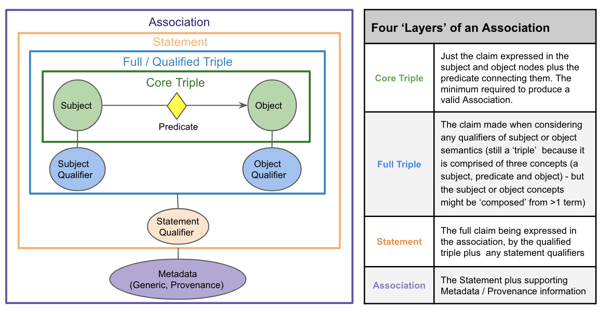
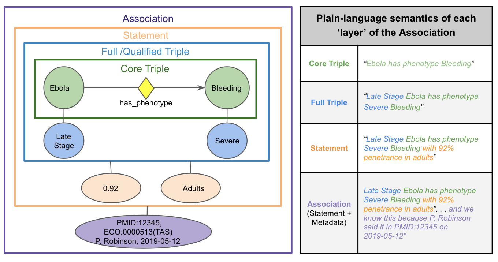

## Overview

`biocypher/config/torchcell_schema_config.yaml` defines the BioCypher schema that grounds torchcell data objects in the [Biolink Model](https://biolink.github.io/biolink-model/) ontology.

**Goal:** Map torchcell-specific entities (experiments, phenotypes, environments) to Biolink's standardized biological ontology, ensuring semantic interoperability and ontological correctness. For now the mapping is loose. We are trying to pave the way.

## Schema Structure

### Nodes (Entities)

- **Direct Biolink usage**: `dataset`, `genome`, `publication` - used as-is from Biolink
- **Inherited entities**: `experiment`, `fitness phenotype`, `media` - torchcell-specific types that inherit from Biolink classes via `is_a`

### Edges (Relationships)

- Map data relationships to Biolink predicates via `is_a`
- Example: `phenotype member of` (torchcell relationship) `is_a: participates in` (Biolink predicate)

## Key Design Decisions

### Experiments as Continuants

- `experiment` and `experiment reference` inherit from `information content entity` (not `activity`)
- Rationale: We store experimental observations (data records), not running processes

### Dataset Membership

- Uses `part of` predicate for `experiment member of` → `dataset`
- Rationale: Experiments are compositional components of datasets (not outputs produced by a process)

## Biolink Triple Structure

The Biolink model defines a core triple pattern for biological knowledge:

**Reference:** [Understanding the Biolink Model](https://biolink.github.io/biolink-model/understanding-the-model/)

## Visualization

See [[Mermaid diagrams|torchcell.ontology.mermaid_diagram]] for visual representation of the complete ontology mapping.

## 2026.01.21 - Flip Flopping on Mapping

Ontology mapping is inherently subjective - the "correct" parent class depends on which aspect of the entity you emphasize. For experiments, we've already changed mappings at least once:

**Previous:** `experiment is_a: activity` (emphasizing the experimental process/procedure)
**Current:** `experiment is_a: information content entity` (emphasizing the recorded observation/data)

Both mappings are defensible depending on perspective:

- If modeling the experimental **procedure** → `activity` or `protocol`
- If modeling the **execution** of that procedure → `process execution` or `activity`
- If modeling the **recorded results** → `information content entity` (our choice)

This ambiguity extends to other entities. For instance, `environment` could be:

- `environmental exposure` (the condition itself - our choice)
- `exposure event` (the time-bounded incident of exposure)
- `material entity` (the physical medium)

**Challenge:** Without clear guidelines, we risk inconsistency as the schema evolves. Different developers might make different mapping choices for similar entities.

**Future consideration:** Establish mapping principles or decision criteria (e.g., "always model stored database records as information/data entities, not processes") to ensure consistency. For now, the Mermaid diagrams help visualize these choices and catch obvious inconsistencies.
