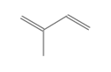

In developing a data factory for cell engineering, two primary observations guide our approach. First, sequencing technologies combined with controlled environmental conditions can be used to effectively estimate global cellular states. Second, targeted analytical techniques that focus on individual biomolecules are essential for practical applications in metabolic engineering, synthetic biology tool design, systems biology discovery, biocatalysis, and natural product discovery [@zelezniakMachineLearningPredicts2018; @zhangCombiningMechanisticMachine2020, @deboerDecipheringEukaryoticGeneregulatory2020, @yuanSelfresistancegeneguidedHighthroughputAutomated2025].  Early deep learning efforts in genotype-phenotype mapping have confirmed the deep learning hypothesis that more high-quality data can be leveraged for improved genotype-phenotype mapping, but also that certain technologies, like RNA-seq and high-throughput mass spectrometry (HTMS), benefit from high data density per sample which can reduce the number of equivalent experiments needed for predicting the same phenotype [@maUsingDeepLearning2018; @culleyMechanismawareMultiomicMachinelearning2020]. Applications of large language models (LLMs) have proven useful in helping predict phenotypes related to sequence data including DNA, and protein, but these models often neglect important biological relationships [@rosenUniversalCellEmbeddings2023; @dalla-torreNucleotideTransformerBuilding2023; @karollusSpeciesawareDNALanguage2023]. Analogous ideas have demonstrated that LLMs trained on single-cell RNA-seq datasets can be used to construct foundation models useful in phenotype prediction tasks in systems that depend on multiple different interacting biological entities, such as gene expression perturbation responses, gene regulatory network inference, and multiomics integration [@singhAutomatedScientistDesign2023; @cuiScGPTBuildingFoundation2024a; @roohaniPredictingTranscriptionalOutcomes2023]. Perturbation to response mapping is largely possible due to Perturb-Seq which links a genetic library of possible perturbations to a genome-wide mRNA expression profiles but this method has been underutilized in microbial engineering[@dixitPerturbSeqDissectingMolecular2016; @yaoScalableGeneticScreening2024; @nadal-ribellesRiseSinglecellTranscriptomics2024]. This method can be used to assess whether genetic manipulations lead to desired cell states and enables screening combinatorial designs by effectively combining thousands of traditional benchtop experiments into a single library experiment. Gene expression is often just a correlate to some desired phenotype, which can be more precisely quantified by HTMS. To this end we plan to use high-throughput Echo MS+ System with the ZenoTOF 7600 System for more targeted phenotypes such as protein-protein interaction (PPI)identification via affinity purification mass spectrometry (AP-MS) and compound-protein interaction (CPI) via affinity selection mass spectrometry (AS-MS) [@stellaAutomatedRapidMethoda]. When compared to sequencing, HTMS has a lower throughput per biological sample, but it is similar in that it can be used to generate of dense data in the order of hundreds of compounds detected per sample. In a natural product campaign such HTMS could be used in a data independent acquisition (DIA) manner to discover natural products that a bioactivty assay would not normally detect @covingtonUnlockingHiddenTreasures2025. With this in mind, we believe that a modern data foundry should be focused on sample construction and preparation for downstream high-throughput sequencing technologies that are supported by sequencing core facilities, and the rest of the data foundry should be focused on efficient phenotype quantification primarily by mass spectrometry due to high data density, with some space dedicated to a few low-density phenotype detection techniques such as growth/inhibition assays and activity assays.

Notes:

- Purchase: RoboLector (approximatley $230,000). This integrates with the BiolectorXT which IGB already has and can be integrated with LIMS system. This will allow for time point sampling, followed by mass spec analysis. This type of data can used for developing systems like Dynamic Metabolic Control used by DMC biotechnologies. This can get around the issue you mentioned in last group meeting how compounds are often toxic during growth, but show less toxicity during max growth.
- There is no standard technique for sample preparation in proteomics. Depending on the application it is likely that a lot of effort will be necessary to setup the mass spec. I imagine switching applicaitons a lot will defeat the high-throughput goals of automation.
- At metabolomics center on campus cost per sample of DIA and DDA are around $75. We can do an entire price breakdown if necessary. This means take a prototypical example application and compute cost per biological sample and corresponding data density for sequence and metabolite data.

<!-- ## Isoprenoid Case Study  

## Research

- "The global isoprene market, a key market for synthetic rubber production, is projected to grow significantly, with a Compound Annual Growth Rate (CAGR) of around 7% to 8% between 2023 and 2030, reaching a value of around $5 billion to $8 billion by 2030. "

<!-- 
<!-- (https://webbook.nist.gov/cgi/inchi/InChI%3D1S/C5H8/c1-4-5(2)3/h4H%2C1-2H2%2C3H3) -->

## References
