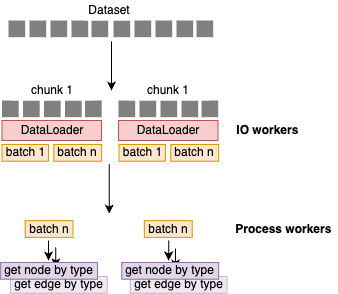

## 2024.02.28 - Database Chunking Method

Now we can control the number of workers dedicated to IO and the number dedicated to multiprocessing within the function. This chunking method also reduces memory overhead by controlling chunk size.
The text is describing a programming task or update involving the modification of a function named `_get_experiment_nodes` in a software component referred to as `SmfCostanzo2016Adapter`.

The purpose of this modification is to enable the function to utilize a data loader that incorporates a chunking technique borrowed from another component named `DmfCostanzo2016Adapter`. This adjustment allows for better management of resources when the function is executed. Specifically, it makes it possible to specify and control the number of worker processes allocated for input/output operations (IO) and the number allocated for multiprocessing tasks separately. Additionally, by using chunking to handle data in smaller, more manageable pieces, the update aims to reduce the memory overhead associated with processing large datasets at once.