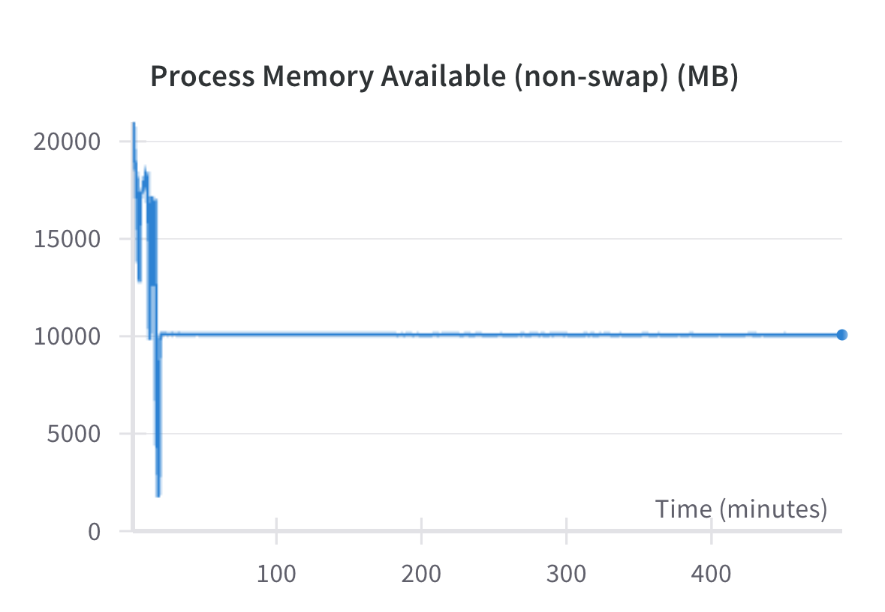

## 2024-03-13 11:35 - Troubleshooting

- On latest docker build we have an #OOM , we are adjusting memory giving it now all 32 GB and only 1 GB swap. Should fail fast with low swap. This doesn't solve no cpu issue.
- Although we set the number of cpus in docker desktop, this is the number of cpus available to the daemon. It does not specify the number of cpus available to a a given container. For that we can pass the cpus flag.

```
docker run --cpus 10
```
