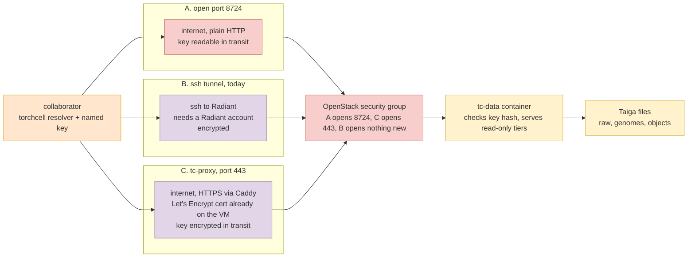

## 2026.10.09 - Three ways a collaborator reaches the tc-data tiers

The endpoint on Radiant holds one named key, `mjvolk3`, stored as a sha256 hash. The key identifies who downloads, makes revocation per person, and keeps anonymous callers at `/health` only. The data mounts are read-only. Port 8724 is plain HTTP, so the key rides in `X-API-Key` unencrypted on option A. The Caddy container `tc-proxy` on Radiant already holds a Let's Encrypt certificate for the public hostname, which is what option C uses. Measured 2026.10.09: 7473 answers 200 from GilaHyper, 8724 times out, and both ports are identical at the host level, so the security group is the only difference. Background in [[database.tc-data-endpoint]].

| | A. open 8724 | B. ssh tunnel | C. tc-proxy TLS |
|---|---|---|---|
| who can use it | anyone with a key | only people with a Radiant login | anyone with a key |
| key in transit | cleartext | encrypted | encrypted |
| change needed | one dashboard rule | none | Caddy route plus a dashboard rule for 443 |
| `make ops` tc-data line | green | stays red | green with the URL changed |

A collaborator cannot use B, so the choice for sharing is between A and C. C is the end state: a `handle_path /data/*` block in the Caddyfile that reverse-proxies to the tc-data container, 443 opened in the security group, and `TC_DATA_URL` set to `https://torchcell-database.ncsa.illinois.edu/data`.

Rendered: `notes/assets/pdf-output/database.tc-data-endpoint.mermaid.access-options.pdf` (`bash notes/assets/publish/scripts/mermaid_pdf.sh notes/database.tc-data-endpoint.mermaid.access-options.md`).
