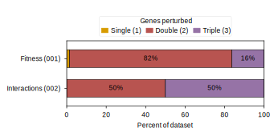

## 2026.07.13 - Stating what the classical-ML benchmarks are actually made of

The classical-ML supplementary figure argues that bag-of-genes baselines plateau on gene interactions, and that argument is only auditable if a reader can see what was in the training data. This panel states the perturbation-order makeup (single / double / triple mutant) of both traditional-ML benchmarks - fitness (`smf-dmf-tmf-001`) and interaction (`002-dmi-tmi`) - as one stacked bar each, so the two performance panels beside it are read on equal footing.

- **Reads** the one-hot design matrices under `DATA_ROOT`: `data/torchcell/experiments/smf-dmf-tmf-traditional-ml/one_hot_gene/sum_pert_1e04/` and `data/torchcell/experiments/002-dmi-tmi/traditional-ml/one_hot_gene/sum_pert_1e04/` (prefers `all/X.npy`, otherwise concatenates `train`/`val`/`test`). Perturbation order per sample is the row-sum of the one-hot `X`.
- **Writes** `notes/assets/images/traditional-ml_dataset-composition_palette.svg` (`ASSET_IMAGES_DIR`) through `savefig_true_size_svg` from [[torchcell.utils.utils]], so the panel imports into draw.io at true mm.
- `SIZE = "1e04"` only: composition is a size-invariant proportion across the 1e3-1e5 subsets, so one size represents the dataset. No per-bar `N` is drawn for the same reason - a single count would falsely imply one dataset size.
- Standard conformance: width `PANEL_WIDTHS_MM["half"]` (88 mm), Arial 6 pt, all four spines boxed at 0.5 pt, base-primary gold / red / purple (`#BD8800` / `#A24A46` / `#846592`) for single / double / triple. In-bar percent labels are drawn only when a segment is at least 3%.

### Palette moved to ordered PLOT_PALETTE; boxed, black labels

The single/double/triple colors now come from `PLOT_PALETTE[:3]` in [[torchcell.utils.utils]] (the draw.io line colors orange/red/purple matching Fig 1) rather than hardcoded hexes; the panel is fully boxed and the in-bar percent labels are black so they read on the mid-tone bars. See CLAUDE.md "Figure & Plotting Standards".
