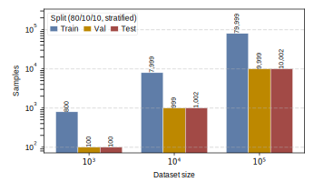

## 2026.07.13 - Making the benchmark's train/val/test protocol auditable

A reader who sees classical baselines fail from 1e3 up to 1e5 samples will immediately ask whether the splits are honest. This panel answers that before the performance panels do their work: it draws the *real on-disk* split sizes at every dataset size, so the 80/10/10 stratified protocol (seed 42, identical for fitness-001 and interaction-002) is shown as a measured fact rather than a nominal ratio asserted in a caption.

- **Reads** split sizes from `DATA_ROOT/data/torchcell/experiments/002-dmi-tmi/traditional-ml/one_hot_gene/sum_pert_{1e03,1e04,1e05}/{train,val,test}/X.npy` (`shape[0]`). 002 stands in for both experiments because the split scheme is identical for 001.
- **Writes** `notes/assets/images/traditional-ml_dataset-sampling_palette.svg` (`ASSET_IMAGES_DIR`) via `savefig_true_size_svg` from [[torchcell.utils.utils]].
- Grouped bars on a log y-axis with the exact count printed (rotated) on each bar; the y-limit is padded 3x to give those labels headroom.
- Standard conformance: width `PANEL_WIDTHS_MM["half"]` (88 mm), Arial 6 pt, all four spines boxed at 0.5 pt, primary blue / gold / red (`#5F7DA8` / `#BD8800` / `#A24A46`) for train / val / test.

