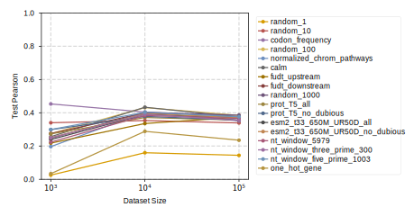

## 2026.07.13 - Scaling panel: more data does not rescue the bag-of-genes baseline

The obvious objection to a failing classical baseline is "you just needed more data." This panel closes that door for gene interactions by tracking each encoding's best random-forest test metric across 1e3 -> 1e4 -> 1e5 samples: the curves stay flat and low, so the ceiling is representational rather than a sample-size artifact. This `_palette` variant is the true-size, standard-conforming rendering that goes into the paper's classical-ML figure.

- **Reads** `experiments/002-dmi-tmi/results/random_forest/random_forest_processed_df_{1000,10000,100000}.csv`. Per encoding it takes the run maximizing `val_r2` (`get_best_runs`) and plots that run's *test* metric - selection on val, reporting on test.
- **Writes** `notes/assets/images/002-dmi-tmi_node_embedding_performance_{test_spearman,test_pearson,test_mse}[_shared_0_1][_no_legend]_palette.svg` plus a standalone shared legend `node_embedding_legend_palette.svg` (`ASSET_IMAGES_DIR`), all via `savefig_true_size_svg` from [[torchcell.utils.utils]].
- `show_legend=False` emits a narrow plot-only panel (2.6x2.2 in) so the fitness-001 and interaction-002 curves can sit side-by-side under one shared legend; `create_legend()` crops to the legend's own window extent rather than the (invisible) axes box, which otherwise left a few mm of margin.
- `shared_pearson_ylims = {"_shared_0_1": (0.0, 1.0)}` fixes a common y-scale across both experiments so the interaction panel visibly sits below the fitness panel. Keep this dict identical in the `smf-dmf-tmf-001` twin script.
- Gridlines only at the 3 measured sizes (`minorticks_off()`): each line has just 3 points, so the connecting segment is a trend guide, not interpolation over intermediate dataset sizes.

