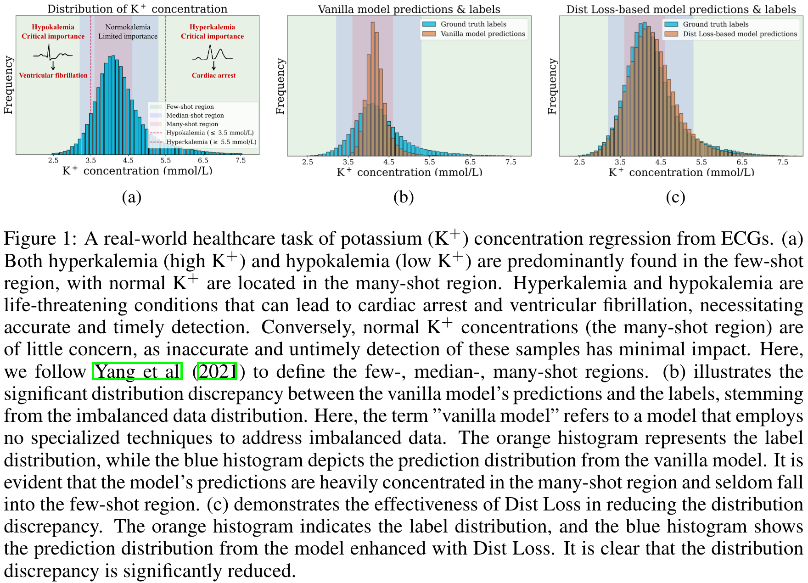
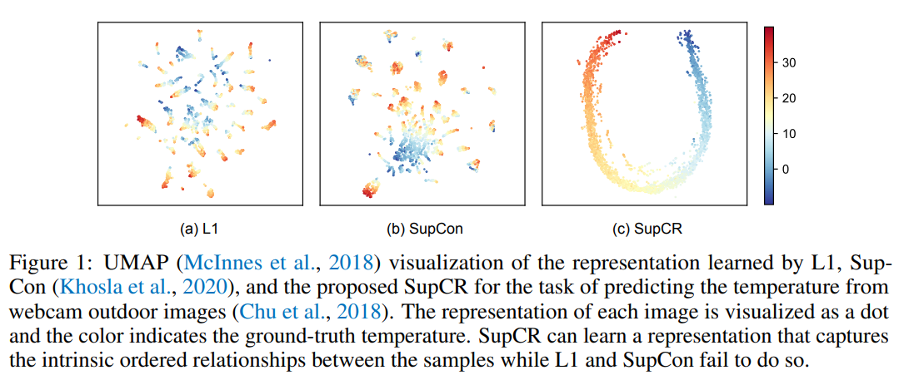
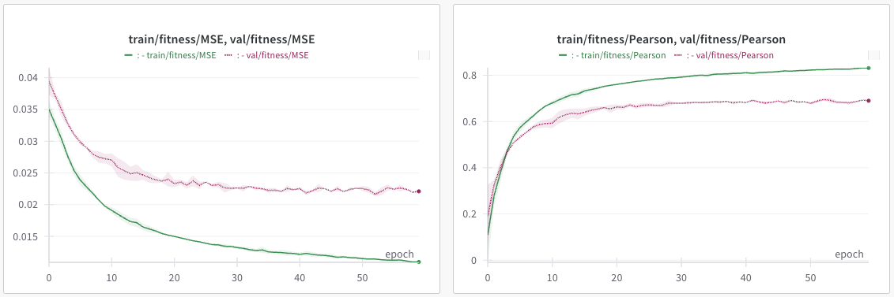
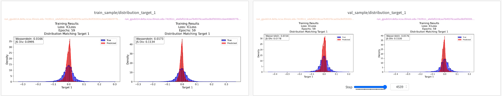
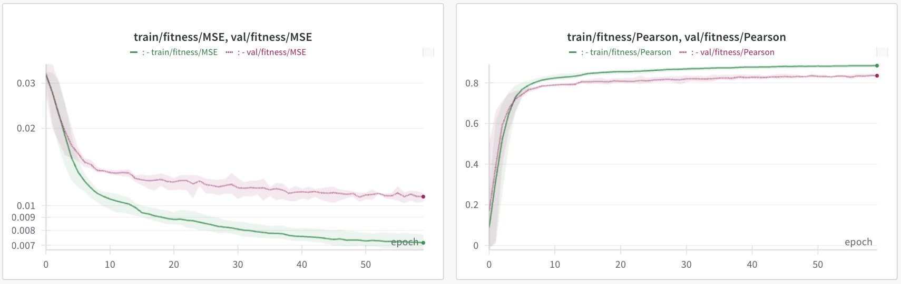

## Summary of Current Problem

- Our supervised model cannot fit the `gene_interaction` label. This is what I need help on.

## General Problem Formulation in TorchCell

$$
\begin{aligned}
\hat{f}_\theta & : \tilde{\mathcal{G}} \times \tilde{\mathcal{E}} \times \tilde{\mathcal{P}} \rightarrow \mathcal{Y} \\
\hat{\theta} & =\arg \min _\theta \mathbb{E}_{(\tilde{G}, \tilde{E}, \tilde{P}, Y) \sim \mathcal{D}}\left[\mathcal{L}\left(\hat{f}_\theta(\tilde{G}, \tilde{E}, \tilde{P}), Y\right)\right]
\end{aligned}
$$

where:

$\tilde{\mathcal{G}}$ - cellular graphs with vertex/edge features
$\tilde{\mathcal{E}}$ - real-valued environment space
$\tilde{\mathcal{P}}$ - perturbation operators
$\mathcal{D}$ - data distribution
$\mathcal{L}$ - loss function
$\theta$ - learnable parameters

## Code - Data

Look at the wildtype. `x` dim 1 is 0 here because we are for now using learnable embeddings. When we refer to `z_w` this is the embedding from the wildtype.

```python
dataset.wildtype
HeteroData(
  gene={
    num_nodes=6607,
    node_ids=[6607],
    x=[6607, 0],
  },
  metabolite={
    num_nodes=2534,
    node_ids=[2534],
  },
  reaction={
    num_nodes=4881,
    node_ids=[4881],
  },
  (gene, physical_interaction, gene)={
    edge_index=[2, 144211],
    num_edges=144211,
  },
  (gene, regulatory_interaction, gene)={
    edge_index=[2, 16095],
    num_edges=16095,
  },
  (metabolite, reaction, metabolite)={
    hyperedge_index=[2, 20960],
    stoichiometry=[20960],
    num_edges=4882,
    reaction_to_genes=dict(len=4881),
    reaction_to_genes_indices=dict(len=4881),
  },
  (gene, gpr, reaction)={
    hyperedge_index=[2, 5450],
    num_edges=4881,
  }
)
```

We look at the first instance of the dataset. This instance is for a double gene deletion and we have `fitness` and `gene_interaction` data.

```python
dataset[0]
HeteroData(
  gene={
    node_ids=[6605],
    num_nodes=6605,
    ids_pert=[2],
    cell_graph_idx_pert=[2],
    x=[6605, 0],
    x_pert=[2, 0],
    gene_interaction=[1],
    gene_interaction_p_value=[1],
    fitness=[1],
    fitness_std=[1],
    pert_mask=[6607],
  },
  reaction={
    num_nodes=4881,
    node_ids=[4881],
    pert_mask=[4881],
  },
  metabolite={
    node_ids=[2534],
    num_nodes=2534,
    pert_mask=[2534],
  },
  (gene, physical_interaction, gene)={
    edge_index=[2, 144102],
    num_edges=144102,
    pert_mask=[144211],
  },
  (gene, regulatory_interaction, gene)={
    edge_index=[2, 16090],
    num_edges=16090,
    pert_mask=[16095],
  },
  (gene, gpr, reaction)={
    hyperedge_index=[2, 5450],
    num_edges=5450,
    pert_mask=[5450],
  },
  (metabolite, reaction, metabolite)={
    hyperedge_index=[2, 20960],
    stoichiometry=[20960],
    num_edges=4882,
    pert_mask=[20960],
  }
)
```

We show a batch size of 32 to get some perspective on scale.

```python
batch
HeteroDataBatch(
  gene={
    node_ids=[32],
    num_nodes=211352,
    ids_pert=[32],
    cell_graph_idx_pert=[72],
    x=[211352, 0],
    x_batch=[211352],
    x_ptr=[33],
    x_pert=[72, 0],
    x_pert_batch=[72],
    x_pert_ptr=[33],
    gene_interaction=[32],
    gene_interaction_p_value=[32],
    fitness=[32],
    fitness_std=[32],
    pert_mask=[211424],
    batch=[211352],
    ptr=[33],
  },
  reaction={
    num_nodes=156120,
    node_ids=[32],
    pert_mask=[156192],
    batch=[156120],
    ptr=[33],
  },
  metabolite={
    node_ids=[32],
    num_nodes=81079,
    pert_mask=[81088],
    batch=[81079],
    ptr=[33],
  },
  (gene, physical_interaction, gene)={
    edge_index=[2, 4612016],
    num_edges=[32],
    pert_mask=[4614752],
  },
  (gene, regulatory_interaction, gene)={
    edge_index=[2, 514759],
    num_edges=[32],
    pert_mask=[515040],
  },
  (gene, gpr, reaction)={
    hyperedge_index=[2, 174278],
    num_edges=[32],
    pert_mask=[174400],
  },
  (metabolite, reaction, metabolite)={
    hyperedge_index=[2, 670394],
    stoichiometry=[670394],
    num_edges=[32],
    pert_mask=[670720],
  }
)
```

## Code - Model

```python
Model architecture:
HeteroCell(
  (gene_embedding): Embedding(6607, 64)
  (reaction_embedding): Embedding(4881, 64)
  (metabolite_embedding): Embedding(2534, 64)
  (preprocessor): PreProcessor(
    (mlp): Sequential(
      (0): Linear(in_features=64, out_features=64, bias=True)
      (1): LayerNorm((64,), eps=1e-05, elementwise_affine=True)
      (2): ReLU()
      (3): Dropout(p=0.0, inplace=False)
      (4): Linear(in_features=64, out_features=64, bias=True)
      (5): LayerNorm((64,), eps=1e-05, elementwise_affine=True)
      (6): ReLU()
      (7): Dropout(p=0.0, inplace=False)
    )
  )
  (convs): ModuleList(
    (0-2): 3 x HeteroConv(num_relations=4)
  )
  (global_aggregator): SortedSetTransformerAggregation(
    (aggregator): SetTransformerAggregation()
    (proj): Identity()
  )
  (prediction_head): Sequential(
    (0): Linear(in_features=64, out_features=64, bias=True)
    (1): LayerNorm((64,), eps=1e-05, elementwise_affine=True)
    (2): ReLU()
    (3): Dropout(p=0.0, inplace=False)
    (4): Linear(in_features=64, out_features=64, bias=True)
    (5): LayerNorm((64,), eps=1e-05, elementwise_affine=True)
    (6): ReLU()
    (7): Dropout(p=0.0, inplace=False)
    (8): Linear(in_features=64, out_features=64, bias=True)
    (9): LayerNorm((64,), eps=1e-05, elementwise_affine=True)
    (10): ReLU()
    (11): Dropout(p=0.0, inplace=False)
    (12): Linear(in_features=64, out_features=2, bias=True)
  )
)
Parameter count: 1167493
```


## Model - Math

...

## Loss Function

$$
\mathcal{L}=\mathcal{L}_{\text {MSE}}(y, \hat{y})+\lambda_1 \mathcal{L}_{\operatorname{dist}}(y, \hat{y})+\lambda_2 \mathcal{L}_{\text {SupCR}}\left(z_P, y \right)
$$

### Loss Function - Dist Definition

Explanation: We include this loss to encourage distribution matching.

This image is from the original [DistLoss](https://arxiv.org/abs/2411.15216) paper and shows how the loss function can help improve prediction in few-shot region long tails. This is important in our prediction task for finding genes with high interaction scores (tail of distribution). This figure also shows how models without distribution matching will favor towards mean prediction.



$\\S_{\text{pred}}:=$ Sorted pseudo-predictions from model output

$S_{\text{label}}:=$ Pseudo-labels generated from KDE of the ground truth labels

$M:=$  The number of samples in a batch, used to normalize the sum of squared differences.

$\mathbb{E}_{b \in \text { batch }}:=$ Expectation over all batches during the training process.

$\mathcal{L}_{\text {dist }}(y, \hat{y}):=$  The distribution loss, specifically computed as the
mean squared error (MSE) between the pseudo-predictions $S_P$ and pseudo-labels $S_L$.

$$
\begin{aligned}
\mathcal{L}_{\text {div }}(y, \hat{y}) & :=\mathcal{L}_{\text {dist }}(y, \hat{y}) \\
& :=\mathbb{E}_{b \in \text { batch }}\left[\frac{1}{M} \sum_{i=1}^M\left(S_{\text{pred}}[i]-S_{\text{label}}[i]\right)^2\right]
\end{aligned}
$$

### Loss Function - SupCR Definition

Explanation: We include this loss to encourage structure in the latent space.

This image from the original [SupCR](https://openreview.net/pdf?id=_QZlje4dZPu) paper shows how the contrastive regression loss can organize the embedding space.



$\\N :=$  The number of graphs (or samples) in a batch.

$y_i, y_j, y_k :=$  Continuous regression labels for graphs $i, j$, and $k$.

$z_i, z_j, z_k :=$  Embeddings of graphs $i, j$, and $k$, generated by a feature encoder $f(\cdot)$.

$\operatorname{sim}\left(z_i, z_j\right) :=$  Similarity between embeddings $z_i$ and $z_j$, we use cosine similarity $\frac{z_i \cdot z_j}{\left\|z_i\right\|\left\|z_j\right\|}$.

$\tau :=$ Temperature parameter that scales the similarities for sharper gradients.

$d\left(y_i, y_j\right) :=$  Distance between the labels $y_i$ and $y_j$, we use the $L_1$ norm $\left|y_i-y_j\right|$.

$1[\cdot] :=$  Indicator function, which is $1$ if the condition in brackets is true, and 0 otherwise.

$$
\begin{aligned}
\mathcal{L}_{\text{con}}(z_P, y) &:=\mathcal{L}_{\mathrm{SupCR}}(z_P, y) \\
& :=-\frac{1}{N} \sum_{i=1}^N \frac{1}{N-1} \sum_{\substack{j=1 \\ j \neq i}}^N \log \frac{\exp \left(\operatorname{sim}\left(z_{P_{i}}, z_{P_{j}}\right) / \tau\right)}{\sum_{\substack{k=1 \\ k \neq i}}^N 1\left[d\left(y_i, y_k\right) \geq d\left(y_i, y_j\right)\right] \exp \left(\operatorname{sim}\left(z_{P_{i}}, z_{P_{k}}\right) / \tau\right)}
\end{aligned}
$$

## Experiments

Experiments were conducted with either random sampling of the configuration space or by tree structured parzen estimator (TPE) sampling over the configuration space. We have been sweeping over parameters that affect model size and the objective function.

| Parameter                                         | Choices                        |
|---------------------------------------------------|--------------------------------|
| `heads`                                           | 1, 5, 10                       |
| `cell_dataset.learnable_embedding_input_channels` | 16, 32, 64                     |
| `model.num_layers`                                | 2, 3, 4, 5, 6                  |
| `model.hidden_channels`                           | 16, 32, 64                     |
| `model.prediction_head_config.hidden_channels`    | 16, 32, 64                     |
| `regression_task.lambda_dist`                     | 0, 1e-3, 1e-2, 1e-1, 1, 1.5, 2 |
| `regression_task.lambda_supcr`                    | 0, 1e-4, 1e-3, 1e-2, 1e-1, 1   |

## Results Without Label Standardization on 2.5e4 Dataset - 20 Epochs

We see some success in fitting `fitness` but we struggle with the `genetic_interaction` label. We started focusing on `fitness` since we know that if we cannot predict `fitness` we won't be able to predict `gene_interaction`. Labels at this stage were not standardized and `gene_interaction` distribution is centered around 0 so values are always lower than `fitness`. This different scale will force optimizer to pay more attention to `fitness`. In next experiments we apply label standardization.


**Fig - Z-score standardization of labels** - Applied in all further experiments.  

## Results With Label Standardization on 2.5e4 Dataset - 20 Epochs


**Fig - Selected Best Runs According To best Fitness/MSE** - We do this because we cannot fit gene interactions.


**Fig - Grouped Selected Runs** - We see normal fitting behavior for `fitness`. For `gene_interaction` it is not until later epochs that `train/gene_interaction/MSEe` starts to drop, but simultaneously `val/gene_interaction/MSE` starts to go up. Strangely we see this corresponds with `train/gene_interaction/pearson` increasing. As a reference we cannot get any better than `0.4` on `val/gene_interaction/pearson` in traditional machine learning benchmarks.

<!-- - We start to see that we are no longer predicting 0 fitness labels as well. I believe this is due to the label standardization. -->

- The output appears to have hard bounds whereas before it did not


**Fig - Best Runs Have Less Smoothing** - Best runs don't have oversmoothing issues. When we sort by `fitness/MSE` and look at the top run the average distance between vectors is higher than when we compare again the worst runs. Best runs have 2-4 layers. This is just a sanity check.


**Fig - Oversmoothing is Correlated with Higher Number of Layers** - We expect this with GNNS.

## Results With Label Standardization on 2.5e4 Dataset - 60 Epochs








**Fig - 2.5e4 Results** - `train/gene_interaction/MSE` drops but `val/gene_interaction/MSE` goes up as we saw before. `train/gene_interaction/Pearson` goes up and doesn't show sign of stopping yet we see nothing from `val/gene_interaction/Pearson`.

## Results With Label Standardization on 1e5 Dataset - 60 Epochs

We fix the architecture and run a sweep over these objectives to see if we can get any benefit of scale for prediction of `gene_interaction`.

| Parameter                      | Choices    |
|--------------------------------|------------|
| `regression_task.lambda_dist`  | 1e-2, 1e-1 |
| `regression_task.lambda_supcr` | 1e-3, 1e-2 |

We show the best three runs.




**Fig - 1e5 Results** - We continue to see the same trends for `train/gene_interaction/MSE` and `val/gene_interaction/MSE`. With more scale we do some improvement on `train/gene_interaction/Pearson` and it still doesn't show a sign of stopping.

## Questions

- We should push training epochs to see pearson flatten  
  - **Running**
- Architecture modifications to SAB/ISAB?
  - It is possible that the attentional aggregation we are currently using is too simple of a pooling method. SAB/ISAB is a more expressive way to pool over sets of nodes. This is sometimes called pooling by multi-head attention (PMA).
- Are we losing out on global relations between nodes? Probably, but the graphs seem a bit large for dense operations. We tried dense diffpool earlier and could only fit 2-4 graphs in a batch.
  - We are working on implementing `NSA` as `ESA` won't scale for our problem.


- Should we consider modeling noise?

$$
L=\sum_{t=1}^T\left(\frac{w_t}{2 \sigma_t^2} L_t+\log \sigma_t\right)+\lambda \sum_{t=1}^T \sigma_t^{-2}
$$

- Will this issue be solved with more scale? `>1e6`?
- Could this be delayed generalization (grokking)? "Deep Neural Networks Always Grok and Here is Why"


## Open Ended Ideas

- The interactions definition is the composition of fitness. We will be able to check if the fitness supervised values align the gene interaction prediction. I don't know if there is any possibility of showing that the model is reusing it's ability to predict gene interactions using the same neurons for predicting fitness.
  - The basic idea is for interactions and fitness that align, check if the subset of activated neurons for the power set of fitness correlate with the activation pattern on gene interaction. You can probably do something more complicated than correlation.
