## Entire Dataset

| split | index_type               | key              | count   | ratio | total   |
|-------|--------------------------|------------------|---------|-------|---------|
| train | perturbation_count_index | 1                | 4972    | 0.878 | 5665    |
| train | perturbation_count_index | 2                | 863417  | 0.833 | 1036030 |
| train | perturbation_count_index | 3                | 204284  | 0.683 | 299146  |
| train | phenotype_label_index    | fitness          | 1072673 | 0.800 | 1340841 |
| train | phenotype_label_index    | gene_interaction | 854275  | 0.835 | 1023196 |
| val   | perturbation_count_index | 1                | 345     | 0.061 | 5665    |
| val   | perturbation_count_index | 2                | 86407   | 0.083 | 1036030 |
| val   | perturbation_count_index | 3                | 47332   | 0.158 | 299146  |
| val   | phenotype_label_index    | fitness          | 134084  | 0.100 | 1340841 |
| val   | phenotype_label_index    | gene_interaction | 84578   | 0.083 | 1023196 |
| test  | perturbation_count_index | 1                | 348     | 0.061 | 5665    |
| test  | perturbation_count_index | 2                | 86206   | 0.083 | 1036030 |
| test  | perturbation_count_index | 3                | 47530   | 0.159 | 299146  |
| test  | phenotype_label_index    | fitness          | 134084  | 0.100 | 1340841 |
| test  | phenotype_label_index    | gene_interaction | 84343   | 0.082 | 1023196 |

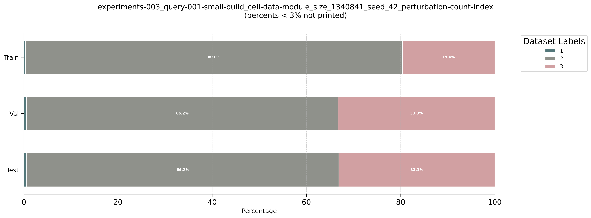
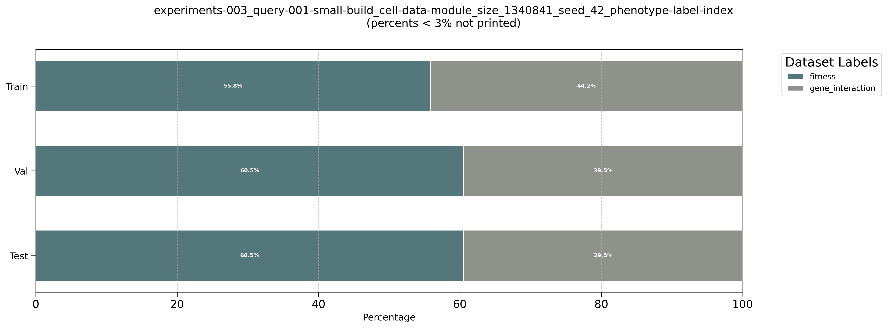

## 5e01  Perturbation Subset

## 1e02 Perturbation Subset

## 5e02 Perturbation Subset

)

## 1e03 Perturbation Subset

## 5e03 Perturbation Subset

## 7e03 Perturbation Subset

Smallest dataset used in testing

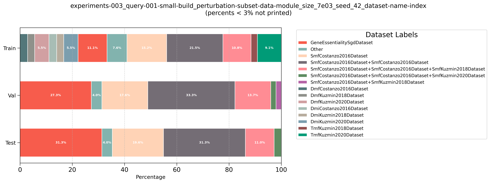

## 1e04 Perturbation Subset

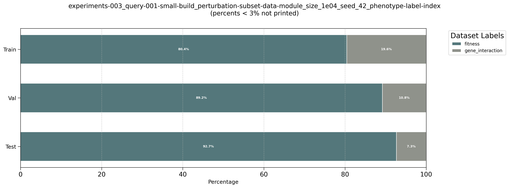
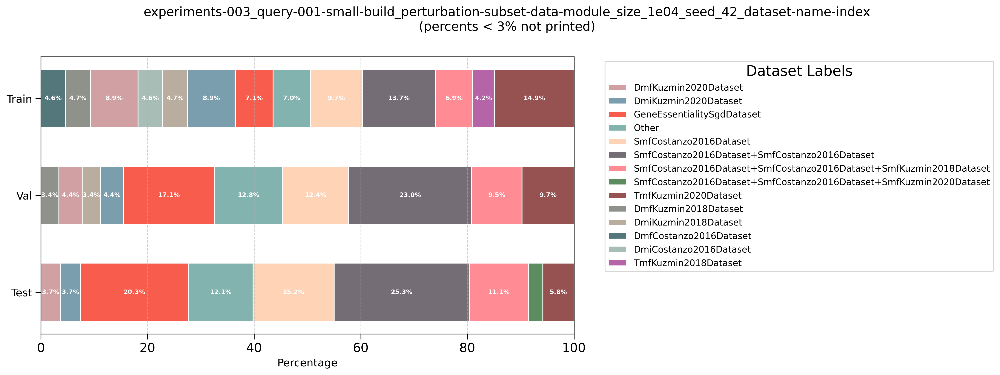

## 5e04 Perturbation Subset

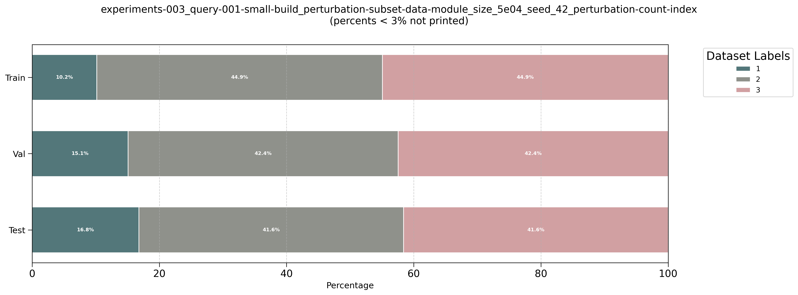

## 1e05 Perturbation Subset

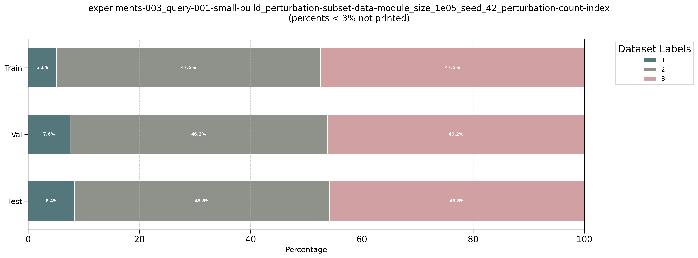

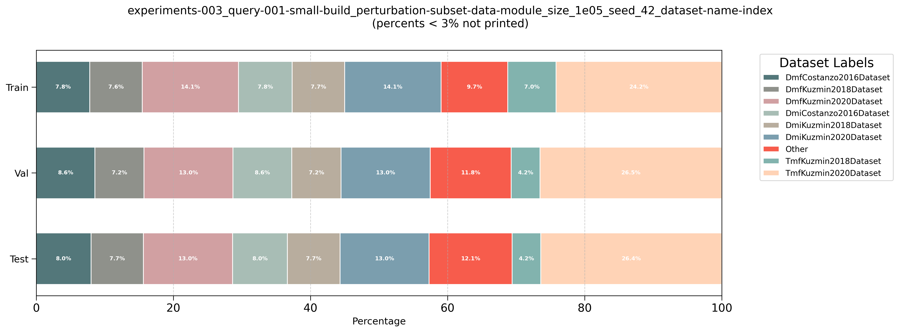

## 5e05 Perturbation Subset

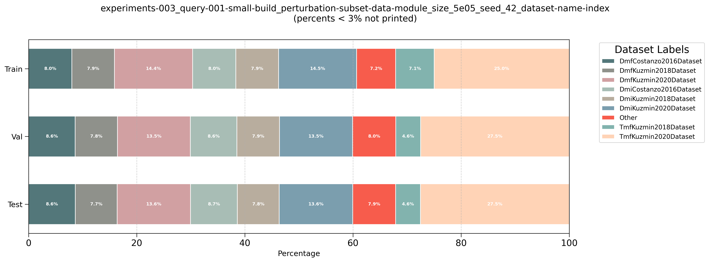

## 1e06 Perturbation Subset

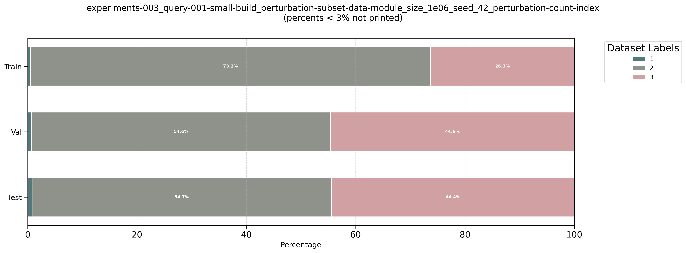
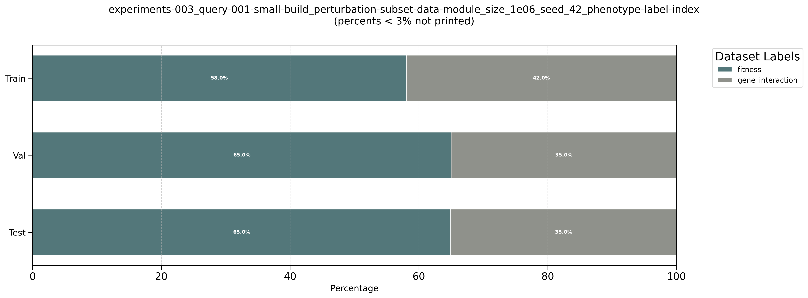

