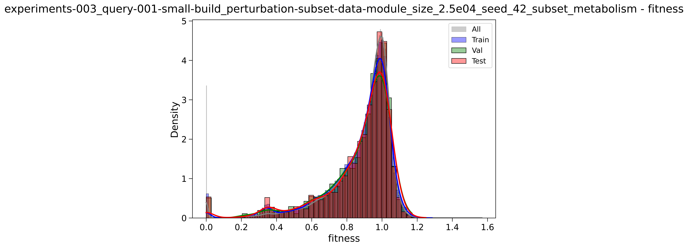

## 2025.02.02 - 2.5e04  Perturbation Subset

## 2025.02.02 - 5e04  Perturbation Subset

## 2025.02.02 - 1e05  Perturbation Subset

## 2025.02.02 - 4e05  Perturbation Subset

This is the highest we go because we have something approximately 430,000 genes in db that are in metabolism.

