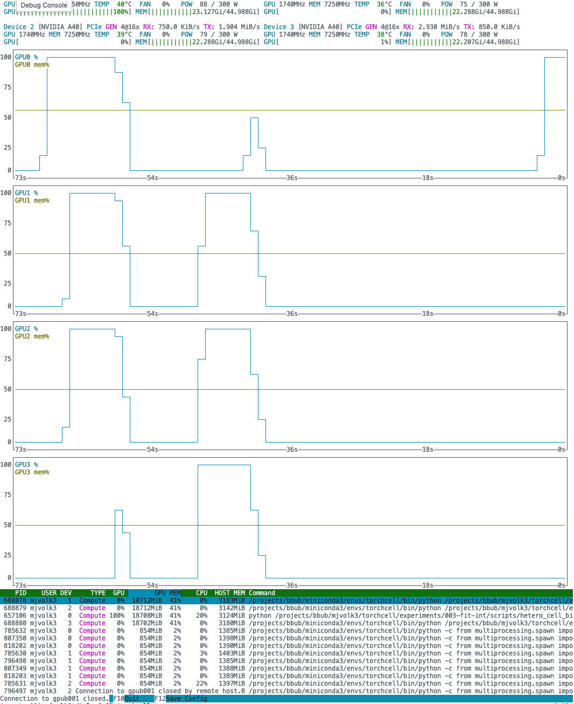

## Delta 1 GPU - Sbatch 2.5e4 with Single GPU

```yaml
data_module:
  is_perturbation_subset: true
  perturbation_subset_size: 2.5e4 # 𝚫
  batch_size: 32
  num_workers: 4
  pin_memory: false
  prefetch: false
trainer:
  strategy: auto
  num_nodes: 1
  accelerator: gpu
  devices: 1 # 𝚫
```

`Epoch 37: 100%|██████████| 626/626 [59:42<00:00,  0.17it/s, v_num=7ycm]`

## Delta 2 GPU - Interactive Find Used Parameters

```yaml
data_module:
  is_perturbation_subset: true
  perturbation_subset_size: 4e5
  batch_size: 32
  num_workers: 4
  pin_memory: false
  prefetch: false
trainer:
  strategy: ddp_find_unused_parameters_true # 𝚫
  num_nodes: 1
  accelerator: gpu
  devices: 2 # 𝚫
```

**Results**
`Epoch 0:   0%|...| 10/5001 [05:14<43:32:08,  0.03it/s, v_num=goco]`

## Delta 2 GPU - Interactive Add Small Loss

To avoid the issue of having some parameters not used we add a 0 to loss for all labels as a `dummy_loss`. This then allows us to use regular `DDP`.

```yaml
data_module:
  is_perturbation_subset: true
  perturbation_subset_size: 4e5
  batch_size: 32
  num_workers: 4
  pin_memory: false
  prefetch: false
trainer:
  strategy: ddp # 𝚫
  num_nodes: 1
  accelerator: gpu
  devices: 2 
```

**Results**
`Epoch 0:   1%|▌...| 35/5001 [11:32<27:17:55,  0.05it/s, v_num=cvh1]`

It looks like we did get some speed improvement.


## Delta 1 GPU - Interactive with Single GPU

To avoid the issue of having some parameters not used we add a 0 to loss for all labels as a `dummy_loss`. This then allows us to use regular `DDP`.

```yaml
data_module:
  is_perturbation_subset: true
  perturbation_subset_size: 4e5
  batch_size: 32
  num_workers: 4
  pin_memory: false
  prefetch: false
trainer:
  strategy: ddp
  num_nodes: 1
  accelerator: gpu
  devices: 1 # 𝚫
```

**Results**

`Epoch 0:   1%|▊...| 91/10001 [11:48<21:25:37,  0.13it/s, v_num=zlgq]`

This is `21 hr/ 16 gpu =1.3 hr`, which is about on par with `Sbatch` which is `1 hr` on `2.5e4`.


## Delta 4 GPU - Interactive with 4 GPU

```yaml
data_module:
  is_perturbation_subset: true
  perturbation_subset_size: 4e5
  batch_size: 32
  num_workers: 4
  pin_memory: false
  prefetch: false

trainer:
  max_epochs: 1000
  strategy: ddp
  num_nodes: 1
  accelerator: gpu
  devices: 4
```

**Restuls**

Epoch 0:   1%|▋...| 21/2501 [13:27<26:28:55,  0.03it/s, v_num=0hxc]

Why aren't we seeing any speed up? Maybe this is due to interactive nodes? Will try `Sbatch`.



## IGB Test

#FLAG  MOVE to own note

***

```bash
mjvolk3@biologin-3 ~/projects/torchcell $ srun -p mmli --gres=gpu:4 --mem=480g -n 1 --cpus-per-task=16 --time=24:00:00 --pty bash
mjvolk3@compute-5-7 ~/projects/torchcell $ conda activate torchcell
python /home/a-m/mjvolk3/scratch/torchcell/experiments/003-fit-int/scripts/igb_ddp.py
Rank 1 finished with loss 1.4144690036773682
Rank 0 finished with loss 1.2256187200546265
Rank 2 finished with loss 1.492952585220337
Rank 3 finished with loss 1.44109046459198
```

## IGB Test - No Issue with Singularity

```bash
(torchcell) mjvolk3@compute-5-7 ~/projects/torchcell $ module load singularity
(torchcell) mjvolk3@compute-5-7 ~/projects/torchcell $ singularity shell --nv rockylinux_9.sif
Singularity> source $HOME/miniconda3/bin/activate
conda activate torchcell
(torchcell) Singularity> python /home/a-m/mjvolk3/scratch/torchcell/experiments/003-fit-int/scripts/igb_ddp.py
Rank 0 finished with loss 1.3922936916351318
Rank 2 finished with loss 1.2557555437088013
Rank 3 finished with loss 1.533262848854065
Rank 1 finished with loss 1.33245849609375
```
