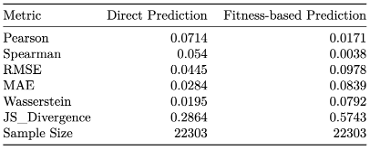

Table we aim to make.

| $\epsilon$ true | $\epsilon$ pred | $\epsilon$ from fitness pred | num gene deletions |
|:----------------|:----------------|:-----------------------------|:-------------------|
| -               | -               | -                            | -                  |

Table showing things are not working

| Metric        |   Direct Prediction |   Fitness-based Prediction |
|:--------------|--------------------:|---------------------------:|
| Pearson       |              0.0714 |                     0.0171 |
| Spearman      |              0.054  |                     0.0038 |
| RMSE          |              0.0445 |                     0.0978 |
| MAE           |              0.0284 |                     0.0839 |
| Wasserstein   |              0.0195 |                     0.0792 |
| JS_Divergence |              0.2864 |                     0.5743 |
| Sample Size   |          22303      |                 22303      |

[[Hetero_cell_bipartite_bad_gi_analytic_v_direct_plot|dendron://torchcell/experiments.003-fit-int.scripts.hetero_cell_bipartite_bad_gi_analytic_v_direct_plot]]