```bash
michaelvolk@M1-MV torchcell % /Users/michaelvolk/opt/miniconda3/envs/torchcell/bin/python /Users/michaelvolk/Docume
nts/projects/torchcell/experiments/004-dmi-tmi/scripts/dango_ppi_vs_sgd_ppi.py
/Users/michaelvolk/opt/miniconda3/envs/torchcell/lib/python3.11/site-packages/torch_geometric/typing.py:68: UserWarning: An issue occurred while importing 'pyg-lib'. Disabling its usage. Stacktrace: dlopen(/Users/michaelvolk/opt/miniconda3/envs/torchcell/lib/python3.11/site-packages/libpyg.so, 0x0006): Library not loaded: /Library/Frameworks/Python.framework/Versions/3.11/Python
  Referenced from: <B4DF21CE-3AD4-3ED1-8E22-0F66900D55D2> /Users/michaelvolk/opt/miniconda3/envs/torchcell/lib/python3.11/site-packages/libpyg.so
  Reason: tried: '/Library/Frameworks/Python.framework/Versions/3.11/Python' (no such file), '/System/Volumes/Preboot/Cryptexes/OS/Library/Frameworks/Python.framework/Versions/3.11/Python' (no such file), '/Library/Frameworks/Python.framework/Versions/3.11/Python' (no such file)
  warnings.warn(f"An issue occurred while importing 'pyg-lib'. "
/Users/michaelvolk/opt/miniconda3/envs/torchcell/lib/python3.11/site-packages/torch_geometric/typing.py:124: UserWarning: An issue occurred while importing 'torch-sparse'. Disabling its usage. Stacktrace: dlopen(/Users/michaelvolk/opt/miniconda3/envs/torchcell/lib/python3.11/site-packages/libpyg.so, 0x0006): Library not loaded: /Library/Frameworks/Python.framework/Versions/3.11/Python
  Referenced from: <B4DF21CE-3AD4-3ED1-8E22-0F66900D55D2> /Users/michaelvolk/opt/miniconda3/envs/torchcell/lib/python3.11/site-packages/libpyg.so
  Reason: tried: '/Library/Frameworks/Python.framework/Versions/3.11/Python' (no such file), '/System/Volumes/Preboot/Cryptexes/OS/Library/Frameworks/Python.framework/Versions/3.11/Python' (no such file), '/Library/Frameworks/Python.framework/Versions/3.11/Python' (no such file)
  warnings.warn(f"An issue occurred while importing 'torch-sparse'. "
STRING v9.1 data already exists at /Users/michaelvolk/Documents/projects/torchcell/data/string91/4932.protein.links.detailed.v9.1.txt.gz, skipping download
STRING v12.0 data already exists at /Users/michaelvolk/Documents/projects/torchcell/data/string12/4932.protein.links.detailed.v12.0.txt.gz, skipping download

Columns in the STRING v9.1 dataframe:
['protein1', 'protein2', 'neighborhood', 'fusion', 'cooccurence', 'coexpression', 'experimental', 'database', 'textmining', 'combined_score']

Sample data from STRING v9.1:
     protein1    protein2  neighborhood  fusion  ...  experimental  database  textmining  combined_score
0  4932.Q0010  4932.Q0017             0       0  ...             0         0         921             921
1  4932.Q0010  4932.Q0032             0       0  ...             0         0         873             873
2  4932.Q0010  4932.Q0143             0       0  ...             0         0         808             808
3  4932.Q0010  4932.Q0182             0       0  ...             0         0         808             808
4  4932.Q0010  4932.Q0297             0       0  ...             0         0         655             655

[5 rows x 10 columns]
STRING v9.1 neighborhood network: 2172 nodes, 45610 edges
STRING v9.1 fusion network: 1191 nodes, 1361 edges
STRING v9.1 cooccurence network: 1271 nodes, 2664 edges
STRING v9.1 coexpression network: 5811 nodes, 314013 edges
STRING v9.1 experimental network: 6169 nodes, 219995 edges
STRING v9.1 database network: 2712 nodes, 33486 edges
STRING v9.1 combined network: 6311 nodes, 536207 edges

Columns in the STRING v12.0 dataframe:
['protein1', 'protein2', 'neighborhood', 'fusion', 'cooccurence', 'coexpression', 'experimental', 'database', 'textmining', 'combined_score']

Sample data from STRING v12.0:
     protein1      protein2  neighborhood  fusion  ...  experimental  database  textmining  combined_score
0  4932.Q0010  4932.YMR207C            45       0  ...             0       245          99             333
1  4932.Q0010  4932.YCR051W             0       0  ...           180         0          71             205
2  4932.Q0010  4932.YPR002W             0       0  ...           116         0         117             195
3  4932.Q0010  4932.YGR117C             0       0  ...           151         0          48             166
4  4932.Q0010  4932.YML056C             0       0  ...           134         0          61             152

[5 rows x 10 columns]
STRING v12.0 neighborhood network: 2204 nodes, 147874 edges
STRING v12.0 fusion network: 3095 nodes, 11810 edges
STRING v12.0 cooccurence network: 2615 nodes, 11115 edges
STRING v12.0 coexpression network: 6503 nodes, 1002538 edges
STRING v12.0 experimental network: 6036 nodes, 825101 edges
STRING v12.0 database network: 4044 nodes, 73818 edges
STRING v12.0 combined network: 6532 nodes, 1298235 edges
/Users/michaelvolk/Documents/projects/torchcell/data/go/go.obo: fmt(1.2) rel(2024-11-03) 43,983 Terms
Physical graph: 5721 nodes, 139463 edges
Regulatory graph: 3632 nodes, 9753 edges

=== Comparisons with STRING v9.1 ===
Physical graph has 139463 edges (comparing with STRING v9.1)

Physical Graph vs STRING v9.1 Comparison Results:
Physical Graph: 139463 edges

Overlap with STRING v9.1 networks:
neighborhood: 45610 edges, 2108 shared edges
Jaccard similarity: 0.0115
fusion: 1361 edges, 153 shared edges
Jaccard similarity: 0.0011
cooccurence: 2664 edges, 476 shared edges
Jaccard similarity: 0.0034
coexpression: 314013 edges, 21555 shared edges
Jaccard similarity: 0.0499
experimental: 219995 edges, 59886 shared edges
Jaccard similarity: 0.1999
database: 33486 edges, 7935 shared edges
Jaccard similarity: 0.0481
combined: 536207 edges, 68743 shared edges
Jaccard similarity: 0.1133
Regulatory graph has 9745 edges (comparing with STRING v9.1)

Regulatory Graph vs STRING v9.1 Comparison Results:
Regulatory Graph: 9745 edges

Overlap with STRING v9.1 networks:
neighborhood: 45610 edges, 9 shared edges
Jaccard similarity: 0.0002
fusion: 1361 edges, 1 shared edges
Jaccard similarity: 0.0001
cooccurence: 2664 edges, 1 shared edges
Jaccard similarity: 0.0001
coexpression: 314013 edges, 153 shared edges
Jaccard similarity: 0.0005
experimental: 219995 edges, 489 shared edges
Jaccard similarity: 0.0021
database: 33486 edges, 58 shared edges
Jaccard similarity: 0.0013
combined: 536207 edges, 608 shared edges
Jaccard similarity: 0.0011

=== Comparisons with STRING v12.0 ===
Physical graph has 139463 edges (comparing with STRING v12.0)

Physical Graph vs STRING v12.0 Comparison Results:
Physical Graph: 139463 edges

Overlap with STRING v12.0 networks:
neighborhood: 147874 edges, 4578 shared edges
Jaccard similarity: 0.0162
fusion: 11810 edges, 788 shared edges
Jaccard similarity: 0.0052
cooccurence: 11115 edges, 1005 shared edges
Jaccard similarity: 0.0067
coexpression: 1002538 edges, 69946 shared edges
Jaccard similarity: 0.0652
experimental: 825101 edges, 105034 shared edges
Jaccard similarity: 0.1222
database: 73818 edges, 11230 shared edges
Jaccard similarity: 0.0556
combined: 1298235 edges, 106455 shared edges
Jaccard similarity: 0.0800
Regulatory graph has 9745 edges (comparing with STRING v12.0)

Regulatory Graph vs STRING v12.0 Comparison Results:
Regulatory Graph: 9745 edges

Overlap with STRING v12.0 networks:
neighborhood: 147874 edges, 27 shared edges
Jaccard similarity: 0.0002
fusion: 11810 edges, 11 shared edges
Jaccard similarity: 0.0005
cooccurence: 11115 edges, 37 shared edges
Jaccard similarity: 0.0018
coexpression: 1002538 edges, 1050 shared edges
Jaccard similarity: 0.0010
experimental: 825101 edges, 1244 shared edges
Jaccard similarity: 0.0015
database: 73818 edges, 65 shared edges
Jaccard similarity: 0.0008
combined: 1298235 edges, 1514 shared edges
Jaccard similarity: 0.0012

Generating visualizations...
Visualizations complete!

STRING v9.1 network overlap analysis:
Number of edges appearing in N network types:
In 1 networks: 467361 edges
In 2 networks: 58079 edges
In 3 networks: 9561 edges
In 4 networks: 1115 edges
In 5 networks: 79 edges
In 6 networks: 12 edges

Pairwise overlaps between network types:
coexpression ∩ database: 15409 edges
coexpression ∩ experimental: 34806 edges
cooccurence ∩ coexpression: 1251 edges
cooccurence ∩ database: 395 edges
cooccurence ∩ experimental: 874 edges
experimental ∩ database: 11940 edges
fusion ∩ coexpression: 482 edges
fusion ∩ cooccurence: 77 edges
fusion ∩ database: 243 edges
fusion ∩ experimental: 345 edges
neighborhood ∩ coexpression: 18694 edges
neighborhood ∩ cooccurence: 255 edges
neighborhood ∩ database: 3552 edges
neighborhood ∩ experimental: 5797 edges
neighborhood ∩ fusion: 302 edges

STRING v12.0 network overlap analysis:
Number of edges appearing in N network types:
In 1 networks: 630567 edges
In 2 networks: 572039 edges
In 3 networks: 85339 edges
In 4 networks: 9900 edges
In 5 networks: 346 edges
In 6 networks: 44 edges

Pairwise overlaps between network types:
coexpression ∩ database: 57388 edges
coexpression ∩ experimental: 557632 edges
cooccurence ∩ coexpression: 7119 edges
cooccurence ∩ database: 1184 edges
cooccurence ∩ experimental: 5660 edges
experimental ∩ database: 40076 edges
fusion ∩ coexpression: 8601 edges
fusion ∩ cooccurence: 318 edges
fusion ∩ database: 876 edges
fusion ∩ experimental: 5960 edges
neighborhood ∩ coexpression: 120681 edges
neighborhood ∩ cooccurence: 287 edges
neighborhood ∩ database: 22212 edges
neighborhood ∩ experimental: 61904 edges
neighborhood ∩ fusion: 1678 edges
```

***

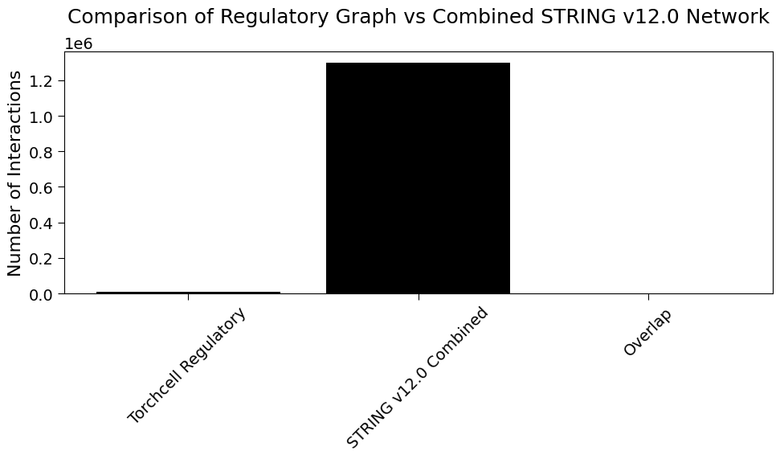
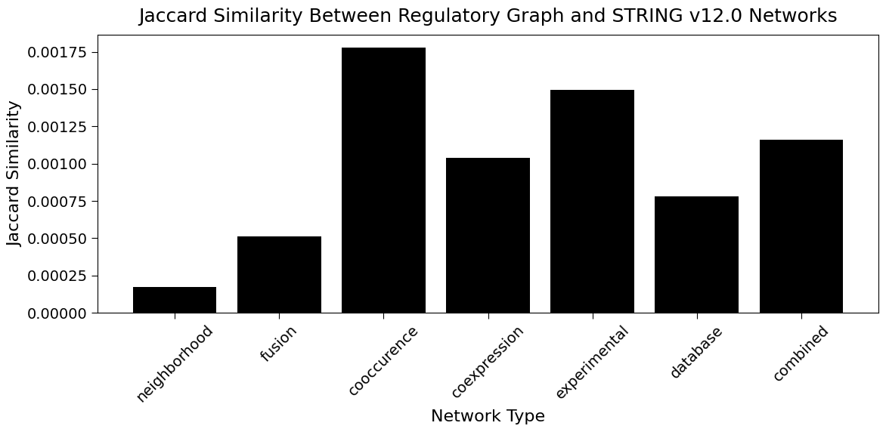
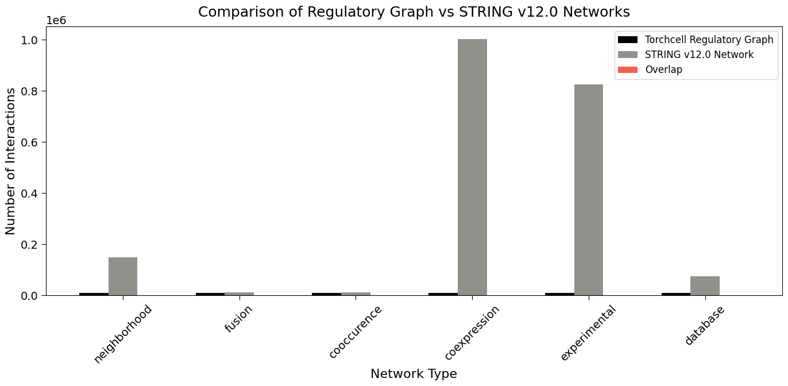
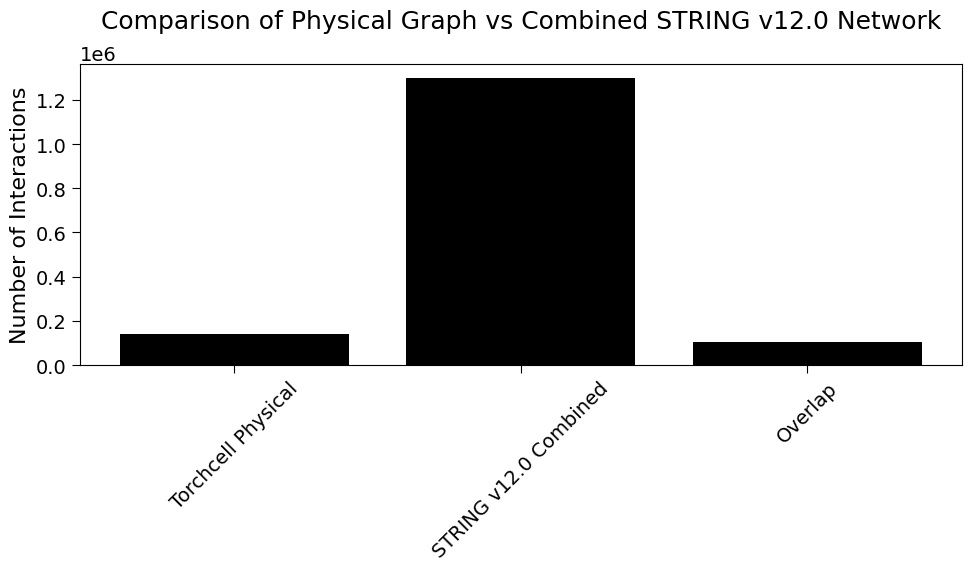
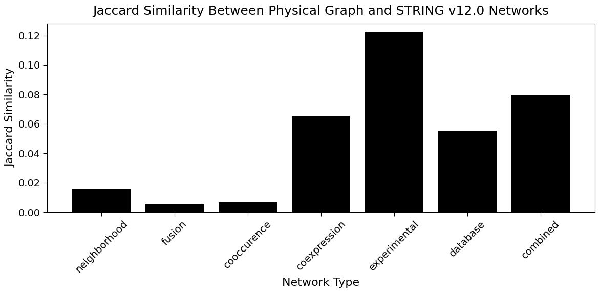
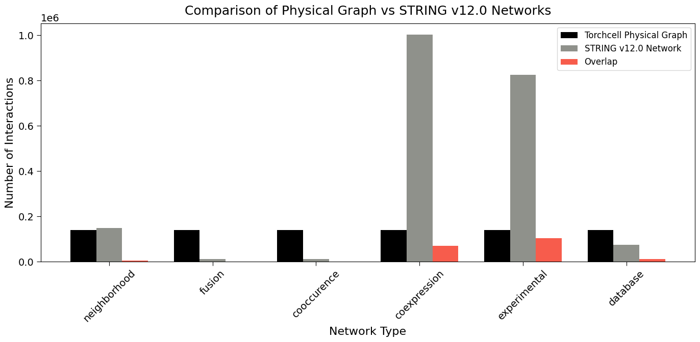
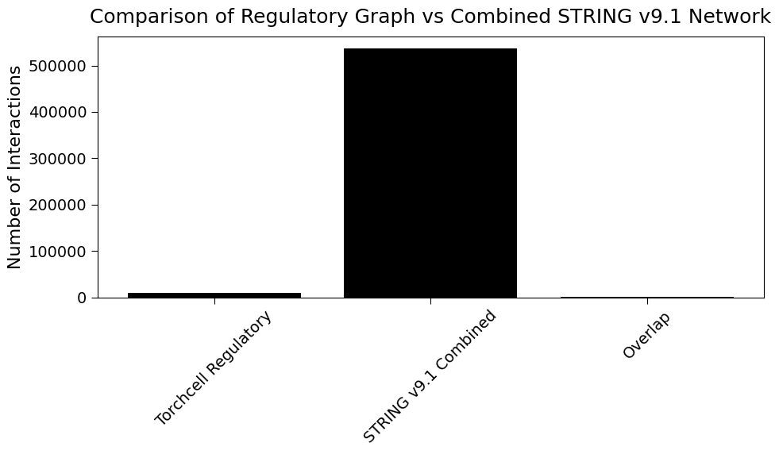
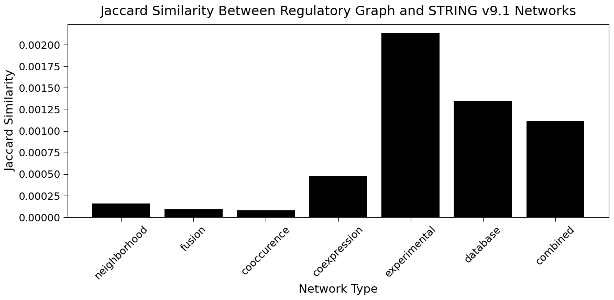
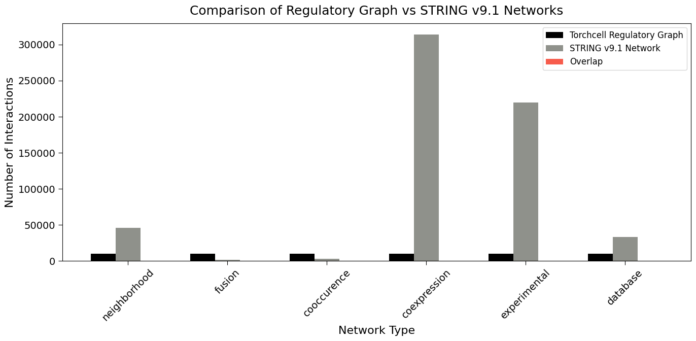
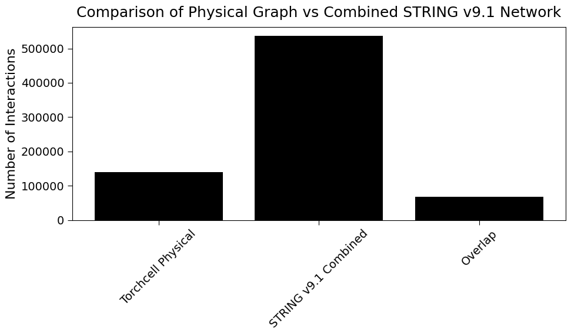
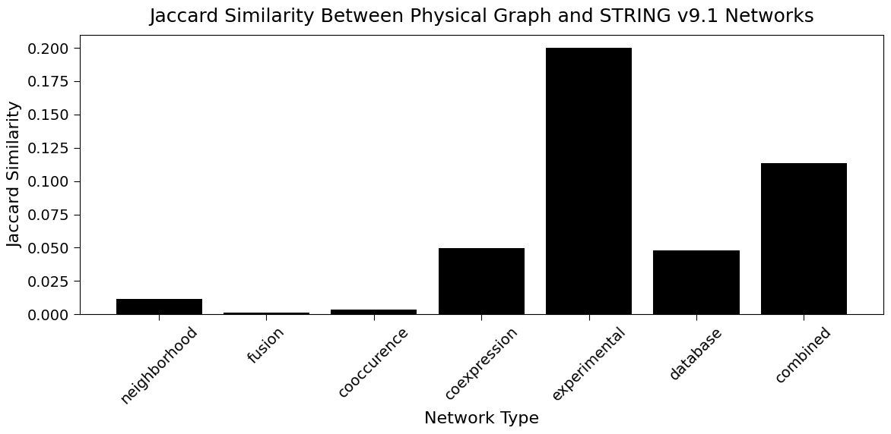
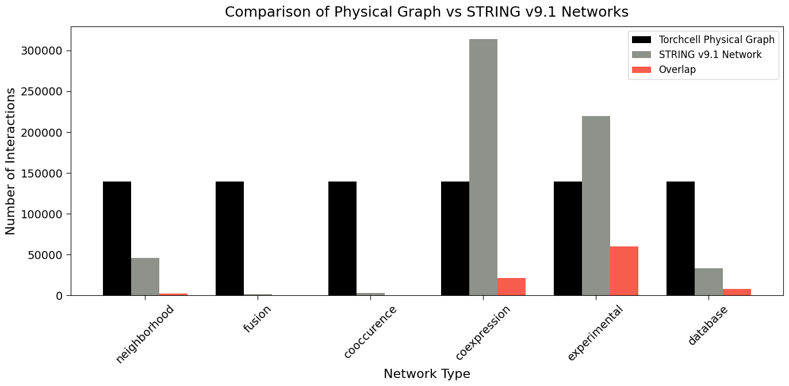
