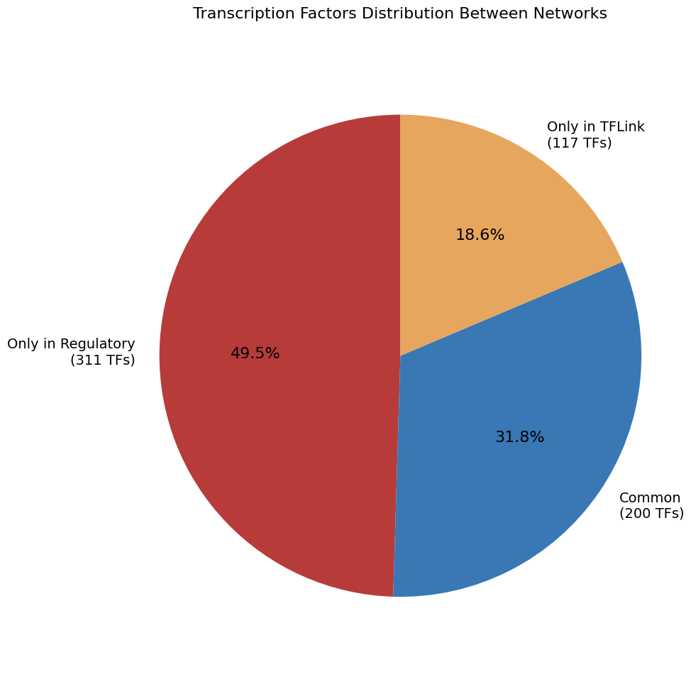
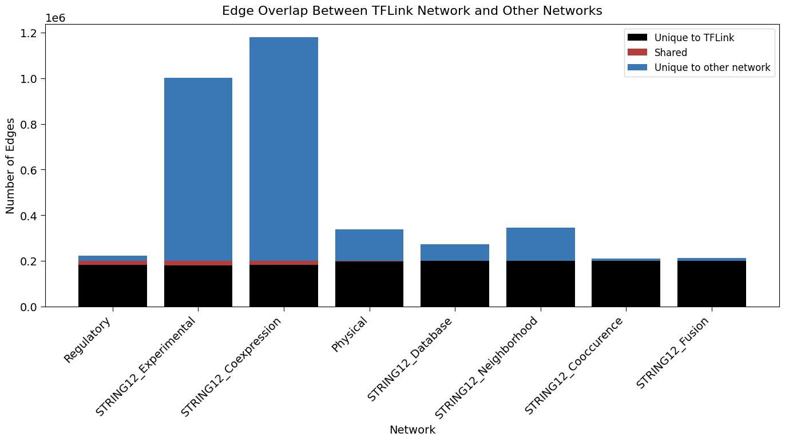
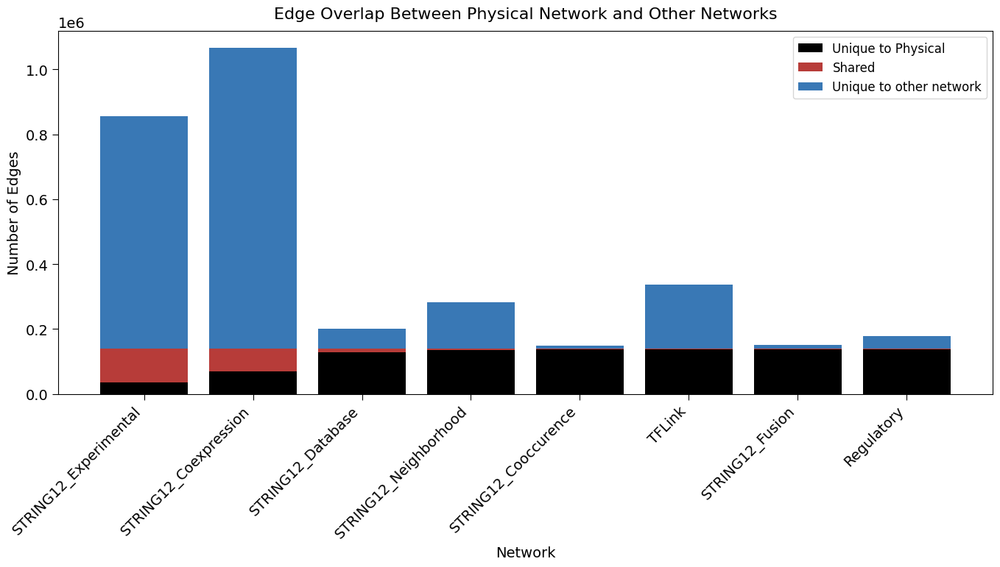
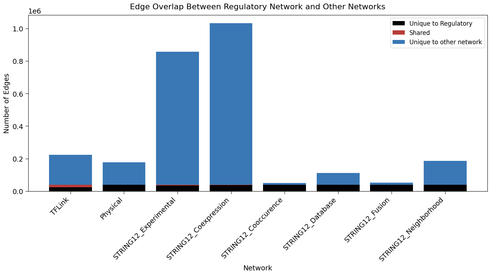
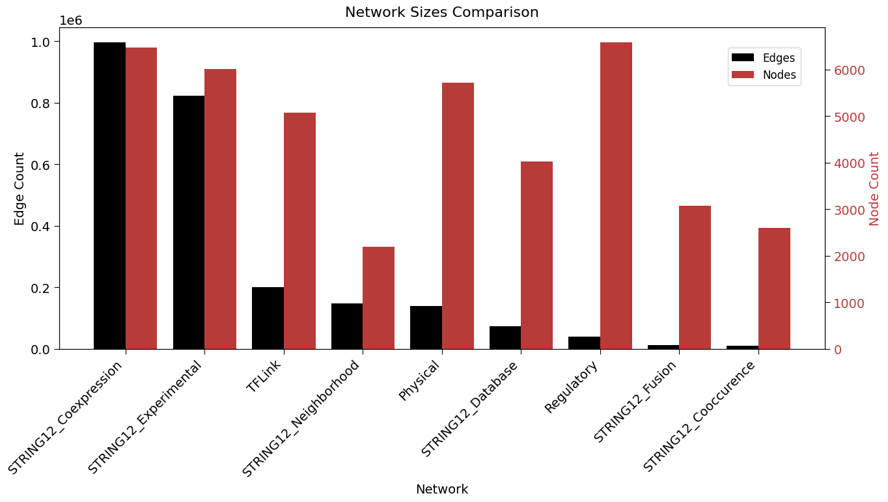

```bash
michaelvolk@M1-MV torchcell % /Users/michaelvolk/opt/miniconda3/envs/torchcell/bin/python /Users/michaelvolk/Documents/projects/torchcell/experiments/004
-dmi-tmi/scripts/string_vs_sgd_vs_reg.py
/Users/michaelvolk/opt/miniconda3/envs/torchcell/lib/python3.11/site-packages/torch_geometric/typing.py:68: UserWarning: An issue occurred while importing 'pyg-lib'. Disabling its usage. Stacktrace: dlopen(/Users/michaelvolk/opt/miniconda3/envs/torchcell/lib/python3.11/site-packages/libpyg.so, 0x0006): Library not loaded: /Library/Frameworks/Python.framework/Versions/3.11/Python
  Referenced from: <B4DF21CE-3AD4-3ED1-8E22-0F66900D55D2> /Users/michaelvolk/opt/miniconda3/envs/torchcell/lib/python3.11/site-packages/libpyg.so
  Reason: tried: '/Library/Frameworks/Python.framework/Versions/3.11/Python' (no such file), '/System/Volumes/Preboot/Cryptexes/OS/Library/Frameworks/Python.framework/Versions/3.11/Python' (no such file), '/Library/Frameworks/Python.framework/Versions/3.11/Python' (no such file)
  warnings.warn(f"An issue occurred while importing 'pyg-lib'. "
/Users/michaelvolk/opt/miniconda3/envs/torchcell/lib/python3.11/site-packages/torch_geometric/typing.py:124: UserWarning: An issue occurred while importing 'torch-sparse'. Disabling its usage. Stacktrace: dlopen(/Users/michaelvolk/opt/miniconda3/envs/torchcell/lib/python3.11/site-packages/libpyg.so, 0x0006): Library not loaded: /Library/Frameworks/Python.framework/Versions/3.11/Python
  Referenced from: <B4DF21CE-3AD4-3ED1-8E22-0F66900D55D2> /Users/michaelvolk/opt/miniconda3/envs/torchcell/lib/python3.11/site-packages/libpyg.so
  Reason: tried: '/Library/Frameworks/Python.framework/Versions/3.11/Python' (no such file), '/System/Volumes/Preboot/Cryptexes/OS/Library/Frameworks/Python.framework/Versions/3.11/Python' (no such file), '/Library/Frameworks/Python.framework/Versions/3.11/Python' (no such file)
  warnings.warn(f"An issue occurred while importing 'torch-sparse'. "
Asset images will be saved to: /Users/michaelvolk/Documents/projects/torchcell/notes/assets/images
/Users/michaelvolk/Documents/projects/torchcell/data/go/go.obo: fmt(1.2) rel(2024-11-03) 43,983 Terms

===== Network Statistics =====
Regulatory: 3632 nodes, 9753 edges
Physical: 5721 nodes, 139463 edges
TFLink: 5092 nodes, 201898 edges
STRING12_Neighborhood: 2204 nodes, 147874 edges
STRING12_Fusion: 3095 nodes, 11810 edges
STRING12_Cooccurence: 2615 nodes, 11115 edges
STRING12_Coexpression: 6503 nodes, 1002538 edges
STRING12_Experimental: 6036 nodes, 825101 edges
STRING12_Database: 4044 nodes, 73818 edges

===== Pairwise Comparison Results =====

Physical vs STRING12_Coexpression:
  Network 1 edges: 139463
  Network 2 edges: 1002538
  Shared edges: 69946
  Jaccard similarity: 0.0652

Physical vs STRING12_Cooccurence:
  Network 1 edges: 139463
  Network 2 edges: 11115
  Shared edges: 1005
  Jaccard similarity: 0.0067

Physical vs STRING12_Database:
  Network 1 edges: 139463
  Network 2 edges: 73818
  Shared edges: 11230
  Jaccard similarity: 0.0556

Physical vs STRING12_Experimental:
  Network 1 edges: 139463
  Network 2 edges: 825101
  Shared edges: 105034
  Jaccard similarity: 0.1222

Physical vs STRING12_Fusion:
  Network 1 edges: 139463
  Network 2 edges: 11810
  Shared edges: 788
  Jaccard similarity: 0.0052

Physical vs STRING12_Neighborhood:
  Network 1 edges: 139463
  Network 2 edges: 147874
  Shared edges: 4578
  Jaccard similarity: 0.0162

Physical vs TFLink:
  Network 1 edges: 139463
  Network 2 edges: 200803
  Shared edges: 2013
  Jaccard similarity: 0.0060

Regulatory vs Physical:
  Network 1 edges: 9745
  Network 2 edges: 139463
  Shared edges: 403
  Jaccard similarity: 0.0027

Regulatory vs STRING12_Coexpression:
  Network 1 edges: 9745
  Network 2 edges: 1002538
  Shared edges: 1050
  Jaccard similarity: 0.0010

Regulatory vs STRING12_Cooccurence:
  Network 1 edges: 9745
  Network 2 edges: 11115
  Shared edges: 37
  Jaccard similarity: 0.0018

Regulatory vs STRING12_Database:
  Network 1 edges: 9745
  Network 2 edges: 73818
  Shared edges: 65
  Jaccard similarity: 0.0008

Regulatory vs STRING12_Experimental:
  Network 1 edges: 9745
  Network 2 edges: 825101
  Shared edges: 1244
  Jaccard similarity: 0.0015

Regulatory vs STRING12_Fusion:
  Network 1 edges: 9745
  Network 2 edges: 11810
  Shared edges: 11
  Jaccard similarity: 0.0005

Regulatory vs STRING12_Neighborhood:
  Network 1 edges: 9745
  Network 2 edges: 147874
  Shared edges: 27
  Jaccard similarity: 0.0002

Regulatory vs TFLink:
  Network 1 edges: 9745
  Network 2 edges: 200803
  Shared edges: 3577
  Jaccard similarity: 0.0173

STRING12_Coexpression vs STRING12_Database:
  Network 1 edges: 1002538
  Network 2 edges: 73818
  Shared edges: 57388
  Jaccard similarity: 0.0563

STRING12_Coexpression vs STRING12_Experimental:
  Network 1 edges: 1002538
  Network 2 edges: 825101
  Shared edges: 557632
  Jaccard similarity: 0.4391

STRING12_Cooccurence vs STRING12_Coexpression:
  Network 1 edges: 11115
  Network 2 edges: 1002538
  Shared edges: 7119
  Jaccard similarity: 0.0071

STRING12_Cooccurence vs STRING12_Database:
  Network 1 edges: 11115
  Network 2 edges: 73818
  Shared edges: 1184
  Jaccard similarity: 0.0141

STRING12_Cooccurence vs STRING12_Experimental:
  Network 1 edges: 11115
  Network 2 edges: 825101
  Shared edges: 5660
  Jaccard similarity: 0.0068

STRING12_Experimental vs STRING12_Database:
  Network 1 edges: 825101
  Network 2 edges: 73818
  Shared edges: 40076
  Jaccard similarity: 0.0467

STRING12_Fusion vs STRING12_Coexpression:
  Network 1 edges: 11810
  Network 2 edges: 1002538
  Shared edges: 8601
  Jaccard similarity: 0.0086

STRING12_Fusion vs STRING12_Cooccurence:
  Network 1 edges: 11810
  Network 2 edges: 11115
  Shared edges: 318
  Jaccard similarity: 0.0141

STRING12_Fusion vs STRING12_Database:
  Network 1 edges: 11810
  Network 2 edges: 73818
  Shared edges: 876
  Jaccard similarity: 0.0103

STRING12_Fusion vs STRING12_Experimental:
  Network 1 edges: 11810
  Network 2 edges: 825101
  Shared edges: 5960
  Jaccard similarity: 0.0072

STRING12_Neighborhood vs STRING12_Coexpression:
  Network 1 edges: 147874
  Network 2 edges: 1002538
  Shared edges: 120681
  Jaccard similarity: 0.1172

STRING12_Neighborhood vs STRING12_Cooccurence:
  Network 1 edges: 147874
  Network 2 edges: 11115
  Shared edges: 287
  Jaccard similarity: 0.0018

STRING12_Neighborhood vs STRING12_Database:
  Network 1 edges: 147874
  Network 2 edges: 73818
  Shared edges: 22212
  Jaccard similarity: 0.1113

STRING12_Neighborhood vs STRING12_Experimental:
  Network 1 edges: 147874
  Network 2 edges: 825101
  Shared edges: 61904
  Jaccard similarity: 0.0679

STRING12_Neighborhood vs STRING12_Fusion:
  Network 1 edges: 147874
  Network 2 edges: 11810
  Shared edges: 1678
  Jaccard similarity: 0.0106

TFLink vs STRING12_Coexpression:
  Network 1 edges: 200803
  Network 2 edges: 1002538
  Shared edges: 16708
  Jaccard similarity: 0.0141

TFLink vs STRING12_Cooccurence:
  Network 1 edges: 200803
  Network 2 edges: 11115
  Shared edges: 120
  Jaccard similarity: 0.0006

TFLink vs STRING12_Database:
  Network 1 edges: 200803
  Network 2 edges: 73818
  Shared edges: 576
  Jaccard similarity: 0.0021

TFLink vs STRING12_Experimental:
  Network 1 edges: 200803
  Network 2 edges: 825101
  Shared edges: 20035
  Jaccard similarity: 0.0199

TFLink vs STRING12_Fusion:
  Network 1 edges: 200803
  Network 2 edges: 11810
  Shared edges: 60
  Jaccard similarity: 0.0003

TFLink vs STRING12_Neighborhood:
  Network 1 edges: 200803
  Network 2 edges: 147874
  Shared edges: 414
  Jaccard similarity: 0.0012

===== Generating Visualizations =====
✅ Network sizes chart created
✅ Jaccard similarity heatmap created
✅ Edge overlap matrices created
✅ Network overlap charts created
✅ TF regulatory comparison visualizations created

All visualizations saved to /Users/michaelvolk/Documents/projects/torchcell/notes/assets/images
```










***

| Network               | Nodes     | Edges       |
|-----------------------|-----------|-------------|
| Regulatory            | 3,632      | 9,753        |
| Physical              | 5,721      | 139,463      |
| TFLink                | 5,092      | 201,898      |
| STRING12_Neighborhood | 2,204      | 147,874      |
| STRING12_Fusion       | 3,095      | 11,810       |
| STRING12_Cooccurence  | 2,615      | 11,115       |
| STRING12_Coexpression | 6,503      | 1,002,538     |
| STRING12_Experimental | 6,036      | 825,101      |
| STRING12_Database     | 4,044      | 73,818       |
| **Sum**               | **38,942** | **2,423,370** |
