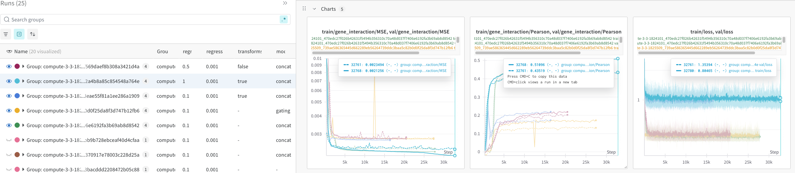

| Model                   | Training Strategy       | Data                                | Train Pearson | Val Pearson | Status |
|:------------------------|:------------------------|:------------------------------------|:--------------|:------------|:-------|
| Dango                   | PreThenPost             | String 9.1                          | 0.5264        | 0.4185      | x      |
| Dango                   | LinearUntilUniform      | String 9.1                          | 0.5160        | 0.4196      | x      |
| Dango                   | LinearUntilFlipped      | String 9.1                          | 0.5306        | **0.4214**  | x      |
| Dango                   | PreThenPost             | String 11.0                         | 0.5523        | 0.4137      | x      |
| Dango                   | LinearUntilUniform      | String 11.0                         | 0.5099        | 0.4194      | x      |
| Dango                   | LinearUntilFlipped      | String 11.0                         |               |             | x      |
| Dango                   | PreThenPost             | String 12.0                         | 0.5365        | **0.4209**  | x      |
| Dango                   | LinearUntilUniform      | String 12.0                         | 0.5255        | **0.4202**  | x      |
| Dango                   | LinearUntilFlipped      | String 12.0                         | 0.4768        | 0.4146      | x      |
| DCell                   | containment(n=4)        | GO                                  |               |             | issue  |
| TC_all_graphs           | embed_diff              | Str12.0 + Phys + Reg + TFlink + Met |               |             | x      |
| TC_all_graphs + fitness | embed_diff              | Str12.0 + Phys + Reg + TFlink + Met |               |             | debug  |
| TC_all_graphs + fitness | embed_diff + dango_head | Str12.0 + Phys + Reg + TFlink + Met |               |             | debug  |

Pearson values were read off of charts according to the best pearson value since we have model saved saved at val best pearson. It is probably better to do this programmatically but we just want a sense of the trends.

There are seems to be no benefit of updating to String 12.0

342,350

| Model                   | Training Strategy       | Data                                | Train Pearson | Val Pearson | Status       |
|:------------------------|:------------------------|:------------------------------------|:--------------|:------------|:-------------|
| Dango                   | PreThenPost             | String 9.1                          | 0.510         | 0.402       | x            |
| Dango                   | LinearUntilUniform      | String 9.1                          | 0.521         | 0.412       | x            |
| Dango                   | LinearUntilFlipped      | String 9.1                          | 0.511         | 0.402       | x            |
| Dango                   | PreThenPost             | String 11.0                         | 0.521         | 0.407       | x            |
| Dango                   | LinearUntilUniform      | String 11.0                         | 0.521         | 0.413       | x            |
| Dango                   | LinearUntilFlipped      | String 11.0                         | 0.511         | 0.401       | x            |
| Dango                   | PreThenPost             | String 12.0                         | 0.522         | 0.410       | x            |
| Dango                   | LinearUntilUniform      | String 12.0                         | 0.520         | 0.417       | x            |
| Dango                   | LinearUntilFlipped      | String 12.0                         | 0.519         | 0.409       | x            |
| DCell                   | containment(n=4)        | GO                                  |               |             | not run slow |
| TC_all_graphs           | embed_diff              | Str12.0 + Phys + Reg + TFlink + Met | 0.019         | 0.021       | x            |
| TC_all_graphs           | embed_diff + dango_head | Str12.0 + Phys + Reg + TFlink + Met | 0.542         | 0.431       | training     |
| TC_all_graphs + fitness | embed_diff              | Str12.0 + Phys + Reg + TFlink + Met |               |             |              |
| TC_all_graphs + fitness | embed_diff + dango_head | Str12.0 + Phys + Reg + TFlink + Met |               |             |              |

Temp fill in from looking at charts. Not to be taken for use in publication table. Need to programmatically extract values.

## 2025.06.17 - I Cannot Find Pattern Of Jumping Correlation

Unsure if the change in correlation is due the lambdas on loss or the transforms. It doesn't seem related to transforms. Gating 

