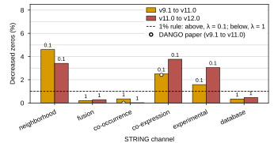

## 2026.09.03 - DANGO construction facts: per-channel lambda and the dataset

Script: `experiments/005-kuzmin2018-tmi/scripts/dango_construction_si.py`. Committed source for
panel (b) of the DANGO reproduction SI figure ([[experiments.005-kuzmin2018-tmi.scripts.compose_dango_si_figures]])
and for the dataset numbers in the Supplementary Note `note:dango-repro`.

DANGO sets the zero-weight `lambda_k` of each STRING channel's reconstruction loss from the
"percentage of decreased zeroes" between two releases (paper: 0.02% co-occurrence to 2.42%
co-expression for v9.1 to v11.0; above 1% gives `lambda = 0.1`, else `1.0`). The paper does not
define the computation. The definition used here, for a channel and an ordered pair of releases:
common nodes `V` = genes in both releases; pairs `P` = unordered gene pairs over `V` without
self-loops; `E_old`, `E_new` = channel edges restricted to `P`; decreased zeros =
`|E_new \ E_old| / (|P| - |E_old|) x 100`. Pairs are canonicalized (sorted tuples) before the set
difference.

Measured (`results/dango_decreased_zeros.csv`, cached `SCerevisiaeGraph` STRING pickles under
`$DATA_ROOT/data/string/graph`):

| channel | v9.1 to v11.0 (%) | lambda for v9.1 | v11.0 to v12.0 (%) | lambda for v11.0 |
|---|---|---|---|---|
| neighborhood | 4.60 | 0.1 | 3.41 | 0.1 |
| fusion | 0.20 | 1.0 | 0.29 | 1.0 |
| co-occurrence | 0.35 | 1.0 | 0.02 | 1.0 |
| co-expression | 2.50 | 0.1 | 3.76 | 0.1 |
| experimental | 1.58 | 0.1 | 3.05 | 0.1 |
| database | 0.33 | 1.0 | 0.47 | 1.0 |

The two exploratory scripts ([[experiments.005-kuzmin2018-tmi.scripts.dango_lambda_determination]],
[[experiments.005-kuzmin2018-tmi.scripts.dango_lambda_determination_string11_0_to_string12_0]]) compare
raw `G.edges()` tuples without canonicalizing orientation, so a pair stored as `(u, v)` in one release
and `(v, u)` in the other counted as a new edge. Their percentages are therefore higher (v9.1 to v11.0:
5.30, 0.24, 0.46, 2.99, 1.81, 0.57; v11.0 to v12.0: 4.86, 0.31, 0.21, 4.69, 3.67, 0.69). The lambda
assignment is the same under both computations (neighborhood, co-expression, experimental at 0.1;
fusion, co-occurrence, database at 1.0). The corrected co-expression value (2.50%) sits close to the
paper's 2.42%; co-occurrence (0.35%) does not match the paper's 0.02%.

Dataset facts read from the build the replication trained on
(`$DATA_ROOT/data/torchcell/experiments/005-kuzmin2018-tmi/001-small-build`,
`results/dango_dataset_split.csv`): 91,050 records after deduplication and aggregation (the query
returns 91,111), all triple perturbations, 1,400 perturbed genes over the 6,607-gene vocabulary;
seed-42 split 72,841 / 9,105 / 9,104 (train / val / test); labels 91,049 negative, 1 zero, 0
positive, min -1.08, mean -0.048, SD 0.054.

## 2026.09.03 - Detail moved out of the SI prose during reconciliation

The Supplementary Note `note:dango-repro` was compressed to about half a page; these facts left the
prose and live here (and in the `tab-dango-string-versions` caption for the run hyperparameters).

- Query conditions for the 005 build: YEPD, 30 C, every perturbation type kept. The DANGO paper
  describes the same screen as "around 91,000 triplets among 1,400 genes"; the build holds 91,050
  instances (query 91,111 before deduplication and aggregation), all but one with a negative
  interaction.
- The two verbatim lambda-rule sentences from the DANGO preprint (doi:10.1101/2020.11.26.400739):
  "we calculated the percentage of decreased zeroes from STRING database v9.1 to v11.0 for each
  network, ranging from 0.02% (co-occurrence) to 2.42% (co-expression)", and "if the decreased
  percentage of zeros is greater than 1%, we set lambda = 0.1; otherwise, we set lambda = 1.0."
- Run hyperparameters of the 19 replication runs: AdamW, learning rate 1e-5, weight decay 1e-6,
  batch 32, hidden width 64, four attention heads, 442 to 1,000 logged epochs.
- DANGO's own numbers used for comparison: about r = 0.47 under a random split (its Fig. 2b, read
  from the bar), 0.46 at the loosest replicate-consistency cutoff of its Fig. 2c, and the replicate
  ceiling "The Pearson correlation between the trigenic interaction scores of two individual
  replicates is around 0.59".
- The lambda fall-through (v11.0/v12.0 runs trained with lambda = 1.0 for every channel because
  `determine_lambda_values()` keys are `string9_1_*` and `DangoLoss` uses `.get(edge_type, 1.0)`) is
  read from the code, not measured; the same script (`experiments/006-kuzmin-tmi/scripts/dango.py`)
  trained the full-dataset runs of `note:dango-full`, so it applies there too.

## 2026.09.04 - Legend on an opaque white box

Author review: the legend of the decreased-zeros panel was hard to read over the gridlines and the
neighborhood bars. It now draws with `frameon=True`, white face, no edge (`framealpha=1`), same
position. Re-rendered with `--from-csv`; no value changed. The panel is now (c) of
`FigS-dango-reproduction` (was b).
