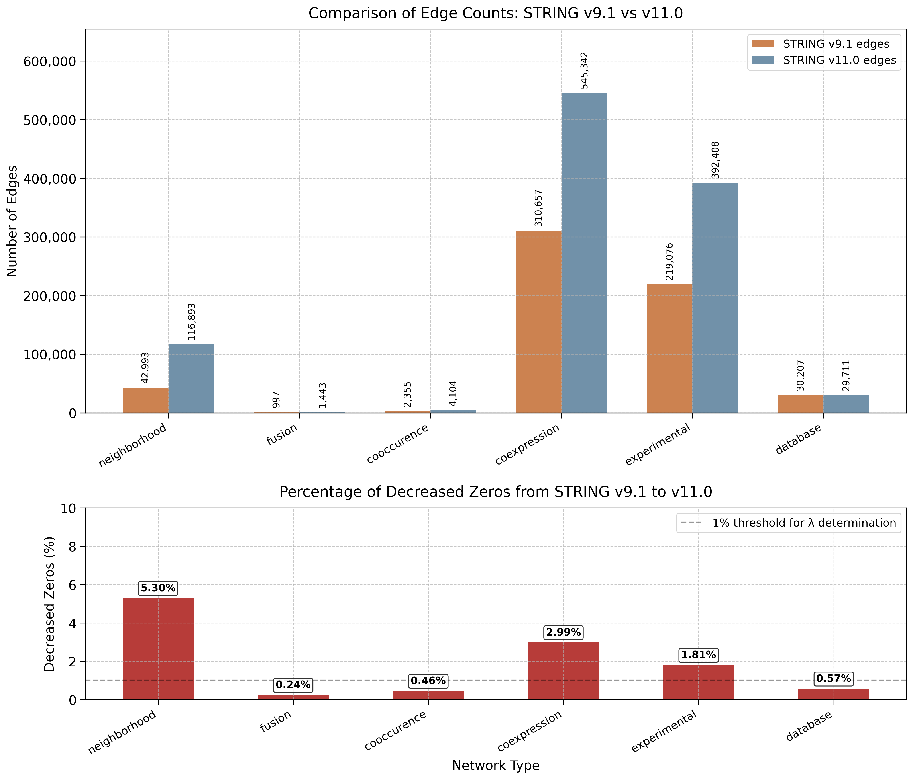

```python
(torchcell) michaelvolk@M1-MV torchcell % /Users/michaelvolk/opt/miniconda3/envs/torchcell/bin/python /Users/michaelvolk/Documents/projects/torchcell/experiments/005-kuzmin2018-tmi/scripts/dango_lambda_determination.py
/Users/michaelvolk/opt/miniconda3/envs/torchcell/lib/python3.11/site-packages/torch_geometric/typing.py:68: UserWarning: An issue occurred while importing 'pyg-lib'. Disabling its usage. Stacktrace: dlopen(/Users/michaelvolk/opt/miniconda3/envs/torchcell/lib/python3.11/site-packages/libpyg.so, 0x0006): Library not loaded: /Library/Frameworks/Python.framework/Versions/3.11/Python
  Referenced from: <B4DF21CE-3AD4-3ED1-8E22-0F66900D55D2> /Users/michaelvolk/opt/miniconda3/envs/torchcell/lib/python3.11/site-packages/libpyg.so
  Reason: tried: '/Library/Frameworks/Python.framework/Versions/3.11/Python' (no such file), '/System/Volumes/Preboot/Cryptexes/OS/Library/Frameworks/Python.framework/Versions/3.11/Python' (no such file), '/Library/Frameworks/Python.framework/Versions/3.11/Python' (no such file)
  warnings.warn(f"An issue occurred while importing 'pyg-lib'. "
/Users/michaelvolk/opt/miniconda3/envs/torchcell/lib/python3.11/site-packages/torch_geometric/typing.py:124: UserWarning: An issue occurred while importing 'torch-sparse'. Disabling its usage. Stacktrace: dlopen(/Users/michaelvolk/opt/miniconda3/envs/torchcell/lib/python3.11/site-packages/libpyg.so, 0x0006): Library not loaded: /Library/Frameworks/Python.framework/Versions/3.11/Python
  Referenced from: <B4DF21CE-3AD4-3ED1-8E22-0F66900D55D2> /Users/michaelvolk/opt/miniconda3/envs/torchcell/lib/python3.11/site-packages/libpyg.so
  Reason: tried: '/Library/Frameworks/Python.framework/Versions/3.11/Python' (no such file), '/System/Volumes/Preboot/Cryptexes/OS/Library/Frameworks/Python.framework/Versions/3.11/Python' (no such file), '/Library/Frameworks/Python.framework/Versions/3.11/Python' (no such file)
  warnings.warn(f"An issue occurred while importing 'torch-sparse'. "
2025-05-08 16:14:46,700 - __main__ - INFO - Loading gene graphs...
/Users/michaelvolk/Documents/projects/torchcell/data/go/go.obo: fmt(1.2) rel(2024-11-03) 43,983 Terms
2025-05-08 16:14:49,032 - __main__ - INFO - Calculating zero decrease percentages...
2025-05-08 16:14:49,032 - __main__ - INFO - 
Analyzing neighborhood network...
2025-05-08 16:14:49,342 - __main__ - INFO - Network type: neighborhood
2025-05-08 16:14:49,342 - __main__ - INFO - Common nodes across versions: 1932
2025-05-08 16:14:49,342 - __main__ - INFO - Possible edges: 1865346
2025-05-08 16:14:49,342 - __main__ - INFO - Filtered edges in v9.1: 42993
2025-05-08 16:14:49,342 - __main__ - INFO - Filtered edges in v11.0: 116893
2025-05-08 16:14:49,342 - __main__ - INFO - New edges in v11.0: 96579
2025-05-08 16:14:49,342 - __main__ - INFO - Zero edges in v9.1: 1822353
2025-05-08 16:14:49,342 - __main__ - INFO - Percentage of decreased zeros: 5.2997%
2025-05-08 16:14:49,355 - __main__ - INFO - 
Analyzing fusion network...
2025-05-08 16:14:49,365 - __main__ - INFO - Network type: fusion
2025-05-08 16:14:49,365 - __main__ - INFO - Common nodes across versions: 936
2025-05-08 16:14:49,365 - __main__ - INFO - Possible edges: 437580
2025-05-08 16:14:49,365 - __main__ - INFO - Filtered edges in v9.1: 997
2025-05-08 16:14:49,365 - __main__ - INFO - Filtered edges in v11.0: 1443
2025-05-08 16:14:49,365 - __main__ - INFO - New edges in v11.0: 1051
2025-05-08 16:14:49,365 - __main__ - INFO - Zero edges in v9.1: 436583
2025-05-08 16:14:49,365 - __main__ - INFO - Percentage of decreased zeros: 0.2407%
2025-05-08 16:14:49,365 - __main__ - INFO - 
Analyzing cooccurence network...
2025-05-08 16:14:49,376 - __main__ - INFO - Network type: cooccurence
2025-05-08 16:14:49,376 - __main__ - INFO - Common nodes across versions: 1121
2025-05-08 16:14:49,376 - __main__ - INFO - Possible edges: 627760
2025-05-08 16:14:49,376 - __main__ - INFO - Filtered edges in v9.1: 2355
2025-05-08 16:14:49,376 - __main__ - INFO - Filtered edges in v11.0: 4104
2025-05-08 16:14:49,376 - __main__ - INFO - New edges in v11.0: 2876
2025-05-08 16:14:49,376 - __main__ - INFO - Zero edges in v9.1: 625405
2025-05-08 16:14:49,376 - __main__ - INFO - Percentage of decreased zeros: 0.4599%
2025-05-08 16:14:49,376 - __main__ - WARNING - Calculation differs from paper: Got 0.4599% for co-occurrence but paper reports ~0.02%
2025-05-08 16:14:49,376 - __main__ - INFO - 
Analyzing coexpression network...
2025-05-08 16:14:50,147 - __main__ - INFO - Network type: coexpression
2025-05-08 16:14:50,147 - __main__ - INFO - Common nodes across versions: 5437
2025-05-08 16:14:50,147 - __main__ - INFO - Possible edges: 14777766
2025-05-08 16:14:50,147 - __main__ - INFO - Filtered edges in v9.1: 310657
2025-05-08 16:14:50,147 - __main__ - INFO - Filtered edges in v11.0: 545342
2025-05-08 16:14:50,147 - __main__ - INFO - New edges in v11.0: 431959
2025-05-08 16:14:50,147 - __main__ - INFO - Zero edges in v9.1: 14467109
2025-05-08 16:14:50,147 - __main__ - INFO - Percentage of decreased zeros: 2.9858%
2025-05-08 16:14:50,147 - __main__ - WARNING - Calculation differs from paper: Got 2.9858% for co-expression but paper reports ~2.42%
2025-05-08 16:14:50,234 - __main__ - INFO - 
Analyzing experimental network...
2025-05-08 16:14:50,811 - __main__ - INFO - Network type: experimental
2025-05-08 16:14:50,811 - __main__ - INFO - Common nodes across versions: 5884
2025-05-08 16:14:50,811 - __main__ - INFO - Possible edges: 17307786
2025-05-08 16:14:50,811 - __main__ - INFO - Filtered edges in v9.1: 219076
2025-05-08 16:14:50,811 - __main__ - INFO - Filtered edges in v11.0: 392408
2025-05-08 16:14:50,811 - __main__ - INFO - New edges in v11.0: 309160
2025-05-08 16:14:50,811 - __main__ - INFO - Zero edges in v9.1: 17088710
2025-05-08 16:14:50,811 - __main__ - INFO - Percentage of decreased zeros: 1.8091%
2025-05-08 16:14:50,871 - __main__ - INFO - 
Analyzing database network...
2025-05-08 16:14:50,931 - __main__ - INFO - Network type: database
2025-05-08 16:14:50,931 - __main__ - INFO - Common nodes across versions: 2455
2025-05-08 16:14:50,931 - __main__ - INFO - Possible edges: 3012285
2025-05-08 16:14:50,931 - __main__ - INFO - Filtered edges in v9.1: 30207
2025-05-08 16:14:50,931 - __main__ - INFO - Filtered edges in v11.0: 29711
2025-05-08 16:14:50,931 - __main__ - INFO - New edges in v11.0: 17140
2025-05-08 16:14:50,931 - __main__ - INFO - Zero edges in v9.1: 2982078
2025-05-08 16:14:50,931 - __main__ - INFO - Percentage of decreased zeros: 0.5748%
2025-05-08 16:14:50,935 - __main__ - INFO - 
--- SUMMARY OF ZERO DECREASE PERCENTAGES ---
2025-05-08 16:14:50,935 - __main__ - INFO - neighborhood: 5.2997%
2025-05-08 16:14:50,935 - __main__ - INFO - fusion: 0.2407%
2025-05-08 16:14:50,935 - __main__ - INFO - cooccurence: 0.4599%
2025-05-08 16:14:50,935 - __main__ - INFO - coexpression: 2.9858%
2025-05-08 16:14:50,935 - __main__ - INFO - experimental: 1.8091%
2025-05-08 16:14:50,935 - __main__ - INFO - database: 0.5748%
2025-05-08 16:14:50,935 - __main__ - INFO - 
--- DETERMINED LAMBDA VALUES ---
2025-05-08 16:14:50,935 - __main__ - INFO - string9_1_neighborhood: 0.1
2025-05-08 16:14:50,935 - __main__ - INFO - string9_1_fusion: 1.0
2025-05-08 16:14:50,935 - __main__ - INFO - string9_1_cooccurence: 1.0
2025-05-08 16:14:50,935 - __main__ - INFO - string9_1_coexpression: 0.1
2025-05-08 16:14:50,936 - __main__ - INFO - string9_1_experimental: 0.1
2025-05-08 16:14:50,936 - __main__ - INFO - string9_1_database: 1.0
2025-05-08 16:14:50,936 - __main__ - WARNING - 
--- DIFFERENCES FROM PAPER VALUES ---
2025-05-08 16:14:50,936 - __main__ - WARNING - cooccurence: calculated=0.4599%, paper=0.02%
2025-05-08 16:14:50,936 - __main__ - WARNING - coexpression: calculated=2.9858%, paper=2.42%
2025-05-08 16:14:50,936 - __main__ - WARNING - These differences might be due to different STRING database versions or filtering methods
2025-05-08 16:14:50,936 - __main__ - WARNING - The DANGO paper uses STRING v9.1 to v11.0 comparison, while we may have different node sets or network construction
2025-05-08 16:14:51,496 - __main__ - INFO - Plot saved to /Users/michaelvolk/Documents/projects/torchcell/notes/assets/images/string_v9.1_vs_v11.0_comparison_2025-05-08-16-14-51.png
2025-05-08 16:14:51,496 - __main__ - INFO - Generated plot at: /Users/michaelvolk/Documents/projects/torchcell/notes/assets/images/string_v9.1_vs_v11.0_comparison_2025-05-08-16-14-51.png
```


