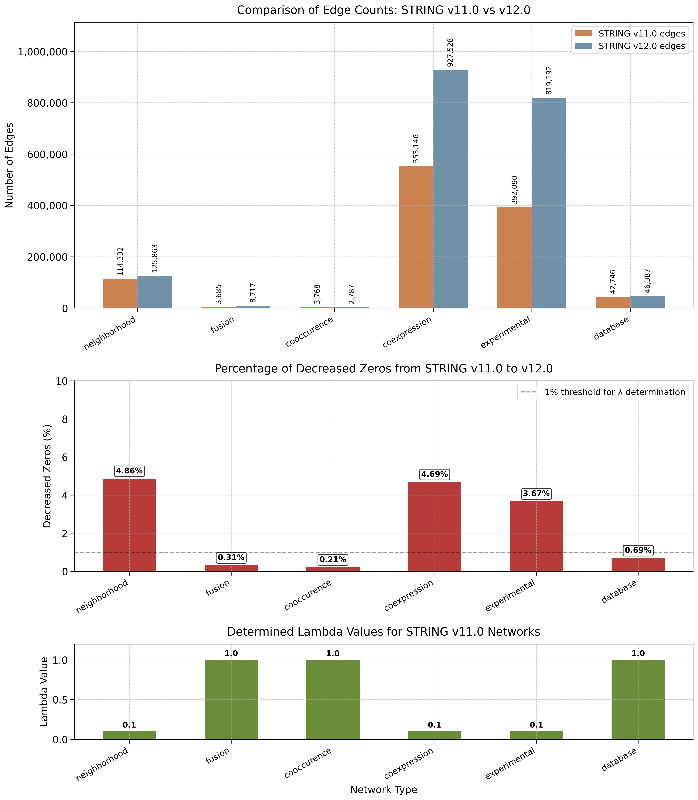

```python
(torchcell) michaelvolk@M1-MV torchcell % python /Users/michaelvolk/Documents/projects/torchcell/experiments/005-kuzmin2018-tmi/scripts/dango_lambda_determination_string11_0_to_string12_0.py
/Users/michaelvolk/opt/miniconda3/envs/torchcell/lib/python3.11/site-packages/torch_geometric/typing.py:68: UserWarning: An issue occurred while importing 'pyg-lib'. Disabling its usage. Stacktrace: dlopen(/Users/michaelvolk/opt/miniconda3/envs/torchcell/lib/python3.11/site-packages/libpyg.so, 0x0006): Library not loaded: /Library/Frameworks/Python.framework/Versions/3.11/Python
  Referenced from: <B4DF21CE-3AD4-3ED1-8E22-0F66900D55D2> /Users/michaelvolk/opt/miniconda3/envs/torchcell/lib/python3.11/site-packages/libpyg.so
  Reason: tried: '/Library/Frameworks/Python.framework/Versions/3.11/Python' (no such file), '/System/Volumes/Preboot/Cryptexes/OS/Library/Frameworks/Python.framework/Versions/3.11/Python' (no such file), '/Library/Frameworks/Python.framework/Versions/3.11/Python' (no such file)
  warnings.warn(f"An issue occurred while importing 'pyg-lib'. "
/Users/michaelvolk/opt/miniconda3/envs/torchcell/lib/python3.11/site-packages/torch_geometric/typing.py:124: UserWarning: An issue occurred while importing 'torch-sparse'. Disabling its usage. Stacktrace: dlopen(/Users/michaelvolk/opt/miniconda3/envs/torchcell/lib/python3.11/site-packages/libpyg.so, 0x0006): Library not loaded: /Library/Frameworks/Python.framework/Versions/3.11/Python
  Referenced from: <B4DF21CE-3AD4-3ED1-8E22-0F66900D55D2> /Users/michaelvolk/opt/miniconda3/envs/torchcell/lib/python3.11/site-packages/libpyg.so
  Reason: tried: '/Library/Frameworks/Python.framework/Versions/3.11/Python' (no such file), '/System/Volumes/Preboot/Cryptexes/OS/Library/Frameworks/Python.framework/Versions/3.11/Python' (no such file), '/Library/Frameworks/Python.framework/Versions/3.11/Python' (no such file)
  warnings.warn(f"An issue occurred while importing 'torch-sparse'. "
2025-05-10 22:53:42,712 - __main__ - INFO - Loading gene graphs...
/Users/michaelvolk/Documents/projects/torchcell/data/go/go.obo: fmt(1.2) rel(2024-11-03) 43,983 Terms
2025-05-10 22:53:45,083 - __main__ - INFO - Calculating zero decrease percentages...
2025-05-10 22:53:45,083 - __main__ - INFO - 
Analyzing neighborhood network...
2025-05-10 22:53:45,482 - __main__ - INFO - Network type: neighborhood
2025-05-10 22:53:45,482 - __main__ - INFO - Common nodes across versions: 1938
2025-05-10 22:53:45,482 - __main__ - INFO - Possible edges: 1876953
2025-05-10 22:53:45,482 - __main__ - INFO - Filtered edges in v11.0: 114332
2025-05-10 22:53:45,482 - __main__ - INFO - Filtered edges in v12.0: 125863
2025-05-10 22:53:45,482 - __main__ - INFO - New edges in v12.0: 85693
2025-05-10 22:53:45,482 - __main__ - INFO - Zero edges in v11.0: 1762621
2025-05-10 22:53:45,482 - __main__ - INFO - Percentage of decreased zeros: 4.8617%
2025-05-10 22:53:45,505 - __main__ - INFO - 
Analyzing fusion network...
2025-05-10 22:53:45,525 - __main__ - INFO - Network type: fusion
2025-05-10 22:53:45,525 - __main__ - INFO - Common nodes across versions: 2172
2025-05-10 22:53:45,525 - __main__ - INFO - Possible edges: 2357706
2025-05-10 22:53:45,525 - __main__ - INFO - Filtered edges in v11.0: 3685
2025-05-10 22:53:45,525 - __main__ - INFO - Filtered edges in v12.0: 8717
2025-05-10 22:53:45,525 - __main__ - INFO - New edges in v12.0: 7326
2025-05-10 22:53:45,525 - __main__ - INFO - Zero edges in v11.0: 2354021
2025-05-10 22:53:45,526 - __main__ - INFO - Percentage of decreased zeros: 0.3112%
2025-05-10 22:53:45,526 - __main__ - INFO - 
Analyzing cooccurence network...
2025-05-10 22:53:45,543 - __main__ - INFO - Network type: cooccurence
2025-05-10 22:53:45,543 - __main__ - INFO - Common nodes across versions: 1084
2025-05-10 22:53:45,543 - __main__ - INFO - Possible edges: 586986
2025-05-10 22:53:45,543 - __main__ - INFO - Filtered edges in v11.0: 3768
2025-05-10 22:53:45,543 - __main__ - INFO - Filtered edges in v12.0: 2787
2025-05-10 22:53:45,543 - __main__ - INFO - New edges in v12.0: 1212
2025-05-10 22:53:45,543 - __main__ - INFO - Zero edges in v11.0: 583218
2025-05-10 22:53:45,543 - __main__ - INFO - Percentage of decreased zeros: 0.2078%
2025-05-10 22:53:45,544 - __main__ - INFO - 
Analyzing coexpression network...
2025-05-10 22:53:46,990 - __main__ - INFO - Network type: coexpression
2025-05-10 22:53:46,990 - __main__ - INFO - Common nodes across versions: 5615
2025-05-10 22:53:46,990 - __main__ - INFO - Possible edges: 15761305
2025-05-10 22:53:46,990 - __main__ - INFO - Filtered edges in v11.0: 553146
2025-05-10 22:53:46,990 - __main__ - INFO - Filtered edges in v12.0: 927528
2025-05-10 22:53:46,990 - __main__ - INFO - New edges in v12.0: 713124
2025-05-10 22:53:46,990 - __main__ - INFO - Zero edges in v11.0: 15208159
2025-05-10 22:53:46,990 - __main__ - INFO - Percentage of decreased zeros: 4.6891%
2025-05-10 22:53:47,140 - __main__ - INFO - 
Analyzing experimental network...
2025-05-10 22:53:48,322 - __main__ - INFO - Network type: experimental
2025-05-10 22:53:48,322 - __main__ - INFO - Common nodes across versions: 5924
2025-05-10 22:53:48,322 - __main__ - INFO - Possible edges: 17543926
2025-05-10 22:53:48,322 - __main__ - INFO - Filtered edges in v11.0: 392090
2025-05-10 22:53:48,322 - __main__ - INFO - Filtered edges in v12.0: 819192
2025-05-10 22:53:48,322 - __main__ - INFO - New edges in v12.0: 629303
2025-05-10 22:53:48,322 - __main__ - INFO - Zero edges in v11.0: 17151836
2025-05-10 22:53:48,322 - __main__ - INFO - Percentage of decreased zeros: 3.6690%
2025-05-10 22:53:48,447 - __main__ - INFO - 
Analyzing database network...
2025-05-10 22:53:48,540 - __main__ - INFO - Network type: database
2025-05-10 22:53:48,540 - __main__ - INFO - Common nodes across versions: 2954
2025-05-10 22:53:48,540 - __main__ - INFO - Possible edges: 4361581
2025-05-10 22:53:48,540 - __main__ - INFO - Filtered edges in v11.0: 42746
2025-05-10 22:53:48,540 - __main__ - INFO - Filtered edges in v12.0: 46387
2025-05-10 22:53:48,540 - __main__ - INFO - New edges in v12.0: 30000
2025-05-10 22:53:48,540 - __main__ - INFO - Zero edges in v11.0: 4318835
2025-05-10 22:53:48,540 - __main__ - INFO - Percentage of decreased zeros: 0.6946%
2025-05-10 22:53:48,547 - __main__ - INFO - 
--- SUMMARY OF ZERO DECREASE PERCENTAGES ---
2025-05-10 22:53:48,547 - __main__ - INFO - neighborhood: 4.8617%
2025-05-10 22:53:48,547 - __main__ - INFO - fusion: 0.3112%
2025-05-10 22:53:48,547 - __main__ - INFO - cooccurence: 0.2078%
2025-05-10 22:53:48,547 - __main__ - INFO - coexpression: 4.6891%
2025-05-10 22:53:48,547 - __main__ - INFO - experimental: 3.6690%
2025-05-10 22:53:48,547 - __main__ - INFO - database: 0.6946%
2025-05-10 22:53:48,547 - __main__ - INFO - 
--- DETERMINED LAMBDA VALUES FOR STRING V11.0 ---
2025-05-10 22:53:48,547 - __main__ - INFO - string11_0_neighborhood: 0.1
2025-05-10 22:53:48,547 - __main__ - INFO - string11_0_fusion: 1.0
2025-05-10 22:53:48,547 - __main__ - INFO - string11_0_cooccurence: 1.0
2025-05-10 22:53:48,547 - __main__ - INFO - string11_0_coexpression: 0.1
2025-05-10 22:53:48,547 - __main__ - INFO - string11_0_experimental: 0.1
2025-05-10 22:53:48,547 - __main__ - INFO - string11_0_database: 1.0
2025-05-10 22:53:49,225 - __main__ - INFO - Plot saved to /Users/michaelvolk/Documents/projects/torchcell/notes/assets/images/string_v11.0_vs_v12.0_comparison_2025-05-10-22-53-48.png
2025-05-10 22:53:49,225 - __main__ - INFO - Generated plot at: /Users/michaelvolk/Documents/projects/torchcell/notes/assets/images/string_v11.0_vs_v12.0_comparison_2025-05-10-22-53-48.png
```


