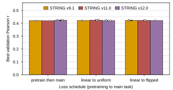
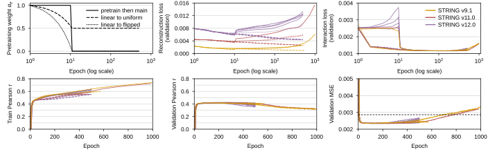

## 2026.09.03 - DANGO replication by STRING release, pulled from wandb

Script: `experiments/005-kuzmin2018-tmi/scripts/dango_string_version_sweep.py`. The results note
[[experiments.005-kuzmin2018-tmi.results]] recorded the STRING 9.1 / 11.0 / 12.0 sweep by reading
values off wandb charts. This script pulls every run of `zhao-group/torchcell_005-kuzmin2018-tmi_dango`
through the API, keeps runs with at least 100 logged epochs (drops the one 9-epoch smoke test), and
records per run the maximum over epochs of `val/gene_interaction/Pearson` (the checkpoint-selection
rule; an upward-biased order statistic, so epochs logged sit next to it). Outputs:

- `experiments/005-kuzmin2018-tmi/results/dango_string_version_sweep.csv` (19 runs) and
  `dango_string_version_summary.csv` (mean, SD, SEM per release x schedule)
- `paper/nature-biotech/sections/tab-dango-string-versions.tex`
- the panel below; `--from-csv` re-renders offline from the frozen run table.

Measured: best validation Pearson across the 19 runs spans 0.415 to 0.427; per release x schedule
means are 0.419 to 0.424 with SEM at most 0.003 where n > 1. No release or schedule separates from
the others beyond the run-to-run spread. These are validation maxima, not the test-split baseline of
the main text.

## 2026.09.03 - Training curves, train Pearson at the selected epoch, and a fresh pull

Re-pulled for the Supplementary Note `note:dango-repro` (figure composed by
[[experiments.005-kuzmin2018-tmi.scripts.compose_dango_si_figures]]). The project holds 21 runs; the
two dropped are smoke tests of 9 and 6 epochs (`2yq5dedk`, `ikh3sj5f`), so the 19 kept runs and their
best-validation values are unchanged from the first pull. Additions:

- `results/dango_string_version_curves.csv` freezes the per-epoch history of every kept run (train and
  validation Pearson and MSE, validation reconstruction and interaction loss, `alpha`, learning rate;
  10,514 run-epochs). The trainer never called `trainer.test`, so no test-split metric exists for
  these runs.
- The run table gains `train_pearson_at_best` (training Pearson at the epoch of the validation
  maximum), `final_train_pearson`, `params_total` (3,138,270 in every run, consistent with the
  6,607-gene vocabulary: `454 N + 138,692`), batch size and learning rate; the LaTeX table gains the
  train-at-best column.
- The curves panel below (full width): train (left) and validation (right) Pearson per epoch, color
  by release, line style by schedule.

Measured: training Pearson at the selected epoch spans 0.488 to 0.553; validation Pearson reaches 0.4
within the first 50 epochs, peaks between epochs 106 and 439, and then declines, most steeply for
pretrain-then-main, to 0.32 at epoch 1,000 in the two runs that went that far (`ytkjmgvs`, `g34rn9ti`),
while training Pearson keeps rising to 0.55 to 0.74 at the last logged epoch. The plateau is therefore a
generalization limit rather than a failure to optimize.

Found while writing the note: `dango.py` takes `lambda_values` from `determine_lambda_values()`, whose
keys are `string9_1_<channel>`, and `DangoLoss.compute_reconstruction_loss` looks each run's edge type
up with `.get(edge_type, 1.0)`. The v11.0 and v12.0 runs therefore trained with `lambda_k = 1.0` for
every channel, not with the 0.1/1.0 assignment; only the v9.1 runs used it (code as of commit
`af2406523`, the version the runs were launched from). Whether this matters is not measured.

## 2026.09.03 - Table caption carries the run hyperparameters

The `tab-dango-string-versions` caption now states the optimizer (AdamW, learning rate 1e-5, weight decay
1e-6, batch 32), hidden width 64, four attention heads, and the 72,841 / 9,105 / 9,104 split, which left
the Note prose during the SI reconciliation. Regenerated with `--from-csv`; every value in the table is
unchanged.

## 2026.09.04 - Panels re-lettered; the frozen run table feeds the full-dataset data-effect panel

No change to the script or its outputs. In `FigS-dango-reproduction` the sweep panel is now (d)
and the curves panel (e), after the STRING-release panel (a) and the schematic (b).
`experiments/010-kuzmin-tmi/scripts/dango_full_dataset_si.py` reads
`results/dango_string_version_sweep.csv` (19 runs) for its data-effect panel, pooling the three
schedules per release: v9.1 n = 4, mean 0.4216 +/- 0.0009 (SEM); v11.0 n = 5, 0.4225 +/- 0.0013;
v12.0 n = 10, 0.4213 +/- 0.0011 ([[experiments.010-kuzmin-tmi.scripts.dango_full_dataset_si]]).
