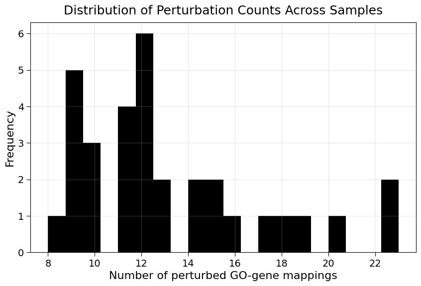
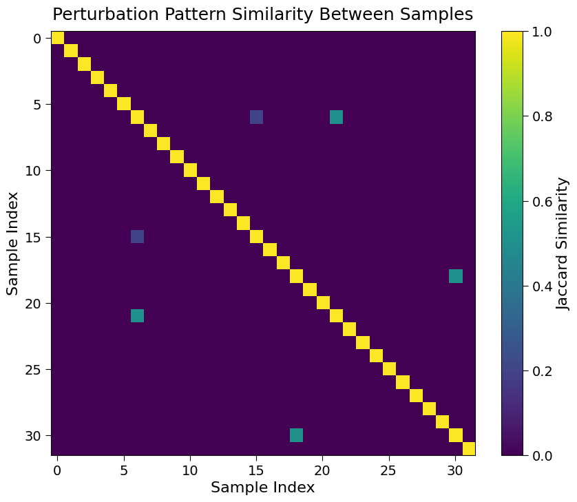

```python
michaelvolk@M1-MV torchcell % /Users/michaelvolk/opt/miniconda3/envs/torchcell/bin/python /Users/michaelvolk/Documen
ts/projects/torchcell/experiments/005-kuzmin2018-tmi/scripts/dcell_batch_005_verify_mutant_state.py
/Users/michaelvolk/opt/miniconda3/envs/torchcell/lib/python3.11/site-packages/torch_geometric/typing.py:68: UserWarning: An issue occurred while importing 'pyg-lib'. Disabling its usage. Stacktrace: dlopen(/Users/michaelvolk/opt/miniconda3/envs/torchcell/lib/python3.11/site-packages/libpyg.so, 0x0006): Library not loaded: /Library/Frameworks/Python.framework/Versions/3.11/Python
  Referenced from: <B4DF21CE-3AD4-3ED1-8E22-0F66900D55D2> /Users/michaelvolk/opt/miniconda3/envs/torchcell/lib/python3.11/site-packages/libpyg.so
  Reason: tried: '/Library/Frameworks/Python.framework/Versions/3.11/Python' (no such file), '/System/Volumes/Preboot/Cryptexes/OS/Library/Frameworks/Python.framework/Versions/3.11/Python' (no such file), '/Library/Frameworks/Python.framework/Versions/3.11/Python' (no such file)
  warnings.warn(f"An issue occurred while importing 'pyg-lib'. "
/Users/michaelvolk/opt/miniconda3/envs/torchcell/lib/python3.11/site-packages/torch_geometric/typing.py:124: UserWarning: An issue occurred while importing 'torch-sparse'. Disabling its usage. Stacktrace: dlopen(/Users/michaelvolk/opt/miniconda3/envs/torchcell/lib/python3.11/site-packages/libpyg.so, 0x0006): Library not loaded: /Library/Frameworks/Python.framework/Versions/3.11/Python
  Referenced from: <B4DF21CE-3AD4-3ED1-8E22-0F66900D55D2> /Users/michaelvolk/opt/miniconda3/envs/torchcell/lib/python3.11/site-packages/libpyg.so
  Reason: tried: '/Library/Frameworks/Python.framework/Versions/3.11/Python' (no such file), '/System/Volumes/Preboot/Cryptexes/OS/Library/Frameworks/Python.framework/Versions/3.11/Python' (no such file), '/Library/Frameworks/Python.framework/Versions/3.11/Python' (no such file)
  warnings.warn(f"An issue occurred while importing 'torch-sparse'. "
<frozen importlib._bootstrap>:241: DeprecationWarning: builtin type SwigPyPacked has no __module__ attribute
<frozen importlib._bootstrap>:241: DeprecationWarning: builtin type SwigPyObject has no __module__ attribute
Loading DCell batch with size 32...
DATA_ROOT: /Users/michaelvolk/Documents/projects/torchcell
/Users/michaelvolk/Documents/projects/torchcell/data/go/go.obo: fmt(1.2) rel(2024-11-03) 43,983 Terms
INFO:torchcell.graph.graph:Nodes annotated after 2017-07-19 removed: 2435
After date filter: 3439
INFO:torchcell.graph.graph:IGI nodes removed: 160
After IGI filter: 3279
INFO:torchcell.graph.graph:Redundant nodes removed: 15
After redundant filter: 3264
INFO:torchcell.graph.graph:Nodes with < 2 contained genes removed: 1022
After containment filter: 2242

Normalization parameters for gene_interaction:
  mean: -0.048011
  std: 0.053502
  min: -1.081600
  max: 0.000000
  q25: -0.061951
  q75: -0.015263
  strategy: standard
INFO:torchcell.datamodules.cell:Loading index from /Users/michaelvolk/Documents/projects/torchcell/data/torchcell/experiments/005-kuzmin2018-tmi/001-small-build/data_module_cache/index_seed_42.json
INFO:torchcell.datamodules.cell:Loading index details from /Users/michaelvolk/Documents/projects/torchcell/data/torchcell/experiments/005-kuzmin2018-tmi/001-small-build/data_module_cache/index_details_seed_42.json
Setting up PerturbationSubsetDataModule...
Loading cached index files...
Creating subset datasets...
Setup complete.
  0%|                                                                                      | 0/1251 [00:00<?, ?it/s]/Users/michaelvolk/opt/miniconda3/envs/torchcell/lib/python3.11/site-packages/torch_geometric/typing.py:68: UserWarning: An issue occurred while importing 'pyg-lib'. Disabling its usage. Stacktrace: dlopen(/Users/michaelvolk/opt/miniconda3/envs/torchcell/lib/python3.11/site-packages/libpyg.so, 0x0006): Library not loaded: /Library/Frameworks/Python.framework/Versions/3.11/Python
  Referenced from: <B4DF21CE-3AD4-3ED1-8E22-0F66900D55D2> /Users/michaelvolk/opt/miniconda3/envs/torchcell/lib/python3.11/site-packages/libpyg.so
  Reason: tried: '/Library/Frameworks/Python.framework/Versions/3.11/Python' (no such file), '/System/Volumes/Preboot/Cryptexes/OS/Library/Frameworks/Python.framework/Versions/3.11/Python' (no such file), '/Library/Frameworks/Python.framework/Versions/3.11/Python' (no such file)
  warnings.warn(f"An issue occurred while importing 'pyg-lib'. "
/Users/michaelvolk/opt/miniconda3/envs/torchcell/lib/python3.11/site-packages/torch_geometric/typing.py:124: UserWarning: An issue occurred while importing 'torch-sparse'. Disabling its usage. Stacktrace: dlopen(/Users/michaelvolk/opt/miniconda3/envs/torchcell/lib/python3.11/site-packages/libpyg.so, 0x0006): Library not loaded: /Library/Frameworks/Python.framework/Versions/3.11/Python
  Referenced from: <B4DF21CE-3AD4-3ED1-8E22-0F66900D55D2> /Users/michaelvolk/opt/miniconda3/envs/torchcell/lib/python3.11/site-packages/libpyg.so
  Reason: tried: '/Library/Frameworks/Python.framework/Versions/3.11/Python' (no such file), '/System/Volumes/Preboot/Cryptexes/OS/Library/Frameworks/Python.framework/Versions/3.11/Python' (no such file), '/Library/Frameworks/Python.framework/Versions/3.11/Python' (no such file)
  warnings.warn(f"An issue occurred while importing 'torch-sparse'. "
<frozen importlib._bootstrap>:241: DeprecationWarning: builtin type SwigPyPacked has no __module__ attribute
<frozen importlib._bootstrap>:241: DeprecationWarning: builtin type SwigPyObject has no __module__ attribute
/Users/michaelvolk/opt/miniconda3/envs/torchcell/lib/python3.11/site-packages/torch_geometric/typing.py:68: UserWarning: An issue occurred while importing 'pyg-lib'. Disabling its usage. Stacktrace: dlopen(/Users/michaelvolk/opt/miniconda3/envs/torchcell/lib/python3.11/site-packages/libpyg.so, 0x0006): Library not loaded: /Library/Frameworks/Python.framework/Versions/3.11/Python
  Referenced from: <B4DF21CE-3AD4-3ED1-8E22-0F66900D55D2> /Users/michaelvolk/opt/miniconda3/envs/torchcell/lib/python3.11/site-packages/libpyg.so
  Reason: tried: '/Library/Frameworks/Python.framework/Versions/3.11/Python' (no such file), '/System/Volumes/Preboot/Cryptexes/OS/Library/Frameworks/Python.framework/Versions/3.11/Python' (no such file), '/Library/Frameworks/Python.framework/Versions/3.11/Python' (no such file)
  warnings.warn(f"An issue occurred while importing 'pyg-lib'. "
/Users/michaelvolk/opt/miniconda3/envs/torchcell/lib/python3.11/site-packages/torch_geometric/typing.py:124: UserWarning: An issue occurred while importing 'torch-sparse'. Disabling its usage. Stacktrace: dlopen(/Users/michaelvolk/opt/miniconda3/envs/torchcell/lib/python3.11/site-packages/libpyg.so, 0x0006): Library not loaded: /Library/Frameworks/Python.framework/Versions/3.11/Python
  Referenced from: <B4DF21CE-3AD4-3ED1-8E22-0F66900D55D2> /Users/michaelvolk/opt/miniconda3/envs/torchcell/lib/python3.11/site-packages/libpyg.so
  Reason: tried: '/Library/Frameworks/Python.framework/Versions/3.11/Python' (no such file), '/System/Volumes/Preboot/Cryptexes/OS/Library/Frameworks/Python.framework/Versions/3.11/Python' (no such file), '/Library/Frameworks/Python.framework/Versions/3.11/Python' (no such file)
  warnings.warn(f"An issue occurred while importing 'torch-sparse'. "
<frozen importlib._bootstrap>:241: DeprecationWarning: builtin type SwigPyPacked has no __module__ attribute
<frozen importlib._bootstrap>:241: DeprecationWarning: builtin type SwigPyObject has no __module__ attribute
/Users/michaelvolk/opt/miniconda3/envs/torchcell/lib/python3.11/site-packages/torch_geometric/typing.py:68: UserWarning: An issue occurred while importing 'pyg-lib'. Disabling its usage. Stacktrace: dlopen(/Users/michaelvolk/opt/miniconda3/envs/torchcell/lib/python3.11/site-packages/libpyg.so, 0x0006): Library not loaded: /Library/Frameworks/Python.framework/Versions/3.11/Python
  Referenced from: <B4DF21CE-3AD4-3ED1-8E22-0F66900D55D2> /Users/michaelvolk/opt/miniconda3/envs/torchcell/lib/python3.11/site-packages/libpyg.so
  Reason: tried: '/Library/Frameworks/Python.framework/Versions/3.11/Python' (no such file), '/System/Volumes/Preboot/Cryptexes/OS/Library/Frameworks/Python.framework/Versions/3.11/Python' (no such file), '/Library/Frameworks/Python.framework/Versions/3.11/Python' (no such file)
  warnings.warn(f"An issue occurred while importing 'pyg-lib'. "
/Users/michaelvolk/opt/miniconda3/envs/torchcell/lib/python3.11/site-packages/torch_geometric/typing.py:124: UserWarning: An issue occurred while importing 'torch-sparse'. Disabling its usage. Stacktrace: dlopen(/Users/michaelvolk/opt/miniconda3/envs/torchcell/lib/python3.11/site-packages/libpyg.so, 0x0006): Library not loaded: /Library/Frameworks/Python.framework/Versions/3.11/Python
  Referenced from: <B4DF21CE-3AD4-3ED1-8E22-0F66900D55D2> /Users/michaelvolk/opt/miniconda3/envs/torchcell/lib/python3.11/site-packages/libpyg.so
  Reason: tried: '/Library/Frameworks/Python.framework/Versions/3.11/Python' (no such file), '/System/Volumes/Preboot/Cryptexes/OS/Library/Frameworks/Python.framework/Versions/3.11/Python' (no such file), '/Library/Frameworks/Python.framework/Versions/3.11/Python' (no such file)
  warnings.warn(f"An issue occurred while importing 'torch-sparse'. "
<frozen importlib._bootstrap>:241: DeprecationWarning: builtin type SwigPyPacked has no __module__ attribute
<frozen importlib._bootstrap>:241: DeprecationWarning: builtin type SwigPyObject has no __module__ attribute
/Users/michaelvolk/opt/miniconda3/envs/torchcell/lib/python3.11/site-packages/torch_geometric/typing.py:68: UserWarning: An issue occurred while importing 'pyg-lib'. Disabling its usage. Stacktrace: dlopen(/Users/michaelvolk/opt/miniconda3/envs/torchcell/lib/python3.11/site-packages/libpyg.so, 0x0006): Library not loaded: /Library/Frameworks/Python.framework/Versions/3.11/Python
  Referenced from: <B4DF21CE-3AD4-3ED1-8E22-0F66900D55D2> /Users/michaelvolk/opt/miniconda3/envs/torchcell/lib/python3.11/site-packages/libpyg.so
  Reason: tried: '/Library/Frameworks/Python.framework/Versions/3.11/Python' (no such file), '/System/Volumes/Preboot/Cryptexes/OS/Library/Frameworks/Python.framework/Versions/3.11/Python' (no such file), '/Library/Frameworks/Python.framework/Versions/3.11/Python' (no such file)
  warnings.warn(f"An issue occurred while importing 'pyg-lib'. "
/Users/michaelvolk/opt/miniconda3/envs/torchcell/lib/python3.11/site-packages/torch_geometric/typing.py:124: UserWarning: An issue occurred while importing 'torch-sparse'. Disabling its usage. Stacktrace: dlopen(/Users/michaelvolk/opt/miniconda3/envs/torchcell/lib/python3.11/site-packages/libpyg.so, 0x0006): Library not loaded: /Library/Frameworks/Python.framework/Versions/3.11/Python
  Referenced from: <B4DF21CE-3AD4-3ED1-8E22-0F66900D55D2> /Users/michaelvolk/opt/miniconda3/envs/torchcell/lib/python3.11/site-packages/libpyg.so
  Reason: tried: '/Library/Frameworks/Python.framework/Versions/3.11/Python' (no such file), '/System/Volumes/Preboot/Cryptexes/OS/Library/Frameworks/Python.framework/Versions/3.11/Python' (no such file), '/Library/Frameworks/Python.framework/Versions/3.11/Python' (no such file)
  warnings.warn(f"An issue occurred while importing 'torch-sparse'. "
<frozen importlib._bootstrap>:241: DeprecationWarning: builtin type SwigPyPacked has no __module__ attribute
<frozen importlib._bootstrap>:241: DeprecationWarning: builtin type SwigPyObject has no __module__ attribute
  0%|                                                                                      | 0/1251 [00:21<?, ?it/s]
Batch size: 32
Shape of mutant_state tensor: torch.Size([796480, 3])

Verifying unique perturbations across samples:
Number of unique samples in batch: 32

Sample 0:
  Total GO-gene mappings: 24890
  Perturbed genes (state=0): 11
  Unique perturbed genes: 3
  Perturbed gene indices: [861.0, 4546.0, 6502.0]

Sample 1:
  Total GO-gene mappings: 24890
  Perturbed genes (state=0): 13
  Unique perturbed genes: 3
  Perturbed gene indices: [1247.0, 1930.0, 3740.0]

Sample 2:
  Total GO-gene mappings: 24890
  Perturbed genes (state=0): 9
  Unique perturbed genes: 3
  Perturbed gene indices: [1444.0, 2832.0, 3408.0]

Sample 3:
  Total GO-gene mappings: 24890
  Perturbed genes (state=0): 10
  Unique perturbed genes: 3
  Perturbed gene indices: [2324.0, 4923.0, 6361.0]

Sample 4:
  Total GO-gene mappings: 24890
  Perturbed genes (state=0): 10
  Unique perturbed genes: 3
  Perturbed gene indices: [769.0, 1117.0, 2171.0]

Sample 5:
  Total GO-gene mappings: 24890
  Perturbed genes (state=0): 18
  Unique perturbed genes: 3
  Perturbed gene indices: [1368.0, 1863.0, 2730.0]

Sample 6:
  Total GO-gene mappings: 24890
  Perturbed genes (state=0): 12
  Unique perturbed genes: 3
  Perturbed gene indices: [4361.0, 4726.0, 5206.0]

Sample 7:
  Total GO-gene mappings: 24890
  Perturbed genes (state=0): 9
  Unique perturbed genes: 3
  Perturbed gene indices: [494.0, 4186.0, 4893.0]

Sample 8:
  Total GO-gene mappings: 24890
  Perturbed genes (state=0): 8
  Unique perturbed genes: 2
  Perturbed gene indices: [2872.0, 6487.0]

Sample 9:
  Total GO-gene mappings: 24890
  Perturbed genes (state=0): 20
  Unique perturbed genes: 3
  Perturbed gene indices: [1831.0, 2040.0, 5400.0]

Sample 10:
  Total GO-gene mappings: 24890
  Perturbed genes (state=0): 12
  Unique perturbed genes: 3
  Perturbed gene indices: [569.0, 3515.0, 6344.0]

Sample 11:
  Total GO-gene mappings: 24890
  Perturbed genes (state=0): 10
  Unique perturbed genes: 3
  Perturbed gene indices: [2560.0, 2851.0, 4456.0]

Sample 12:
  Total GO-gene mappings: 24890
  Perturbed genes (state=0): 12
  Unique perturbed genes: 3
  Perturbed gene indices: [2923.0, 4054.0, 4424.0]

Sample 13:
  Total GO-gene mappings: 24890
  Perturbed genes (state=0): 11
  Unique perturbed genes: 3
  Perturbed gene indices: [3305.0, 4108.0, 5696.0]

Sample 14:
  Total GO-gene mappings: 24890
  Perturbed genes (state=0): 9
  Unique perturbed genes: 3
  Perturbed gene indices: [1373.0, 4373.0, 5931.0]

Sample 15:
  Total GO-gene mappings: 24890
  Perturbed genes (state=0): 12
  Unique perturbed genes: 3
  Perturbed gene indices: [845.0, 991.0, 5206.0]

Sample 16:
  Total GO-gene mappings: 24890
  Perturbed genes (state=0): 16
  Unique perturbed genes: 3
  Perturbed gene indices: [2705.0, 5871.0, 6522.0]

Sample 17:
  Total GO-gene mappings: 24890
  Perturbed genes (state=0): 12
  Unique perturbed genes: 3
  Perturbed gene indices: [2169.0, 6246.0, 6550.0]

Sample 18:
  Total GO-gene mappings: 24890
  Perturbed genes (state=0): 23
  Unique perturbed genes: 3
  Perturbed gene indices: [1910.0, 4742.0, 5799.0]

Sample 19:
  Total GO-gene mappings: 24890
  Perturbed genes (state=0): 13
  Unique perturbed genes: 3
  Perturbed gene indices: [3096.0, 4267.0, 5226.0]

Sample 20:
  Total GO-gene mappings: 24890
  Perturbed genes (state=0): 12
  Unique perturbed genes: 3
  Perturbed gene indices: [91.0, 5797.0, 6600.0]

Sample 21:
  Total GO-gene mappings: 24890
  Perturbed genes (state=0): 14
  Unique perturbed genes: 3
  Perturbed gene indices: [1957.0, 4361.0, 4726.0]

Sample 22:
  Total GO-gene mappings: 24890
  Perturbed genes (state=0): 23
  Unique perturbed genes: 3
  Perturbed gene indices: [751.0, 2652.0, 4573.0]

Sample 23:
  Total GO-gene mappings: 24890
  Perturbed genes (state=0): 14
  Unique perturbed genes: 3
  Perturbed gene indices: [190.0, 3159.0, 4029.0]

Sample 24:
  Total GO-gene mappings: 24890
  Perturbed genes (state=0): 15
  Unique perturbed genes: 3
  Perturbed gene indices: [2769.0, 3008.0, 3423.0]

Sample 25:
  Total GO-gene mappings: 24890
  Perturbed genes (state=0): 11
  Unique perturbed genes: 3
  Perturbed gene indices: [4115.0, 4963.0, 5195.0]

Sample 26:
  Total GO-gene mappings: 24890
  Perturbed genes (state=0): 15
  Unique perturbed genes: 3
  Perturbed gene indices: [2869.0, 4607.0, 5556.0]

Sample 27:
  Total GO-gene mappings: 24890
  Perturbed genes (state=0): 17
  Unique perturbed genes: 3
  Perturbed gene indices: [1273.0, 3705.0, 5826.0]

Sample 28:
  Total GO-gene mappings: 24890
  Perturbed genes (state=0): 11
  Unique perturbed genes: 3
  Perturbed gene indices: [756.0, 3354.0, 5618.0]

Sample 29:
  Total GO-gene mappings: 24890
  Perturbed genes (state=0): 9
  Unique perturbed genes: 3
  Perturbed gene indices: [1099.0, 3993.0, 4193.0]

Sample 30:
  Total GO-gene mappings: 24890
  Perturbed genes (state=0): 19
  Unique perturbed genes: 3
  Perturbed gene indices: [1235.0, 1910.0, 4742.0]

Sample 31:
  Total GO-gene mappings: 24890
  Perturbed genes (state=0): 9
  Unique perturbed genes: 3
  Perturbed gene indices: [2684.0, 3858.0, 4995.0]

Number of unique perturbation patterns: 32
All samples have unique perturbation patterns: True
Saved perturbation distribution to /Users/michaelvolk/Documents/projects/torchcell/notes/assets/images/dcell_batch_005_perturbation_distribution_2025-05-10-23-10-28.png
Saved perturbation similarity matrix to /Users/michaelvolk/Documents/projects/torchcell/notes/assets/images/dcell_batch_005_perturbation_similarity_2025-05-10-23-10-28.png

Summary Statistics:
Samples with no perturbations: 0
Min genes perturbed: 2
Max genes perturbed: 3
Mean genes perturbed: 2.97
Max similarity between different samples: 0.5000
Mean similarity between different samples: 0.0024
```




