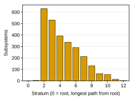
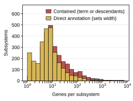
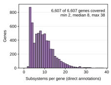
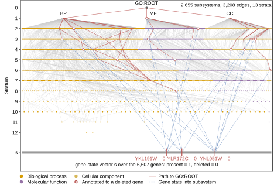

## 2026.09.03 - Measured GO DAG of the DCell baseline

Source for Supplementary Note `note:dcell-model` (`paper/nature-biotech/sections/si-note-dcell-model.tex`), `tab-dcell-model-go-filter.tex`, and panels b-d of `FigS-dcell-model`. The script rebuilds the filtered GO DAG exactly as `experiments/006-kuzmin-tmi/scripts/dcell.py` does for the trigenic DCell run (no `go_date_filter`, `go_min_genes` default 4, `subsystem_output_min` 20, `subsystem_output_max_mult` 0.3), from the cached `SCerevisiaeGraph.G_go` (`$DATA_ROOT/data/sgd/genome/graph/G_go.pkl`, built from SGD `go_details` over the 6,607-gene reference and `$DATA_ROOT/data/go/go.obo`, release 2025-03-16). Filter order: `filter_go_IGI` -> `filter_redundant_terms` -> `filter_by_contained_genes(n=4)`. Strata come from `torchcell.data.cell_data.compute_strata`, the same function the cell graph uses.

Frozen outputs under `experiments/006-kuzmin-tmi/results/dcell_model/`: `go_filter_stages.csv`, `go_terms_final.csv`, `go_strata.csv`, `go_genes_final.csv`, `go_evidence_codes.csv`, `dcell_model_size.csv`, and the wandb freeze `dcell_wandb_model_size.csv` (`model/*` summary fields of every run in `zhao-group/torchcell_006-kuzmin-tmi_dcell` and `zhao-group/torchcell_005-kuzmin2018-tmi_dcell`). `--from-csv` re-renders panels and table without touching the graph or wandb.

Measured (run 2026.09.03 on the M1, `go_filter_stages.csv` and `dcell_model_size.csv`):

| stage | terms | edges | annotations | genes covered | leaves |
|---|---|---|---|---|---|
| raw (three namespaces under GO:ROOT) | 5,660 | 6,674 | 66,404 | 6,607 | 3,826 |
| drop IGI annotations (119 terms emptied) | 5,541 | 6,540 | 64,483 | 6,607 | 3,763 |
| drop redundant terms (106) | 5,435 | 6,433 | 64,324 | 6,607 | 3,763 |
| contained genes >= 4 (2,780 terms dropped; the run) | 2,655 | 3,208 | 59,986 | 6,607 | 1,527 |
| reference only: date <= 2017-07-19, then the same filters | 1,408 | 1,714 | 22,978 | 6,409 | 911 |

- Final DAG: 2,655 subsystems, 3,208 edges, 13 strata (stratum 0 = GO:ROOT, 1 = the three namespace roots, 2 = 630 terms, ..., 12 = 2 terms), 1,527 leaves, 59,986 annotations (the `59986 rows` the model docstring mentions), annotation dates 2000-12-07 to 2023-10-04.
- Evidence codes retained: IEA 26,609; IBA 8,434; IDA 7,491; IMP 5,939; ND 5,487; HDA 4,108; IPI 711; RCA 517; IC 207; ISS 151; TAS 124; HMP 63; ISA 60; NAS 37; ISM 21; IEP 13; HGI 13; ISO 1. All 5,487 ND annotations sit on the three namespace roots; 675 genes are in the DAG only through them. Every gene is in at least 2 subsystems (median 8, max 38).
- Widths: direct-annotation median 6 (contained median 10), max 2,444 direct genes on `molecular_function` (width 734); width floor 20; 61,429 hidden units in total (paper: 97,181 over 2,526 subsystems).
- Parameters implied by the DAG with the `DCell` sizing rules: 20,548,953 (subsystems) + 64,084 (heads) = 20,613,037. This equals `model/params_total` logged by all 15 DCell runs that reached model construction (e.g. `dttu9dx2`, `c7248f86` in 006; `4ipeq1qh` in 005), so the rebuilt DAG is the trained one.
- Deviations from Ma et al. 2018 recorded in the note: IGI removal acts on annotations not terms; redundancy is judged against a parent's gene set; containment threshold 4 over the whole reference (paper: 6 over disrupted genes); no date cutoff; width from direct annotations rather than contained genes; BatchNorm before tanh; auxiliary losses averaged rather than summed; AdamW weight decay instead of a cross-validated L2 penalty.

## 2026.09.03 - The whole DAG as a panel, and the frozen edges and annotations

Author review asked for a real rendering of the filtered ontology in place of the toy seven-term sketch in `FigS-dcell-model` panel a. Changes:

- `load_raw_go()` / `filter_dag()` are factored out of `build_and_measure()`, and a new `--dag-only` mode rebuilds the DAG without the wandb pull, checks that the node set, strata, and edge count equal the frozen `go_terms_final.csv` (it did: 2,655 terms, 3,208 edges, 13 strata), and freezes two new result files: `go_edges_final.csv` (child, parent; 3,208 rows) and `go_annotations_final.csv` (term, gene; 59,986 rows). A full run writes them too. `--from-csv` then renders every panel offline.
- New panel `dcell_model_go_dag` (`wide` width, 118.9 x 69 mm): `layout_dag()` places strata as rows (root at the top) and orders terms within a stratum by the mean x of their parents (every parent is in a shallower stratum, since strata are longest-path depths from `GO:ROOT`); strata with 40+ terms are spread evenly in that order, smaller ones keep the barycenter x pushed apart to a minimum gap. Nodes are colored by namespace (BP orange, MF purple, CC yellow, root gray), edges are 0.12 pt gray. The bottom row is the gene-state vector `s` over the 6,607 genes.
- The highlighted perturbation is a triple deletion chosen by rule (`example_triple()`): among genes annotated to exactly the median number of subsystems (8), sorted by systematic name, the first, middle, and last: `Q0140`, `YJL171C`, `YPR204W`. Dashed red lines carry their zeroed states into the subsystems that annotate them (open red circles); solid red marks every hierarchy edge from those subsystems up to the root. Red is reserved for the perturbation across the figure, which is why MF is purple rather than red.
- Namespace counts in the final DAG: BP 1,490, MF 674, CC 490, plus `GO:ROOT`.

## 2026.09.04 - Second author review: a real strain, labels above the roots, blue feeds

Author review of `FigS-dcell-model` panel a (three points):

- The drawn triple was `Q0140`, a mitochondrially encoded gene never deleted in the screens. The example is now a REAL Kuzmin 2018 record, picked by rule from the local experiment-005 build (`$DATA_ROOT/data/torchcell/experiments/005-kuzmin2018-tmi/001-small-build/processed/lmdb`, 91,050 records): `pick_example_triple()` walks the LMDB keys `"0"` .. `"91049"` in ascending order and takes the first record whose three perturbations are all `deletion` (no allele or ts-allele, so every gene is a nuclear deletion target) and whose genes each carry 5 to 12 direct annotations in the final DAG. Result: record 4, `YKL191W` (dph2, 5 annotations), `YLR172C` (dph5, 5), `YNL051W` (cog5, 9); measured interaction -0.0042 (p = 0.35). Frozen to `results/dcell_model/example_triple.csv` (record index, genes, perturbation types, annotation counts, the rule), read by `render()`, so `--from-csv` needs no LMDB; `--pick-triple` re-picks, and the full and `--dag-only` runs re-pick too.
- `BP`, `MF`, `CC` and `GO:ROOT` labels sit above their node on a white box (`bbox`, zorder above the edges); the MF label steps right of the vertical MF-to-root edge so nothing crosses it.
- The dashed "gene state into subsystem" lines are palette blue (`PLOT_PALETTE[4]`, `#6C8EBF`) so they read apart from the solid red paths to the root; the legend follows. Gene labels under the strain row are staggered by rule (`LABEL_W = 0.115` of the axis): a label whose right neighbor is closer than a label width is right-aligned at its tick, the neighbor left-aligned.

`--from-csv` re-rendered all four panels; every CSV other than the new `example_triple.csv` is unchanged.

## 2026.09.05 - Third author review: the published ontology, quoted, against the rebuild

Author review asked for a direct comparison with the published DCell ontology, every published number quoted from the paper. The DCell paper was pulled over `tc-lit` (`/lit-pull`, mirror key `maUsingDeepLearning2018`): `paper.md` (MinerU OCR of the paper and its Online Methods, 57,903 bytes, sha256 `ac837bc358ea4969a72789e66e31380bfdcbd7b8aea98dec47b108ee21d2070c`, verified against the manifest header) and `si/si1.md` (the three Supplementary Figure captions, sha256 `cea6bb15e067c4b018a25b3b17d96ec8d2b2905fce1bdb65bdf1c8a6c0dc6831`; nothing about the ontology). Note: the worktree's `.env` carried a stale `TC_LIT_API_KEY` (401); the primary checkout's key works.

- `PUBLISHED` is a list of pydantic `PublishedValue` records (row, table cell, verbatim quote, section) with `PAPER_MD_SHA256` beside it; `torchcell_values()` reads the same quantities off the frozen CSVs (`go_filter_stages.csv`, `go_terms_final.csv`, `go_strata.csv`, `go_genes_final.csv`, `go_edges_final.csv`, `dcell_model_size.csv`) and cross-checks them against each other; `write_vs_paper_table()` freezes `results/dcell_model/dcell_vs_paper.csv` and writes `paper/nature-biotech/sections/tab-dcell-model-vs-paper.tex`, whose `%% SOURCE:` header carries every quote. Rows: GO release, annotation source, genes, evidence filter, redundancy filter, containment threshold, filter order, removed-term rewiring, subsystems, hierarchy edges, depth, leaves, width rule, root readout, hidden units, parameters, auxiliary loss, training data.
- What the paper states (verbatim in the table header): "2,526 subsystems"; "The depth of both networks is 12 layers"; "the VNN embedded in GO includes 97,181 neurons"; neurons "ranging from 20 to 1,075 per system"; the three filters (IGI terms; "fewer than six yeast genes disrupted in the available genotypes", containment = term or descendants; terms "redundant with respect to their children"), listed in the order IGI, containment, redundancy; removed terms rewired children to all parents; width `max(20, ceil(0.3 * number of genes contained by t))`; loss `alpha (= 0.3)` summed over `t != r` plus `lambda ||W||_2` by four-fold CV; training on Costanzo 2010 (~3 M) or 2016 (~8 M). Not reported: the GO release (only ref. 9, GO Consortium 2016), the annotation source, the gene count, hierarchy edges, leaves, root width, parameters.
- Measured on the rebuild: 2,655 subsystems, 3,208 edges, 13 strata, 1,527 leaves, 61,429 hidden units (20 to 734; 2,521 subsystems at the floor of 20; `GO:ROOT` has 0 direct genes so `L = 20`), 20,613,037 parameters.
- Why they differ (stated in the new `\notesec{Against the published ontology}` of `si-note-dcell-model.tex`): release drift (2025-03-16 vs an unstated 2017-era release; under the same filters a 2017-07-19 annotation cutoff leaves 1,408 subsystems rather than 2,655, so the release alone moves the count by more than the 2,655 vs 2,526 gap); threshold four over all 6,607 reference genes vs six over the disrupted genes; IGI at annotation rather than term level, redundancy against a parent rather than the children, and redundancy applied before containment; width from direct annotations rather than contained genes (why more subsystems but fewer hidden units). Arithmetic from the quoted rule, not a measurement: 1,075 neurons corresponds to a term containing 3,581 to 3,583 genes. A term-by-term comparison would need the published term list, which the paper does not print; not done.
- DAG panel: `DAG_H_MM` 69 -> 80 mm so the equations column beside it has room; `DAG_TOP = 0.997` puts the axes frame at the image's top edge, and the bottom margin is measured after a draw so the legend's lower edge sits `DAG_BOTTOM_CLEAR` (0.5 mm) above the image's bottom edge. The composed figure ([[experiments.006-kuzmin-tmi.scripts.dcell_model_compose_figure]]) sizes the column to the image, so panel a and the column share top and bottom edges.

`--from-csv` re-rendered all four panels and both tables; no frozen CSV other than the new `dcell_vs_paper.csv` changed.
