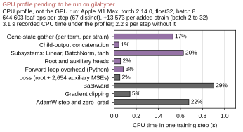

Per-operation CPU profile of one DCell training step for panel e of `FigS-dcell-training` (`paper/nature-biotech/sections/si-note-dcell-training.tex`). Script: `experiments/006-kuzmin-tmi/scripts/dcell_training_cpu_profile.py`. Sibling scripts: [[experiments.006-kuzmin-tmi.scripts.dcell_training_wandb]] (the other panels), [[experiments.006-kuzmin-tmi.scripts.dcell_training_compose_figure]] (the figure).

## 2026.09.04 - One DCell step under torch.profiler on the Mac CPU

No per-operation trace of the cluster GPU runs exists (`profiler = None` in `experiments/006-kuzmin-tmi/scripts/dcell.py`), and there is no GPU here, so the step is profiled on the CPU and labelled as such everywhere. What transfers is the structure of the step (op count, the per-subsystem loop's share), not the absolute times.

### Setup

- Model: `torchcell.models.dcell.DCell` built on the frozen filtered DAG from [[experiments.006-kuzmin-tmi.scripts.dcell_model_go_stats]] (`go_terms_final.csv`, `go_edges_final.csv`, `go_annotations_final.csv`, `go_genes_final.csv`), rebuilding the `cell_graph` fields the model reads exactly as `torchcell.data.cell_data._process_gene_ontology` does (terms and genes indexed in sorted order, child-to-parent edges, strata, the 59,986-row `(term, gene, stratum, state)` table). `subsystem_output_min = 20`, `subsystem_output_max_mult = 0.3`. Check: 20,613,037 parameters, equal to `dcell_model_size.csv` and to the wandb-logged `model/params_total` of every DCell run. No GO graph object or SGD download is needed.
- Batch: synthetic, in the training script's layout (`DCellGraphProcessor` + `follow_batch = ["go_gene_strata_state"]`): per strain one copy of the state table with the rows of three random genes zeroed, `go_gene_strata_state_ptr`, the gene batch vector, one target. Batch 8 is the headline; 2 and 32 for the op-count slope (BatchNorm in train mode needs at least 2).
- Step: forward, `DCellLoss` (auxiliary losses on, alpha 0.3), backward, `clip_grad_norm_` at 10, AdamW (lr 1e-3, weight decay 1e-6), zero_grad. Two warmup steps, three timed steps without the profiler, then one step under `torch.profiler.profile(activities=[CPU], record_shapes=True)`.
- Regions are attached from OUTSIDE the model (forward hooks on every `DCellSubsystem` and head `Linear`, wrappers on the bound `_prepare_term_input` and `_extract_gene_states_for_term`), so `torchcell/models/dcell.py` is untouched. Phases are exclusive: gather = the extract region; concatenation = prepare minus extract; subsystems, heads = their regions; loop overhead = forward minus the three; loss, backward, clipping, optimizer = their regions. They partition the step (asserted).
- Op counts: `aten::` events in `prof.events()`; a leaf op has no `aten::` child and is the unit that becomes one kernel launch on a GPU. Counted per top-level phase.

### Result (`dcell_training_cpu_profile.csv`, batch 8; Apple M1 Max, torch 2.14.0, Python 3.13, 8 threads, fp32)

| phase | CPU ms | share |
|---|---|---|
| Gene-state gather (per term, per strain) | 532 | 17% |
| Child-output concatenation | 42 | 1% |
| Subsystems: Linear, BatchNorm, tanh | 627 | 20% (linear 48 ms = 1.5%, batch_norm 478 ms = 15%, tanh 14 ms = 0.4%) |
| Root and auxiliary heads | 58 | 2% |
| Forward loop overhead (Python) | 83 | 3% |
| Loss (root + 2,654 auxiliary MSEs) | 52 | 2% |
| Backward | 902 | 29% |
| Gradient clipping | 143 | 5% |
| AdamW step and zero_grad | 676 | 22% |

Recorded CPU time 3.1 s per profiled step; 2.2 s wall-clock per step without the profiler (mean of three).

Op counts (`dcell_training_cpu_profile_ops.csv`): batch 2 / 8 / 32 give 564,316 / 644,603 / 971,110 leaf ops per step (1.05 M / 1.20 M / 1.78 M `aten::` events, 67 distinct op names). Only the forward count depends on batch (124,770 / 205,057 / 531,564), a slope of about 13,570 leaf ops per added strain (least-squares over the three batch sizes): `_extract_gene_states_for_term` indexes each term's rows separately for each strain in the batch (2,655 terms x about 5 ops per strain). Backward (110,297), optimizer (238,950; AdamW over 15,930 parameter tensors), clipping (66,384) and loss (23,915) are batch-independent. Wall-clock: 1.9 / 2.2 / 2.9 s per step.

What transfers to the GPU: each leaf op is one kernel launch, and the launch count grows linearly with the batch, so the cluster's batch of 600 per GPU launches millions of kernels per step irrespective of the arithmetic. Hypothesis (untested, stated as such in the note): the GPU step is launch-bound. The CPU-specific findings (BatchNorm over 2,655 small tensors costing ten times the matrix multiplies; AdamW at 22%) are not claimed for the GPU.

