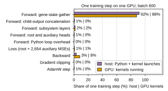

Per-operation GPU profile of one DCell training step for panel e of `FigS-dcell-training` (`paper/nature-biotech/sections/si-note-dcell-training.tex`), replacing the CPU stand-in of [[experiments.006-kuzmin-tmi.scripts.dcell_training_cpu_profile]]. Script: `experiments/006-kuzmin-tmi/scripts/dcell_training_gpu_profile.py`, launcher `gh_dcell_training_gpu_profile.slurm` (gilahyper, one RTX 6000 Ada). Sibling: [[experiments.006-kuzmin-tmi.scripts.dcell_training_wandb]] (the other panels), [[experiments.006-kuzmin-tmi.scripts.dcell_training_compose_figure]] (the figure).

## 2026.09.10 - Design: the cluster step on one GPU, with the trained checkpoint as the architecture check

The cluster run (`eni948by`, IGB job 1922684, four GPUs, batch 600 per GPU, bf16-mixed) was never profiled, and the CPU stand-in could not separate kernel launches from data loading as the cause of its 72 s optimizer step. This script reuses the CPU script's model rebuild (frozen DAG, 20,613,037 parameters), synthetic batch layout, hooks and phase partition, and measures on one GPU at the cluster's batch of 600 with `torch.autocast` bf16 on the forward and loss (Lightning's `bf16-mixed`), under `torch.profiler` with CPU and CUDA activities: per phase the host time (Python plus launch cost) and the device time (kernels the phase launched); per step the `cudaLaunchKernel` count, the `aten::` leaf ops, the synchronized wall-clock, the kernel-busy fraction and the peak memory, over batches 8, 64, 256 and 600. The batch is built once and held on the GPU, so the step has no data loading: a wall-clock far below 72 s attributes the rest to loading, collation and DDP; one that matches attributes it to the step.

The checkpoints of both 006 DCell jobs were copied from IGB (`/home/a-m/mjvolk3/scratch/torchcell/models/checkpoints/compute-5-7-{1922684,1921740}_*`, 1.6 GB, to `$DATA_ROOT/models/checkpoints/igb/`), with the seven `006-00*-dcell_*.out` slurm logs (to `experiments/006-kuzmin-tmi/slurm/output/`, git-ignored). `--checkpoint` loads the epoch-142 save of `eni948by` (`eni948by-best-epoch=142-val/gene_interaction/MSE=0.0037.ckpt`, the checkpoint the training script kept) into the rebuilt model with `strict=True`: all 23,895 tensors match by name and shape. The checkpoint carries one extra key, `model.dummy`, a placeholder parameter of the DCell version that trained the run, which the current model does not declare; it is dropped explicitly and recorded in the metadata. The profile does not depend on the weights; the load is evidence that the profiled architecture is the trained one.

## 2026.09.10 - Result: launch-bound, and the per-term gene-state gather is nine tenths of it (gilahyper job 1675)

One RTX 6000 Ada (44.4 GB), torch 2.11.0+cu128, bf16-mixed, the epoch-142 checkpoint loaded strictly (23,895 tensors; `dummy` dropped). Job 1675, 55 min, of which 44 min is parsing the trace (`dcell_training_gpu_profile_ops.csv`, `dcell_training_gpu_profile.csv`). A first run (job 1670) had read every `record_function` region twice, once as the CPU range and once as the profiler's GPU-side copy of the same annotation, which zeroed the host times and double-counted the kernels; the parser now reads the CPU-side entry only and counts device time from kernel events, and backward, whose kernels the autograd thread launches outside any region, takes the kernel time the other regions do not account for.

| batch | s/step | s/step traced | kernel time s | kernels busy | launches | leaf ops | peak GB |
|---|---|---|---|---|---|---|---|
| 8 | 2.94 | 10.1 | 0.40 | 14% | 132,315 | 457,096 | 0.4 |
| 64 | 6.14 | 19.7 | 0.67 | 11% | 283,331 | 1,200,217 | 0.5 |
| 256 | 15.05 | 55.0 | 1.69 | 11% | 802,967 | 3,748,060 | 0.7 |
| 600 | 30.60 | 118.1 | 3.13 | 10% | 1,731,051 | 8,312,945 | 1.2 |

- **The step is launch-bound at every batch, including the cluster's 600.** Kernels run for 3.1 s of a 30.6 s step (10%); 1.73 M kernel launches per step, about 2,700 per added strain (least squares over the sweep), and the wall-clock grows linearly with the batch (2.9 s at 8, 30.6 s at 600) while peak memory stays at 1.2 GB of 44.
- **The per-term, per-strain gene-state gather is 92% of the host time and 88% of the kernel time** at batch 600 (45.6 s of the 49.7 s traced host time; 2.75 s of 3.13 s kernel time). Subsystems (Linear, BatchNorm, tanh) are 1.8% host / 1.7% device, backward 3.3% / 8.3%, the optimizer 0.5% / 0.2%. The CPU stand-in had put the gather at 17% and BatchNorm at 15%: on the GPU the arithmetic is negligible and the indexing loop is everything.
- **The step alone accounts for 31 of the cluster's 72 s.** The batch is built once and held on the GPU, so the 30.6 s is compute with no loading. The cluster measurement (72 s per optimizer step, `cost.csv`; four GPUs under DDP, batch 600 each, a different GPU model) includes loading, collation, the DDP all-reduce and the IGB GPUs; the split among those is not measured here.

Hypothesis (untested): a single batched gather per stratum (one `index_select` over the flattened state table for all terms of a stratum, all strains at once) would remove most of the 1.66 M launches the forward issues per step, nearly all of them from the gather; at 10% kernel utilization the step could shrink several-fold before the arithmetic shows.

