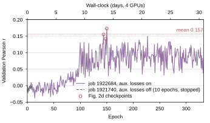
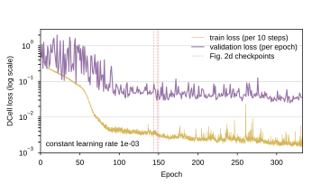
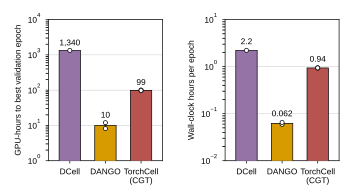
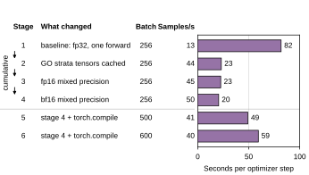

Source data and provenance for the DCell training Supplementary Note (`paper/nature-biotech/sections/si-note-dcell-training.tex`, figure `FigS-dcell-training`). Script: `experiments/006-kuzmin-tmi/scripts/dcell_training_wandb.py`. GitHub issue with the improvement plan: <https://github.com/Mjvolk3/torchcell/issues/321>.

## 2026.09.03 - Freezing the DCell run behind Fig. 2d and costing it against CGT and DANGO

### What the script does

Pulls from wandb (`zhao-group`) and freezes to `experiments/006-kuzmin-tmi/results/dcell_training/`:

- `runs.csv`: metadata for every run touched (all four DDP ranks of the two 006 DCell jobs, the 005 DCell job, the three CGT training jobs behind Fig. 2d and their `evaluation` runs with the checkpoint path, the two DANGO 1000-epoch runs).
- `history_<run>.csv`: one row per validation evaluation (epoch, runtime, val Pearson, val loss, val MSE, mean train loss over the epoch, global step). `history_full_eni948by.csv` keeps the per-10-step rows of the DCell run.
- `checkpoints.csv`: the three Fig. 2d DCell values located in the history (epoch, wall-clock, rank among all evaluations).
- `cost.csv`: per run, samples per epoch from optimizer steps, epoch time, samples/s, best epoch, wall-clock and GPU-hours to best.
- `speedup_stages.csv`: parsed from the pasted logs in [[experiments.006-kuzmin-tmi.dcell-speed-up]] (last progress-bar line per section: elapsed / steps completed, so an upper bound on the steady-state step time; config from the `wandb_cfg` line).

`--from-csv` re-renders panels and tables from the frozen files with no wandb access. Tables: `paper/nature-biotech/sections/tab-dcell-training-checkpoints.tex`, `tab-dcell-training-cost.tex`. DANGO histories (214k rows) come from the `run-<id>-history` wandb artifact (parquet); `scan_history` times out on them.

### Which run is the Fig. 2d DCell

The three values hardcoded in `trigenic_tau_model_comparison.py` (0.17321, 0.15500, 0.14192) are the `val/gene_interaction/Pearson` logged at epochs 150, 144 and 148 of run `eni948by` (`torchcell_006-kuzmin-tmi_dcell`, SLURM job 1922684, config `dcell_kuzmin2018_tmi_mmli_001`, auxiliary losses on). They are three epochs of one run, not three replicates, and the note in [[experiments.010-kuzmin-tmi.scripts.trigenic_tau_model_comparison]] that calls them "3 replicates" is wrong on that point. `trigenic_tau_model_comparison.py` now reads them from `checkpoints.csv`; the plotted statistic is unchanged (DCell r = 0.1567 +/- 0.0091 SEM before and after).

- Epoch 150 (0.1732) is the maximum over all 333 evaluations; epoch 144 ranks 2nd, epoch 148 ranks 4th (epoch 227, 0.1497, ranks 3rd). Mean 0.1567, SD (ddof=1) 0.0157, SEM 0.0091.
- The checkpoint the training script saved (`ModelCheckpoint` on min `val/gene_interaction/MSE`) is epoch 142, Pearson 0.1268. The final epoch (332) scores 0.0381.
- Over epochs 100-332: mean 0.088, SD 0.028, consecutive epochs differ by up to 0.099.
- The learning rate was constant at 1e-3 for the whole run: `ReduceLROnPlateau` has `min_lr: 1e-3` equal to `lr: 1e-3` in `conf/dcell_kuzmin2018_tmi_mmli_00{0,1}.yaml`, so it could never reduce.
- Validation loss maximum 2.006 (first 50 epochs), minimum 0.025; train loss fell from 0.72 to 0.0023.

### Cost (`cost.csv`)

| model | run | build | GPUs | samples/epoch | h/epoch | samples/s | best epoch | best r | h to best | GPU-h to best | total h |
|---|---|---|---|---|---|---|---|---|---|---|---|
| DCell | eni948by (job 1922684) | 006 | 4 | 266,393 | 2.22 | 33 | 150 | 0.173 | 335 | 1,340 | 738 (30.8 d) |
| CGT | lzs9pcj3 (job 2027905) | 010 | 4 | 302,064 | 0.94 | 90 | 24 | 0.452 | 24.3 | 97 | 62.3 |
| CGT | yv4r30bi (job 2027907) | 010 | 4 | 302,064 | 0.94 | 89 | 25 | 0.447 | 25.3 | 101 | 62.6 |
| CGT | c7671wgj (job 2036902) | 010 | 4 | 302,059 | 0.94 | 89 | 24 | 0.462 | 24.5 | 98 | 47.8 |
| DANGO | 014mprap (job 1941704) | 006 | 2 | 265,856 | 0.059 | 1,244 | 98 | 0.368 | 6.0 | 12 | 59.5 |
| DANGO | 9jpfy547 (job 1940775) | 006 | 2 | 265,856 | 0.065 | 1,134 | 60 | 0.354 | 4.1 | 8 | 65.2 |

Samples per epoch are optimizer steps per epoch times the global batch: DCell and DANGO iterate over 265,850 records, the 80% split of the experiment-006 build (332,313 records, [[experiments.011-kuzmin-tmi.scripts.query-comparison-006-009-010-011]]); CGT iterates over 301,386, the 80% split of the experiment-010 build (376,732). So the Fig. 2d bars compare DCell and DANGO on the 006 build with CGT on the 010 build. The CGT "replicate" values (0.462, 0.452, 0.447) are the `evaluation` runs `0psour3n`, `leodrxht`, `cvu2ryfw` of the best-Pearson checkpoints (epochs 24, 24, 25) of those three training jobs, which ran to epochs 49-64 of a configured 600 before their walltime.

The second 006 DCell configuration (job 1921740, `mmli_000`, auxiliary losses off) ran 10 epochs in 23.3 h and reached val Pearson 0.009 before it was stopped: partial, no result. The 005-build run (`biucpv7p`, job 1811673, 29.2 days, 257 epochs, batch 256, fp32) reached 0.259 on the 005 build and is not comparable to the Fig. 2d task.

### Speed-up stages (`speedup_stages.csv`, gilahyper, 4 GPUs, batch 256/GPU unless noted)

| stage | precision | batch/GPU | steps done | s/step | samples/s |
|---|---|---|---|---|---|
| first working implementation (duplicate forward) | fp32 | 256 | 8 | 128 | 8 |
| duplicate forward removed | fp32 | 256 | 8 | 82 | 13 |
| GO strata cached | fp32 | 256 | 66 | 23 | 44 |
| fp16-mixed | 16-mixed | 256 | 74 | 23 | 45 |
| bf16-mixed | bf16-mixed | 256 | 239 | 20 | 50 |
| bf16-mixed, rerun on a later day | bf16-mixed | 256 | 15 | 119 | 9 |
| bf16-mixed, 12 workers | bf16-mixed | 256 | 34 | 99 | 10 |
| torch.compile (recompile_limit 64), batch 500 | bf16-mixed | 500 | 41 | 49 | 41 |
| torch.compile, batch 600 | bf16-mixed | 600 | 34 | 59 | 40 |

The two reruns of the bf16 configuration (99-119 s/step vs 20 s/step) show day-to-day variation on the shared machine as large as several of the optimizations; the ordering among the three fastest stages is inside that noise. `torch.compile` did not improve samples/s. `profiler.is_pytorch: true` in the config is not wired in `experiments/006-kuzmin-tmi/scripts/dcell.py` (`profiler = None`), so no per-operation trace of any DCell run exists; panel (e) of the figure is a placeholder for it.

### Panels

## 2026.09.03 - Stage labels as complete configurations; open-circle replicates

Author review of `FigS-dcell-training`: the `+`-prefixed stage labels in panel d were inconsistent. Every bar is now a numbered stage whose label is the complete configuration of that run (`stage_label` in `panel_stages`; batch 256 per GPU and 8 loader workers unless stated): 1 fp32, duplicate forward; 2 fp32, single forward; 3 fp32, single forward, cached strata; 4 fp16-mixed, single forward, cached strata; 5 bf16-mixed, single forward, cached strata; 6 stage 5 rerun on a later day; 7 stage 5 with 12 loader workers; 8 and 9 stage 5 with `torch.compile` at batch 500 and 600. The caption spells out what each stage adds; the measured seconds per step are unchanged (`speedup_stages.csv` untouched). The label column takes 56% of the 88 mm panel; the x label is shortened to "Training samples per second (4 GPUs)".

Panel c follows the house rule for bar charts with replicate points: bar = mean over runs, replicates as open circles (black edge, white face; previously filled dots); no whisker is drawn because DCell has one run, and the caption says so. No statistic changed. `--from-csv` re-rendered all four panels; `cost.csv` and `checkpoints.csv` were rewritten byte-identical.
