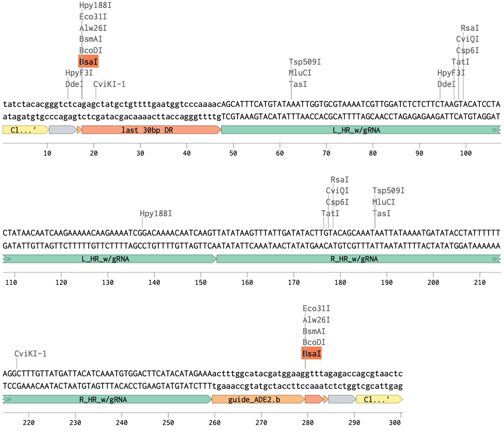
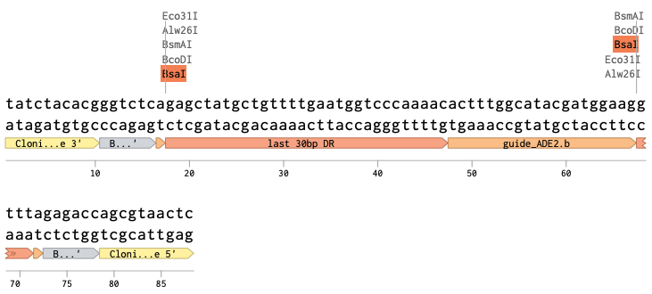
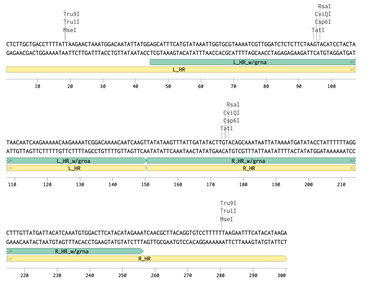
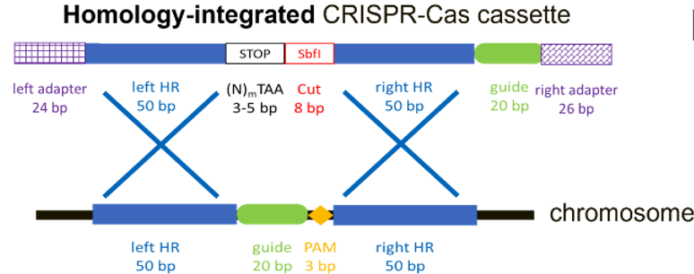

## One Construct

The one construct can be cloned into pCRCT plasmid then transformed. It has the disadvantage of being directly coupled to the gRNA, so if the gRNA fails an entire new gene fragment would need to be synthesized. Depending on the error rate it could be prudent to order 2 constructs per gene. This would cost `$90 / gene fragment` through IDT, but `$35 / gene fragment` through [Twist Bioscience](https://www.twistbioscience.com/products/genes/gene-synthesis?utm_source=google&utm_medium=cpc&utm_campaign=PSR-GLBL-FY21-1808-MULTI-Branded&adgroup=114820227343&utm_term=twist%20gene%20synthesis&utm_content=kwd-328618241911&creative=746872570041&device=c&matchtype=b&location=9022185&gad_source=1&gad_campaignid=12057309113&gbraid=0AAAAADdPWR-6skqaz_dpplXVoyKeaK-9A&gclid=Cj0KCQjwkILEBhDeARIsAL--pjz7NYmPm824Swla1FyVH4IfWp7kmQzlBxxqgLognY7WXpWSwdWDZfEaAp3YEALw_wcB&tab=fragment).

## Two Constructs

The advantage of having two constructs is that gRNA is then decoupled from the the donor. I have previously shown that `100 bp` donors work well, but gRNA can be finicky. Since this fragment is `88 bp` it can be ordered as [IDT duplex DNA](https://www.idtdna.com/pages/products/custom-dna-rna/dna-oligos/custom-dna-oligos) at `$0.3800 USD / Base`, which would give `$34.2 / gRNA fragment`. Duplexed DNA has an additional `$256.00` charge for annealing the entire plate.

## Homologous Recombination Donors

The donors here are adjusted according to Twist `300 bp` minimum for synthesis. If the donor is not included in the pCRCT plasmid then each donor is `150 bp`. If the donors are included in the plasmid then they can be shorter at `106 bp`. The best cost of the HR donor separated from the plasmid is through Twist Bioscience as mentioned above at `$35 / gene fragment`.

## Mason's Design for Free Fatty Acid Production Paper

Mason uses a variant of the one construct method described above that instead does a stop code in-frame insertion with the SbfI rare cut site for digestion and edit confirmation. This fragment is `183 bp` max so we could not benefit from ordering the gene fragments from Twist since we need a minimum of `300 bp`. The confirmation is easy with SbfI after PCR, but if you do full ORF deletion, the confirmation can be easier since it will only take PCR. The SbfI is necessary since the edited and original gene fragment will only differ by a few bp. I think we should also avoid this method because it limit guid RNA targeting to 5' region since we don't want partial transcription of gene products.

## One Versus Two Constructs

The total cost of one construct is `$35 / gene fragment`, but the cost for two gene constructs is `$35 + $34.2 = $69.2 / gene fragment`. Two constructs creates an additional liquid handling step for transformation as well. At this rate you could even order 2 one constructs fragments with different gRNA which would be the same price as the two construct approach `$75 / 2 gene fragments`, which cancels out the gRNA decoupling advantage of 2 constructs.

## Other Resources

GenScript is `$35 / 300 bp gene fragment`. It is also `$35 / 200 bp gene fragment` so I think `$35` is their minimum price. They are not very transparent on per base pair pricing.

## Conclusion

If we order a 96-well plate of gene fragments from Twist total cost of fragments will be `35 * 96 = $3,360`. If we do two construct method total cost would be `69.2 * 96 + 256 = $6,899.2`. One construct method also reduces a lot of additional experimental hassle. Depending on gRNA fidelity and the multiplicity of a particular gene fragments we can order duplicates. We might hold off on this until first round of mutant construction. We know that both of these methods are very efficient for single gene deletion, but there could be issue with gRNA selection. I suspect that we won't need more that 2 gRNA for any given gene. Both methods are also scalable on the robotic system as we will go from plate to cloning, to plasmid purification, to transformation. Once all plasmids are isolated additional gene knockouts are another transformation after plasmid rejection. The single construct method is slightly more scalable since there is one less liquid handling step.

## Some Additional Concerns for Discussion

Previously when I did full ORF deletion I used the GTR method where the `200 bp` donor is transformed separately. I am not sure if the large donor will disrupt Cas9 activity in the pCRCT system. If we are concerned about this we could insert a tRNA-gly `71 bp` fragment at the 5' end of the fragment to make sure it is cleaved from the gRNA. There are other alternative sequences that can be used for cleavage as well. We would then just adjust the HR donor so that the entire sequence is `300 bp`. We want the donor to be relatively large for full ORF deletion and we want full ORF deletion because the original paper use KanMX and NatMX deletion.  We don't want any partial transcription or translation of short peptide sequences.
