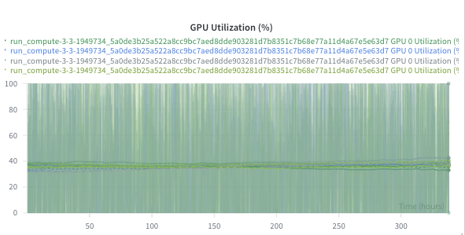
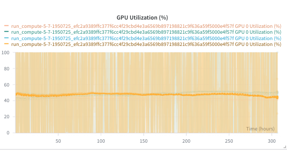

## 2025.10.21 - GPU Utilization Improvement

I suspect that GPU utilization is low due to subgraphing ops and batching. [2025.10.21 - Experiment 058](#20251021---experiment-058---sum-over-graphs-with-dist-loss-regularization)utilization looks high which I believe is mainly due to larger batch size. I don't think it has anything to do with different GPU.

### 2025.10.21 - Experiment 056 - Sum Over Graphs with Wasserstein Regularization

Utilization: 40%
GPU: RTX 6000 Ada

### 2025.10.21 - Experiment 057 - Sum Over Graphs with Wasserstein Regularization

Utilization: 40%
GPU: RTX 6000 Ada

### 2025.10.21 - Experiment 058 - Sum Over Graphs with Dist Loss Regularization

Utilization: 48%
GPU: A100 80GB
