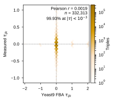
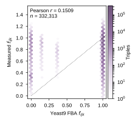
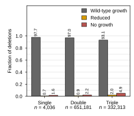
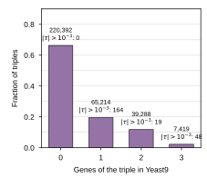
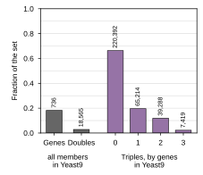
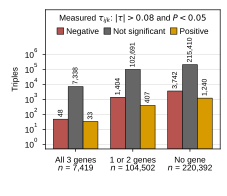

Source data and provenance for Supplementary Note `note:fba` (`paper/nature-biotech/sections/si-note-fba.tex`) and the data panels of `FigS-yeast9-fba`, produced by `experiments/007-kuzmin-tm/scripts/fba_baseline_si.py`.

## 2026.09.05 - The Fig. 2d Yeast9 FBA baseline, recomputed from its frozen run

**Input (the only committed record of the baseline):** `experiments/007-kuzmin-tm/results/cobra-fba-growth_backup_20250923_134447/` (run 2025-09-15T17:50, `targeted_fba_growth_fast.py`, 128 processes, 608.6 s; matched by `match_fba_to_experiments.py`). Plus the yeast-GEM 9.0.2 SBML under `$DATA_ROOT/data/torchcell/yeast-GEM/`, loaded through `YeastGEM()` to record the medium and check the wild-type growth (recomputed 0.08584402 vs frozen 0.08584397; the script asserts agreement within 1e-6).

**Outputs:** `experiments/007-kuzmin-tm/results/fba_baseline_si/` (`stats.json` holds every number the note and the figure state; `yeast9_default_medium.csv`; `triples_matched.parquet`, one row per triple with measured and predicted tau and fitness and the count of its genes in the model; `growth_bands.csv`; `coverage.csv`), `paper/nature-biotech/sections/tab-fba-medium.tex`, and the four panels below.

**Measured (all from `stats.json`):**

- Medium: the model default, 16 open exchanges, glucose 1 mmol/gDW/h, ammonium nitrogen, oxygen and ions unbounded; objective `r_2111`; NGAM `r_4046` = 0.7. Solver GLPK (optlang), 60 s limit; all 987,530 solves returned `optimal`, none timed out.
- Coverage: 736 of 4,036 screened genes in Yeast9; triples with 0/1/2/3 genes in the model: 220,392 / 65,214 / 39,288 / 7,419.
- Growth bands (wild-type within 1e-3 / reduced / fitness < 0.01): singles 97.7 / 0.7 / 1.6%; doubles 97.0 / 0.9 / 2.2%; triples 93.1 / 2.0 / 4.9%. Predicted triple fitness takes 38 distinct values at 3 decimals; 1 (308,363), 0 (16,276), 0.994, 0.983, 0.999, 0.15 (888), 0.367 (563), 0.998 cover 99.6%.
- Correlations: tau r = 0.0019 (n = 332,313, P = 0.27, Spearman -0.0007); fitness r = -0.0046 (n = 299,146). 97.6% of predicted |tau| < 1e-6, 99.93% < 1e-3; 231 nonzero (+1: 122, +2: 62, -1: 19). The manuscript's 0.0006 does not reproduce from the frozen files; its subset or run is not recorded.
- Consistency: 253 / 632,616 checkable doubles and 52 / 285,606 checkable triples contradict the single-deletion result (246 doubles contain YGR144W); 173 triples exceed the minimum of their doubles; 8 doubles exceed their singles. Cause not determined.

**Panels (true-size SVGs, `notes/assets/images/007-kuzmin-tm/`):**

Composed into the figure by [[experiments.007-kuzmin-tm.scripts.fba_baseline_compose_figure]]. Background and the media work that followed the run: [[experiments.007-kuzmin-tm.FBA-interaction-experiments]].

## 2026.09.06 - Raw-derived labels, the misaligned matched file, and the two new panels

Author feedback split the old panel e into two questions (evaluable set; measured landscape) and asked for every number scripted. Doing that required the measured P-values, which the frozen matched file does not carry, so the labels now come from the screens' raw tables: Kuzmin 2018 Data S1 (`data/host/kuzmin2018/aao1729_data_s1.zip`) and Kuzmin 2020 Tables S1 and S3 (`$DATA_ROOT/data/torchcell/tmi_kuzmin2020/raw/`; sha256 of all three in `stats.json`), `trigenic` rows keyed by sorted gene set, mean adjusted tau and mean triple-mutant fitness over a gene set's records (the dataset's `MeanExperimentDeduplicator` rule), smallest P. Cached to `results/fba_baseline_si/raw_trigenic_labels.parquet` (rebuilt when absent). Every one of the 332,313 triples matches a raw record: 91,050 from Kuzmin 2018, 241,746 from Kuzmin 2020 (483 in both); the build is NOT Kuzmin 2018 only, the query unions both `Tmi` datasets.

**Finding: the frozen `matched_fba_experimental_fixed.parquet` labels are misaligned.** `match_fba_to_experiments.py` pairs `dataset[i]`'s gene set with `dataset.label_df.iloc[i]`, and the two orders differ. Measured: the sorted stored tau values and the sorted raw-derived tau values coincide within 1e-3 for 99.98% of triples (a permutation), but row by row only 1.2% agree, and the row-wise correlation between stored and raw tau is -0.03. Fitness rows agree for 0.4%. Consequences, measured:

- tau: Pearson r = 0.0019 either way (stored 0.00191, raw-aligned 0.00187; n = 332,313) because the prediction is nearly constant.
- fitness: stored r = -0.0046 (n = 299,146) becomes **r = 0.151** (n = 332,313) with aligned labels, and 0.254 within the 111,921 triples that contain a model gene. Panels b and c now use the aligned labels.
- Any other analysis built on that matched file inherits the misalignment (flagged in the note's Caveats).

**Evaluable set (panel e).** Genes in Yeast9 736 / 4,036; doubles with both genes in 18,565 / 651,181; triples by genes in the model 0 / 1 / 2 / 3: 220,392 / 65,214 / 39,288 / 7,419.

**Measured landscape (panel f), |tau| > 0.08 and P < 0.05 (Kuzmin 2018 "intermediate score cutoff"), P = min over a gene set's raw records:**

| Coverage | n | Negative | Not significant | Positive |
| :--- | ---: | ---: | ---: | ---: |
| All 3 genes in Yeast9 | 7,419 | 48 | 7,338 | 33 |
| 1 or 2 genes | 104,502 | 1,404 | 102,691 | 407 |
| No gene | 220,392 | 3,742 | 215,410 | 1,240 |

So 81 of the 7,419 fully evaluable triples (1.1%) carry a significant measured interaction, against 6,874 of 332,313 (2.1%) overall. Frozen in `results/fba_baseline_si/measured_landscape.csv`; per-triple class and coverage in `triples_matched.parquet` (columns `tau_stored`, `fitness_stored`, `tau_measured`, `fitness_measured`, `p_min`, `n_raw_records`, `in_kuzmin2018`, `in_kuzmin2020`, `class`, `coverage`).

