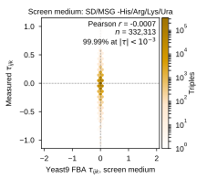
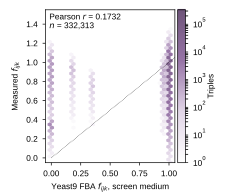
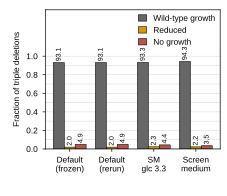

Scores the arms of [[experiments.007-kuzmin-tm.scripts.fba_screen_medium]] the way [[experiments.007-kuzmin-tm.scripts.fba_baseline_si]] scores the frozen baseline, writes `results/fba_screen_medium/stats.json`, `summary.csv`, `paper/nature-biotech/sections/tab-fba-screen-medium.tex`, and panel g of `FigS-yeast9-fba` (`fba_screen_medium_tau.svg`). Script: `experiments/007-kuzmin-tm/scripts/fba_screen_medium_si.py`.

## 2026.09.10 - Panels and table from the three arms

`arm_stats` reuses `gene_coverage`, `growth_bands`, `consistency` and `raw_labels` from the baseline script, so an arm is scored by the same code as the frozen run; the frozen run's row is read from `results/fba_baseline_si/stats.json`. `rerun_reproduces_frozen` in `stats.json` records the default-medium rerun against the frozen files (wild-type growth to 1.3e-9; 182 against 231 nonzero tau, which is the solver-failure count, not a modeled quantity). Numbers and the reading are in [[experiments.007-kuzmin-tm.scripts.fba_screen_medium]].

Panel g (third width, the layout of panel b):

Note-only panels: the fitness scatter on the screen medium and the triple-deletion growth bands of the four media.

