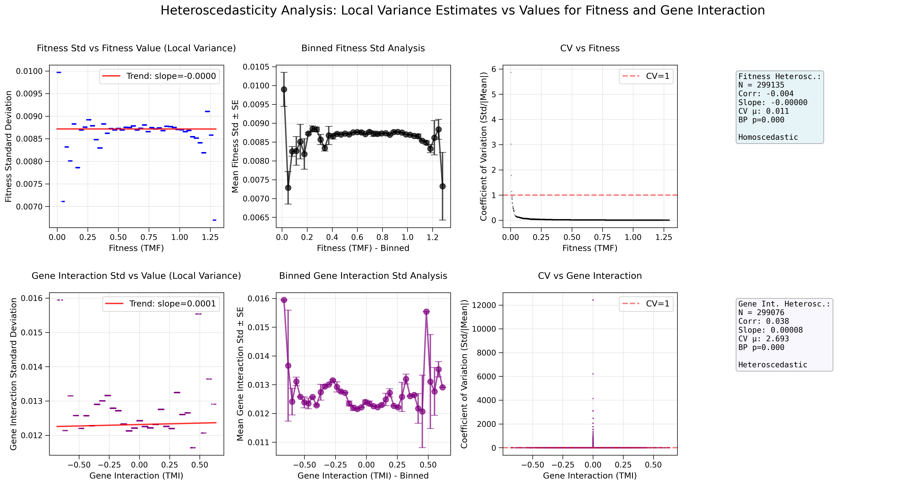
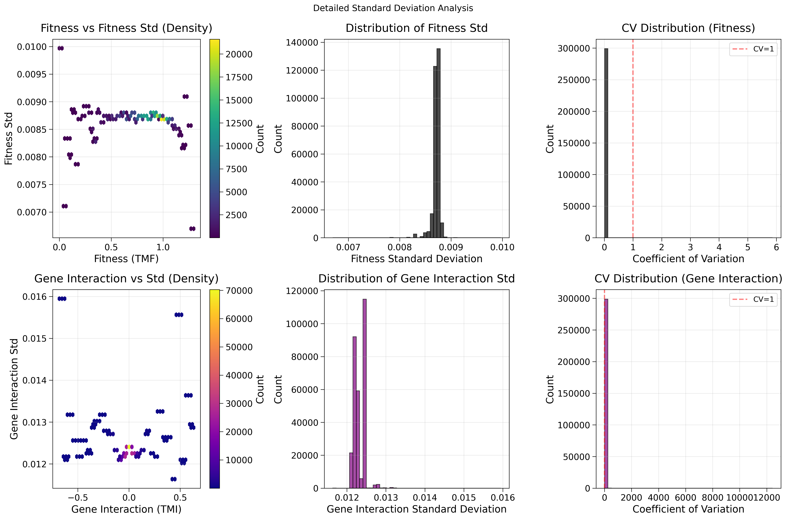

## 2025.09.04 - Plots Review

We can see that noise gets higher at both extremes of high/low fitness and high/low gene interaction. Unsure if we should account for heteroscedasticity in models yet.

