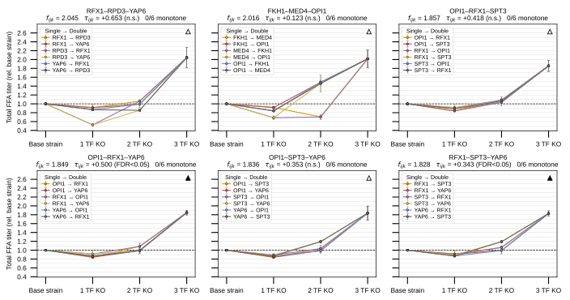
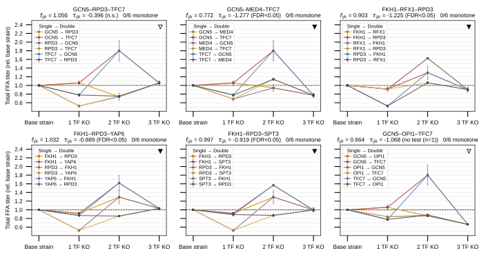

## 2026.08.02 - Per-Triple KO Path Panels on the FFA Titer Landscape

Script: `experiments/008-xue-ffa/scripts/ffa_epistatic_path_panels.py`

The FFA analog of the Kuzmin panel-12 trajectory figure
(`experiments/010-kuzmin-tmi/scripts/12_panel_inference_3_fitness_comparison.py::plot_all_paths_hero_triples`).
Companion to [[experiments.008-xue-ffa.scripts.ffa_total_titer_trajectories]], which
averages the ladder rungs over all orderings on purpose; this script does the complement
and **resolves all 6 orderings** of each triple so the spread of the path intermediates
is visible.

### Why the FFA panel is the better substrate for this figure

The Xue 2025 panel is a **complete combinatorial design** over 10 TFs layered on the
base production strain.

**Naming.** That base is `pox1Δ faa1Δ faa4Δ`, the FFA-overproduction chassis — the "3Δ"
seen in the genotype strings. Those three deletions are the platform and are present in
*every* strain on the ladder; the TF knockouts counted on the x axis are **additional** on
top of it, so a `6Δ` genotype is 3 chassis + 3 TF. The panels therefore label rung 0
"Base strain" rather than "3Δ base", which invited reading the chassis deletions as the
first rungs of the TF series.

| Order | Strains | Note |
| --- | --- | --- |
| 0 TF KO | 1 (`+ve Ctrl`) | the base production strain; ladder anchor, f = 1 by construction |
| 1 TF KO | 10 | all singles |
| 2 TF KO | 45 | all pairs |
| 3 TF KO | 120 | all triples |

10 + 45 + 120 + `wt BY4741` + `+ve Ctrl` = the 177 rows in the raw titer sheet. Because
the design is complete, **all 6 × 120 = 720 paths are fully observed** — every rung is a
measured strain with 3 GC replicates, so the panels carry real error bars. In the Kuzmin
figure the double and triple rungs were model *predictions*; here nothing is inferred.

Phenotype is **total** FFA titer — the sum of all five measured species (C14:0, C16:0,
C18:0, C16:1, C18:1) formed per replicate before averaging — normalized to the base strain
(`f = strain / +ve Ctrl`), the same reference used by `free_fatty_acid_interactions.py`.
Every panel plots this same quantity; none is a single-species titer. All panels also share
one y axis, so rises and valleys are comparable across panels. `wt BY4741` is a different
background (no FFA machinery, f ≈ 0.25) and is not on the ladder.

### The finding: the best producers sit behind a valley

Greedy accessibility is defined per path as every rung strictly improving,
`1 < f_a < f_ab < f_ijk` — the question a strain engineer actually faces if deletions are
stacked one at a time and only improvements are kept.

- **Only 1 of 10 single TF deletions beats the base strain** (median single = 0.880).
- **648 of 720 paths (90.0%) dip below the base strain at the first KO.**
- **Only 2 of 120 triples have any strictly monotone path** (mean 0.02 of 6 paths).
  Relaxing to "no step drops by more than its propagated 1 SE" gives 9 of 120, so the
  result is not a replicate-noise artifact.
- Yet the best triple reaches **f = 2.045** (RFX1-RPD3-YAP6), and **all 36 paths into the
  top 6 triples pass below the base strain**, dipping as low as f = 0.525.

So the highest-titer strains in this panel are essentially **unreachable by greedy
one-deletion-at-a-time engineering**. This is the metabolic-engineering analog of
Weinreich's accessibility-of-adaptive-paths argument, and it is the direct argument for
predicting combinations rather than walking to them. Note the contrast with the 019
result that the upward ladder is not reachable on growth: on a deletion panel scored on
*growth* the ladder was dead because no rung exceeded WT at all.
On *titer* the ladder is alive at the endpoint (2× the base strain) but the route is not
monotone — the destination exists, the greedy path to it does not.

### Panels

`--select top` — the 6 highest-titer triples. Every path dips, then climbs steeply on the
last step; positive τ dominates.



`--select divergent` — the 6 triples with the widest spread of intermediate rungs across
orderings. These are the strongly negative-τ triples: a 2-KO intermediate overshoots
(GCN5-RPD3-TFC7 reaches 1.81 via TFC7 → GCN5) and the third deletion collapses it back to
1.06. Here the *route* matters more than the destination.



### Outputs

- `experiments/008-xue-ffa/results/ffa_epistatic_paths.csv` — 720 rows, one per
  (triple, ordering): 4 rungs + SEs + replicate counts, τ, `monotone`,
  `monotone_within_se`, `min_rung`, `valley_depth`.
- `experiments/008-xue-ffa/results/ffa_epistatic_path_accessibility.csv` — 120 rows, one
  per triple: endpoint, τ, monotone-path counts, `max_valley_depth`,
  `intermediate_spread`.

Run (from the repo root):

```bash
python experiments/008-xue-ffa/scripts/ffa_epistatic_path_panels.py --no-timestamp
```

`--select {top,divergent,both}` picks the panel set, `--n-panels` its size. Timestamped
filenames are the default; `--no-timestamp` writes the stable names embedded above.

## 2026.08.15 - Mark the Sign and Support of Each Trigenic Interaction

Reading the panels, "which of these have a positive trigenic interaction?" could only be
answered by squinting at the sign of the printed τ, and that question deserves a real
answer because sign alone is not evidence. Each panel now carries a **badge** in its top
right encoding both halves of the claim, and the τ in the title carries its support:

- **direction** = sign of τ (▲ positive, ▼ negative)
- **fill** = how much support it has (filled = FDR<0.05, half = P<0.05, open = n.s.)

The badge is solid black, per the repo's convention for pattern marks, so it cannot be
mistaken for one of the six ordering colors.

### The answer, and why it deflates

**All six highest-titer triples have positive τ — and not one of them is significant.**
Their raw p-values run 0.055 to 0.69, so every badge in that figure is an open triangle.
Across all 120 total-titer triples: 27 positive vs 93 negative, 56 reach raw P<0.05, and
**0 survive FDR correction** — only 7 are both positive and raw-P significant, none of
them in the top six.

So the 2× titer gain at the endpoint is real and measured, but the *trigenic* term is not
separable from noise at 3 replicates. The honest reading of the top panels is that the
triples get there mostly through their marginal and digenic terms, and the figure should
not be used to claim positive three-way epistasis. The route-dependent panels are where
the significant interactions actually live (three of those six are negative at P<0.05).

### Statistics come from the experiment's own table, and are asserted to agree

Significance is read from `results/multiplicative_trigenic_interactions_3_delta_normalized.csv`
(written by `free_fatty_acid_interactions.py`) rather than re-derived, so the panels cannot
disagree with the experiment's own interaction analysis. `attach_significance` hard-fails
if any triple is missing or if that table's `interaction_score` differs from the τ computed
here by more than 1e-8. It currently agrees **exactly** (max deviation 0.0), which is a
useful independent check of both implementations of the multiplicative model.

### Defect found in the canonical interaction table: FKH1 is labelled `F`

Joining exposed the Abbreviations-header trap in the wild. Because `load_ffa_data` reads
that sheet with a default header row, FKH1 is consumed as the header and **all 36
FKH1-containing triples in the committed interaction CSV are labelled with the bare letter
`F`** (`F-MED4-OPI1` rather than `FKH1-MED4-OPI1`). Only the *label* is wrong — the
grouping and every statistic are computed off a consistent gene identity, which is why the
τ values still match exactly — so `load_significance` remaps `F` → `FKH1` and documents it.

The root cause is still live in `free_fatty_acid_interactions.py` and affects every artifact
that script writes. Fixing it is a one-line change (`header=None`) but invalidates the
committed CSVs and network figures, so it is left flagged rather than done here. See
[[experiments.008-xue-ffa.scripts.free_fatty_acid_interactions]].

## 2026.08.15 - Correction: the FDR Family Was the Wrong One

The claim recorded above that **zero** trigenic interactions survive FDR is arithmetically
right but answers the wrong question, and stated bare it is misleading. Corrected here.

**The stored `significant_fdr05` pools all six FFA readouts.**
`free_fatty_acid_interactions.py::apply_fdr_correction` flattens the entire trigenic
p-value dict before calling `multipletests`, so Benjamini-Hochberg runs over **all 714
testable triple x readout combinations at once**. That is the correct family for a claim
spanning every readout, and under it nothing survives (reproduced exactly).

But this figure plots **one** readout. Its testing family is the 119 testable total-titer
triples, and correcting over 6x more tests than the figure makes understates significance.
Corrected within the readout:

| Correction family | n tests | FDR<0.05 | of those, positive |
| --- | --- | --- | --- |
| Total Titer only (what this figure asks) | 119 | **21** | **0** |
| pooled over all 6 readouts (stored column) | 714 | 0 | 0 |

Per readout, total titer is the *only* one with anything surviving a within-readout
correction (C14:0, C16:0, C16:1, C18:0, C18:1 all give 0), which is expected: summing the
five species averages down the per-species noise.

**What does not change is the answer to the original question.** All six highest-titer
triples are positive and none is significant, and **no positive total-titer trigenic
interaction survives FDR under either family** (only 7 are even raw-P significant). The 21
that do survive are all negative. So the caution against reading positive three-way
epistasis off the top panels stands; what was wrong was implying nothing at all is
detectable.

`load_significance` now computes BH within the readout and badges on that, keeping the
pooled flag in the CSV as `significant_fdr05` alongside `significant_fdr05_within`.

### Two further scope limits, now explicit

- **This is the multiplicative model only.** 008 defines four: multiplicative, additive
  (`additive_free_fatty_acid_interactions.py`), GLM log-link
  (`glm_log_link_epistatic_interactions.py`), and log-OLS WT-differencing
  (`log_ols_wt_differencing_epistatic_interactions.py`). Only the multiplicative outputs
  exist on disk; the other three still carry hardcoded `/Users/michaelvolk` paths and have
  never been run on GilaHyper, so **no cross-model statement is supported yet**. The badge
  legend and the printed summary now name the model.
- **One triple is untestable, not null.** GCN5-OPI1-TFC7 is the `G-O-T 6d` strain released
  with a single replicate, so it has a tau but no SD and no p-value. It is badged
  "no test (n=1)" rather than silently shown as non-significant.

## 2026.08.15 - Correction 2: the "Nothing Survives FDR" Result Was a Degrees-of-Freedom Bug

The two sections above are **superseded on the significance question**. A full audit of the
008 analysis ([[plan.008-xue-ffa-epistasis-audit.2026.08.15]]) found the p-values were
referred to the wrong reference distribution.

`compute_se_pvalue` used `df = max(1, min(n) - 1)` -- the smallest single input's df -- which
is **1 or 2** for these strains. But tau is a linear combination of seven independently
measured strains and its SE pools all seven, so the reference distribution must use the
**Welch-Satterthwaite effective df** (realized median **4.31**, up to 9.77). df=2 is so
heavy-tailed that it suppressed nearly everything.

Total-titer trigenic, multiplicative model, BH within readout:

| | raw P<0.05 | FDR<0.05 | positive AND FDR<0.05 |
| --- | --- | --- | --- |
| before | 56 | 21 | **0** |
| after | 91 | 86 | **11** |

So **"no positive trigenic interaction survives FDR" was wrong** -- it was an artifact of the
df, not a property of the data. Two of the six highest-titer triples now badge as
FDR-significant positive: **OPI1-RFX1-YAP6** (tau=+0.500) and **RFX1-SPT3-YAP6** (tau=+0.343).

**But it is model-dependent, and that is the caveat to carry.** Across all four epistatic
models, 73 trigenic interactions are FDR-significant in every one with zero sign
discordance -- and that consensus set is *entirely negative*. The GLM log-link and log-OLS
models find **no** positive trigenic interaction on total titer. Positive three-way
epistasis here is a linear-scale phenomenon; any claim about it must name the model.

What does NOT change: the accessibility result. Only 2 of 120 triples have a strictly
monotone path, 90% of paths dip below the base strain, and the top producers still sit
behind a valley. That analysis never used the p-values.
