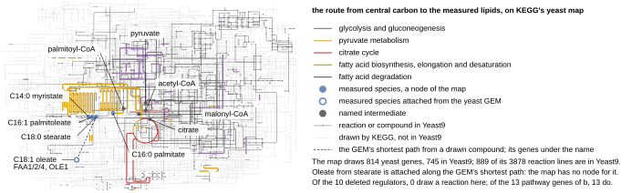

## 2026.09.17 - KEGG's yeast global map, redrawn from KGML with Yeast9 overlaid

Fig 5a of `notes-tex/008-xue-ffa-epistasis`. Replaces the iPath3 panel
([[experiments.008-xue-ffa.scripts.ffa_ipath_map]]) after review asked whether the whole of
Yeast9 could be squeezed into a coherent map.

### Why KEGG's coordinates, not a layout of Yeast9

A coherent map (circular TCA, glycolysis as a spine, the fatty acid comb) is a hand-drawn
artifact. No layout algorithm produces one from a stoichiometric model, Yeast9 ships no map,
and Escher has one yeast map (iMM904 central carbon, BiGG ids) that stops before fatty acid
synthesis. KEGG publishes its yeast global map (`sce01100`) as KGML: 3,878 reaction
polylines and 3,562 compound circles with coordinates, every line carrying the yeast ORFs
and KEGG reaction ids it stands for. This script redraws that as vector in the document's
palette and overlays Yeast9 membership.

### What Yeast9 puts on it, measured against yeast-GEM 9.0.2

| Yeast9 content | on sce01100 |
|---|---|
| genes | 745 of 1,161 drawn |
| reaction lines of the map in Yeast9 (by gene or KEGG reaction id) | 889 of 3,878 |
| compound circles of the map in Yeast9 (by `kegg.compound`) | 684 of 3,562 |

Never on any such map: transport (1,468 reactions), exchange (274), SLIME pseudo-reactions
(188), and most per-chain lipid chemistry, which KEGG draws generically. Panel b carries that
compartment and acyl-chain detail.

### What KEGG's current drawing has that iPath3's did not

Palmitoleate (C08362), stearate (C01530), palmitoyl-CoA (C00154) and all four of ELO1, ELO2,
ELO3 and OLE1 are drawn, so four of the five species are nodes and only oleate (C00712, no
node, nor oleoyl-CoA C00412/C00510) is attached from the GEM (from stearate via stearoyl-CoA
and oleoyl-CoA: FAA1/2/4, OLE1). All 13 pathway genes are on the map; none of the 10
regulators is, read directly from the KGML gene entries rather than probed.

### Drawing

Three tiers: what Yeast9 contains (`#666666`, opacity 0.75, 0.15 mm), what KEGG draws for
yeast or any organism that Yeast9 lacks (`#BBBBBB`, 0.45, 0.09 mm), the route in the module
colors at 0.30 mm. Species nodes are 0.62 mm because KEGG places the measured acids a few
units apart at the end of the fatty acid comb. The map is 83 mm wide (aspect 1.55, so 53.6 mm
tall) to keep Fig 5 inside the 170 mm cap with panel b at 107.9 mm. Labels are placed by
[[experiments.008-xue-ffa.scripts.map_labels]].

### Provenance

`results/kegg_map/`: `sce01100.kgml` (KEGG REST `get/sce01100/kgml`), the seven
`kegg_link_sce_<pathway>.tsv` gene lists, `yeast9_ids.json` keyed by the SBML file's sha256,
`label_anchors.json`, and `provenance.json` with every file's sha256, the counts the key
prints, and the gene rows. `--refresh` refetches and raises on drift. KEGG's KGML is served
under KEGG's academic-use terms; a published redraw cites KEGG, which this document does not
yet do.
