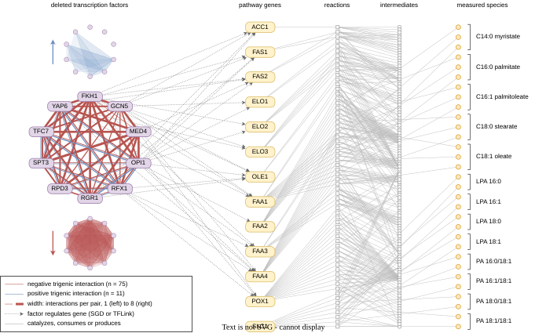

## 2026.09.15 - The network overlay as native draw.io shapes

Writes `notes/assets/drawio/ffa-epistasis-fig4-network-overlay.drawio` with every factor,
gene, reaction, metabolite and edge as its own cell, so the figure is rearranged node by
node in draw.io and the edges follow. Geometry comes from
`ffa_network_overlay_panel.layout()` ([[experiments.008-xue-ffa.scripts.ffa_network_overlay_panel]]),
so the matplotlib panel and this diagram place every node at the same millimetre.

```bash
# write the .drawio; with --drawio also export SVG + PNG here and check the Nature cap
PYTHONPATH=$PWD ~/miniconda3/envs/torchcell/bin/python \
  experiments/008-xue-ffa/scripts/ffa_network_overlay_drawio.py \
  --drawio /tmp/drawio-squashfs/squashfs-root/drawio
```



Measured export: 176.4 x 112.2 mm against the 179.4 x 170 mm full-page cap (the run fails
if an export is over). House style as in the manuscript's Fig. 1: Arial at `fontSize=8.3`
(5.98 pt), palette stroke and fill pairs (purple = deleted factor, yellow = pathway gene,
blue = measured species, gray = reaction and intermediate), amber and brick reserved for
the interaction edges, line widths converted from points at 1 unit = 0.72 pt. A hidden
layer named `print box` holds the 179.4 x 170 mm frame; switch it on in draw.io to see
the cap while arranging (hidden layers are not exported). A single-panel figure carries no
letter; `--letter a` adds one at the top left if the figure gains panels.

Headless export on GilaHyper works with the AppImage extracted and the input path placed
first: `xvfb-run -a squashfs-root/drawio FIG.drawio --no-sandbox --disable-gpu -x -f svg -o out.svg`.
The `figures` rule in `notes-tex/008-xue-ffa-epistasis/Makefile` now does exactly that
(and extracts the AppImage on first use), so `make figures && make` rebuilds Fig. 4 from
the draw.io source.

Related: [[experiments.008-xue-ffa.perspective-epistasis-in-metabolic-engineering]],
[[experiments.008-xue-ffa.scripts.build_perspective_drawio]]

## 2026.09.16 - Three rings: the combined circle plus one per sign

The combined circle could not show what each sign does. Every one of the 45 pairs carries
at least one negative interaction, so the 17 pairs that also carry a positive one had their
blue edge hidden under a brick one. Drawing the two signs as parallel offset lines made the
positives visible but still left the reader tracing individual edges to see the shape.

Two failed attempts, recorded so they are not retried:

- **positive drawn over negative**: no positive edge visible anywhere, because the negative
  edge under it is at least as wide.
- **one translucent filled triangle per triple**: 75 overlapping negative triangles average
  out into a single lens-shaped blob. Density is not structure, and the eleven positives on
  top just tint it. Rejected on review.

What works is repeating the ring. The labeled circle shrank from R 23 mm to 16.5 mm (boxes
10.5 x 3.6 mm to 8.0 x 3.2 mm), and the same ten factors are drawn again at the SAME angles
above and below it, unlabeled, at R 8 mm: positives above in blue, negatives below in
brick. Same orientation is the whole point, since the reader compares shapes rather than
looking up nodes.

The shapes carry the result:

| | pairs reached | factors reached | max interactions on one pair |
|---|---|---|---|
| negative | 45 of 45 | 10 of 10 | 8 |
| positive | 17 of 45 | 7 of 10 | 4 |

FKH1, GCN5 and MED4 take part in no positive interaction at all, which is invisible in the
combined circle and obvious in the upper ring.

Geometry lives in `ffa_network_overlay_panel.py` (`ring_positions`, `ring_edge_width_pt`,
`R_RING`, `Y_RING_POS`, `Y_RING_NEG`) so the matplotlib panel and the draw.io generator
place every node at the same millimetre. Ring edge widths reuse the multiplicity encoding
scaled by `R_RING / R_TF`, floored at 0.25 pt: scaling alone puts a single interaction at
0.19 pt, under the hairline print holds.


