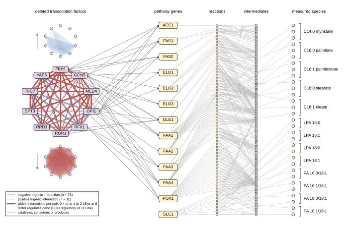

## 2026.09.14 - The network overlay as a full-width publication panel

Replaces the sweep render (`create_ffa_multigraph_overlays.py`, 14 x 18 in portrait, 12 pt
labels) as the perspective's Fig. 4. Same data path, new drawing: positions are set in
millimetres on a 179 mm canvas at Arial 6 pt, written as a true-size SVG.

```bash
PYTHONPATH=$PWD ~/miniconda3/envs/torchcell/bin/python experiments/008-xue-ffa/scripts/ffa_network_overlay_panel.py
# --graph genetic restores the old restriction to triples connected in the genetic graph
```



What it draws, read left to right:

- **Deleted factors in a circle**, with every trigenic interaction significant at a 5% FDR
  within the total-titer readout (multiplicative model): 86 triples, 75 negative and 11
  positive, each as the three edges of its triangle. Edge width is the number of
  interactions the pair takes part in (1 to 8). All 45 pairs carry at least one negative
  interaction; 17 carry a positive one.
- **Regulatory arrows** from a factor to a pathway gene, from the SGD regulatory graph or
  TFLink: 37 edges from 7 of the 10 factors.
- **Pathway genes, reactions, intermediates, measured species** as four columns. Reactions
  and intermediates are ordered by the barycenter of their neighbors to limit crossings.
  Metabolites with no edge in the pathway subgraph (66 of 148) are dropped. Measured species
  are one node per compartment with a bracket and one label per species, which is what
  removed the 33 compartment-suffixed labels that forced the old figure's size.

Three of the old render's problems (labels at 4.4 pt, metabolite labels across the reaction
column, a 131.6 mm width that tiles with nothing) were layout properties, so the fix is a
layout. Nodes take the pale draw.io fills with black outlines; the saturated amber and
brick are reserved for the interaction edges, as in every other panel of the document.
The panel has no axes to box, so it deviates from the boxed-axes rule.

Related: [[experiments.008-xue-ffa.perspective-epistasis-in-metabolic-engineering]],
[[experiments.008-xue-ffa.scripts.build_perspective_drawio]]
