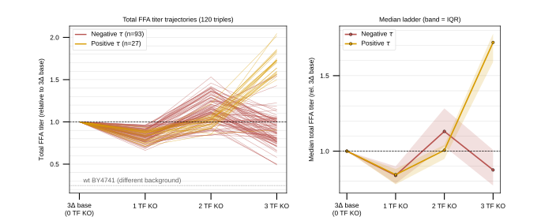

## 2026.08.01 - Total FFA Titer Trajectories Across the TF Deletion Ladder

Script: `experiments/008-xue-ffa/scripts/ffa_total_titer_trajectories.py`
Data out: `experiments/008-xue-ffa/results/ffa_total_titer_trajectories.csv`

### Motivation

The multigraph overlay for Total Titer shows that trigenic interactions on total FFA
titer are predominantly negative (`14` negative vs `2` positive among the significant,
STRING-12.0-Experimental-connected set). This note's figure asks what that looks like as
a *trajectory* over deletion order rather than as a network overlay: does adding the
third TF deletion actually buy titer?

### Panel design

`3Δ base (0 TF KO) → 1 TF KO → 2 TF KO → 3 TF KO` on x, total FFA titer on y.

### Choice of anchor -- this is the load-bearing decision

The Xue 2025 panel is a **complete combinatorial design over 10 TFs** layered on the
POX1-FAA1-FAA4 (3Δ) FFA-overproduction platform: 10 singles (4Δ), 45 doubles (5Δ),
120 triples (6Δ), 3 replicates each. Two rows could serve as "WT", and they mean
different things:

| Row | Mean total titer | What it is |
| --- | --- | --- |
| `+ve Ctrl` | 102.64 mg/L | The **3Δ platform strain** -- sits inside the TF-panel range |
| `wt BY4741` | 25.31 mg/L | True wild type, different background, no FFA machinery |

There is no row literally labelled `3Δ`; `+ve Ctrl` is it. This is confirmed in code,
not inferred: `free_fatty_acid_interactions.normalize_by_reference` documents it as
"the positive control: POX1-FAA1-FAA4 (3Δ metabolic genes)" and uses it as the
normalization reference (`f = strain / ref_mean`).

So the ladder is **anchored at `+ve Ctrl`**, which sits at `f = 1` by construction.
`wt BY4741` (`f = 0.2466`) is drawn only as a dotted floor reference. Anchoring at
`wt BY4741` would spend the entire first step on platform engineering rather than on
the TF biology under study.

### Trajectory construction

For each triple `{i,j,k}` the intermediate rungs average over all constituent
genotypes -- the 3 singles, then the 3 doubles. That is the order-agnostic mean over all
6 mutation orderings. A "best path" (as in the 010 Kuzmin fitness-trajectory plot) would
pre-select for an upward trend and work against the very signal being shown.

Trigenic interaction is the multiplicative form already used in this experiment
(`free_fatty_acid_interactions.py`):

$$\tau_{ijk} = f_{ijk} - f_{ij}f_k - f_{ik}f_j - f_{jk}f_i + 2 f_i f_j f_k$$

Trajectories are colored by the sign of $\tau_{ijk}$: negative in brick (`#B85450`),
positive in amber (`#D79B00`).

### Result

**93 of 120 triples (77.5%) have negative $\tau$.**

Median ladder over all 120 triples:

| Rung | Median relative total titer |
| --- | --- |
| 3Δ base | 1.0000 |
| 1 TF KO | 0.8420 |
| 2 TF KO | 1.0948 |
| 3 TF KO | 0.9516 |

The median **falls back below the base at the third deletion**. The negative-$\tau$
bundle peaks at 2 KO and collapses at 3 KO; the positive-$\tau$ minority keeps climbing
to ~1.9. So on total FFA titer the third TF deletion is, for the large majority of
triples, not merely sub-multiplicative but actively counterproductive.

### Caveat on the coloring

$\tau$ is computed from `f_ijk` against the multiplicative expectation built out of the
same singles/doubles that form the earlier rungs, so the split by sign of $\tau$ is
**not independent evidence** that the bundle bends down -- it is closer to a decomposition
of the same quantity. The figure's job is to show the *shape and magnitude* of that
split, not to prove it. The independent statement is the raw-titer one: median titer
falls from 1.0948 at 2 KO to 0.9516 at 3 KO across all 120 triples, without reference to
$\tau$.

### Defect found in the shared loader

`free_fatty_acid_interactions.load_ffa_data` reads the `Abbreviations` sheet with a
default header row, which **consumes FKH1 as the header** and yields only 9 of the 10 TF
abbreviations. Strains containing `F` therefore carry the bare letter as their gene name
instead of `FKH1`. This script reads that sheet with `header=None` and asserts all 10 are
present. The older 008 scripts still carry the defect -- it affects gene *labels*, not the
interaction arithmetic.
