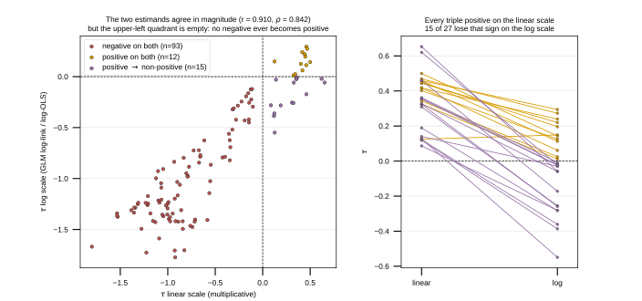

## 2026.08.25 - The Log Scale Explains Most, Not All, of the Sign Difference

Script: `experiments/008-xue-ffa/scripts/linear_vs_log_scale_sign_test.py`

008 fits four epistasis models. On total FFA titer the two linear-scale models report
positive trigenic interactions (11 and 6 clear FDR) and the two log-scale models report
zero. That was recorded as a hypothesis: the two families estimate different quantities,
and the log transform is what removes the positives. This tests it.

Both estimands are computed from the same normalized strain means, so nothing differs
except the scale:

- linear, the Kuzmin tau-SGA form:
  `tau_lin = f_ijk - f_ij f_k - f_ik f_j - f_jk f_i + 2 f_i f_j f_k`
- log, the saturated three-way interaction on log fitness with `g = log f`:
  `tau_log = g_ijk - g_ij - g_ik - g_jk + g_i + g_j + g_k`

### The estimand identification holds

`tau_log` reproduces the shipped log-scale coefficients almost exactly: against the GLM
log-link, Pearson r = 1.0000 with 120 of 120 signs agreeing; against log-OLS,
r = 0.9998 with 119 of 120. The script raises rather than reports if that correlation
falls below 0.99, because every conclusion below depends on it.

### The transform erodes positives and never creates them

The two estimands agree closely in magnitude (Pearson r = 0.910, Spearman 0.842), so this
is not two unrelated quantities. What differs is confined to one direction:

- of the 27 triples positive on the linear scale, **15 (56 percent) are non-positive on the
  log scale**
- of the 93 negative on the linear scale, **0 become positive**

The upper-left quadrant of the scatter is empty. The transform is asymmetric, and that
asymmetry is the mechanism by which the log-scale models lose the positive interactions.

### It explains most of the difference, not all of it

15 of the 27 positives are removed by the sign change. The other 12 remain positive on the
log scale, and the shipped models agree (11 and 12 positive coefficients respectively), but
**none of those 12 reaches FDR significance in either log-scale model**. So the full
accounting of "27 linear positives, 0 log positives that are significant" is 15 lost to the
scale change and 12 lost to power, not the scale alone.

Magnitude predicts the flip only weakly. Flipped triples have smaller linear tau (median
0.324 against 0.431, Mann-Whitney p = 0.027), but the ranges overlap: the largest flipped
value, 0.653, exceeds the smallest surviving value, 0.125. The single largest positive
interaction on the linear scale, RFX1-RPD3-YAP6, is one of the ones that flips.

**Practical consequence.** A positive trigenic interaction on FFA titer is a statement about
the scale it was measured on. The negative interactions are robust to the choice; the
positive ones are not. See [[plan.008-xue-ffa-epistasis-audit.2026.08.15]] and
[[experiments.008-xue-ffa.scripts.ffa_epistatic_path_panels]].

### Output

`experiments/008-xue-ffa/results/linear_vs_log_scale_sign_test.csv`, 120 rows carrying both
estimands and a `sign_class` of `negative_both`, `positive_both`, or
`positive_to_nonpositive`.
