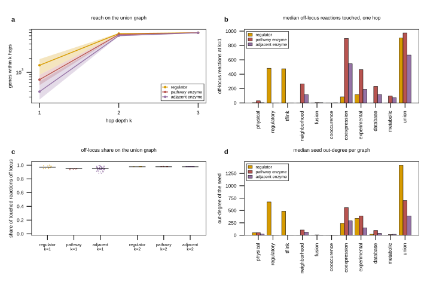

## 2026.09.18 - What the script measures

`experiments/008-xue-ffa/scripts/perturbation_reach_analysis.py` is a descriptive count on
annotation graphs. It asks how far a perturbation seed reaches, and how much of that reach
lands on Yeast9 reactions the free fatty acid titer does not measure. It measures no titer,
no flux and no interaction score, so nothing here is evidence that a large reach produces
the nonlinearity the document reports. Any such link is a hypothesis this script does not
test.

### The three seed classes

- **regulator**, 10 seeds. The ten deleted transcription factors of the source study
  (FKH1, GCN5, MED4, OPI1, RFX1, RGR1, RPD3, SPT3, TFC7, YAP6). None is a Yeast9 gene, so
  each touches the metabolic model only through its targets.
- **pathway enzyme**, 13 seeds. The thirteen core fatty acid pathway genes (ACC1, FAS1,
  FAS2, ELO1, ELO2, ELO3, OLE1, FAA1, FAA2, FAA3, FAA4, POX1, SLC1), a direct hit on the
  measured locus.
- **adjacent enzyme**, 62 seeds. Yeast9 genes that are not pathway genes and whose
  reactions share at least one of the 113 non-currency metabolites carried by a reaction a
  pathway gene catalyzes. One reaction hop from the pathway. These are the genes a "block
  the competing flux and divert it toward the pathway" strategy deletes. The class size,
  62, is computed by the script, not assumed.

Seed names, ORFs, class and Yeast9 membership are in `classes.csv`.

### The ten graphs and their union

Nine CGT gene graphs from `SCerevisiaeGraph`, keyed by systematic name: `physical`
(undirected, 5,721 nodes, 139,463 edges), `regulatory` (directed, 6,582, 39,636),
`tflink` (directed, 5,074, 200,801), and the six STRING 12.0 channels, undirected:
`neighborhood` (2,191, 146,713), `fusion` (3,081, 11,787), `cooccurence` (2,601, 11,085),
`coexpression` (6,474, 996,199), `experimental` (6,016, 822,094), `database` (4,027,
72,617). On the two directed graphs only out-edges are followed, which is the factor to
target direction. Every graph loaded, none failed.

The tenth graph is built from Yeast9 itself: gene to the reactions it catalyzes under the
model's gene-reaction rules, to the non-currency metabolites of those reactions, to the
other reactions carrying those metabolites, to their genes. One gene hop is gene to
reaction to metabolite to reaction to gene. It has 1,101 gene nodes and 11,319 gene-gene
edges, with 7,220 gene-metabolite incidences dropped as currency. The union carries an
edge whenever any of the ten carries it: 6,997 nodes, 2,847,665 out-edges counted once per
direction present.

### The quantities

For every seed, on every graph, at hop depths k = 1, 2, 3 (BFS from the seed, seed
excluded, cumulative within k): `n_reached` genes, `n_metabolic` (reached genes that are
Yeast9 genes), `n_on_locus` (reached genes among the thirteen pathway genes),
`n_reactions_touched` (distinct Yeast9 reactions catalyzed by the reached metabolic
genes), `n_reactions_off_locus`, `share_off_locus`, and the seed's `out_degree`. The
readout locus is the 69 Yeast9 reactions made of the 64 catalyzed by the thirteen pathway
genes plus the five fatty acid exchange reactions (r_1993 palmitate, r_1994 palmitoleate,
r_2055 stearate, r_2189 oleate, r_2193 myristate) that the regulator versus enzyme flux
script uses as its readout. One row per seed, graph and k in `reach.csv`, 2,805 rows.

### The numbers, union graph, median [q1, q3]

| k | class | genes reached | off-locus reactions | off-locus share |
|---|---|---|---|---|
| 1 | regulator | 1416 [888.5, 1915] | 903.5 [666.5, 1052.5] | 0.970 [0.957, 0.987] |
| 1 | pathway enzyme | 701 [535, 885] | 975 [921, 1179] | 0.948 [0.942, 0.950] |
| 1 | adjacent enzyme | 390 [264.2, 640.5] | 667 [475, 946.5] | 0.947 [0.936, 0.962] |
| 2 | regulator | 6680.5 [6481.2, 6849] | 2645 [2645, 2645] | 0.976 [0.976, 0.976] |
| 2 | pathway enzyme | 6390 [6215, 6533] | 2645 [2645, 2645] | 0.977 [0.976, 0.977] |
| 2 | adjacent enzyme | 6024.5 [5881, 6155.5] | 2644 [2638, 2645] | 0.976 [0.976, 0.976] |
| 3 | regulator | 6960 [6960, 6962] | 2645 [2645, 2645] | 0.976 [0.976, 0.976] |
| 3 | pathway enzyme | 6957 [6955, 6958] | 2645 [2645, 2645] | 0.977 [0.976, 0.977] |
| 3 | adjacent enzyme | 6950 [6947, 6953] | 2644 [2638, 2645] | 0.976 [0.976, 0.976] |

The union graph saturates at k = 2. Every class reaches 2,645 off-locus reactions there,
which is every gene-associated Yeast9 reaction outside the locus, so the reach measure
carries no information past one hop on the union. The single-graph medians at k = 1 are
where the classes separate, and they separate by graph rather than by class:

| graph | regulator | pathway enzyme | adjacent enzyme |
|---|---|---|---|
| physical | 2.0 | 29.0 | 2.0 |
| regulatory | 482.5 | 0.0 | 0.0 |
| tflink | 475.5 | 0.0 | 0.0 |
| neighborhood | 0.0 | 265.0 | 115.5 |
| fusion | 0.0 | 3.0 | 2.0 |
| cooccurence | 0.0 | 0.0 | 1.0 |
| coexpression | 85.0 | 898.0 | 545.5 |
| experimental | 116.5 | 463.0 | 188.5 |
| database | 0.0 | 230.0 | 116.5 |
| metabolic | 0.0 | 95.0 | 71.5 |
| union | 903.5 | 975.0 | 667.0 |

The regulator class touches off-locus reactions only through `regulatory` and `tflink`,
and it is at zero on the metabolic graph by construction, since no deleted transcription
factor is a Yeast9 gene. The two enzyme classes are the reverse, at zero on the two
regulatory graphs and carrying their reach on coexpression, experimental, neighborhood and
database. 24 of the 99 graph-class-depth cells have a median reach of zero.

### Mann-Whitney U, two-sided, `n_reactions_off_locus` on the union graph

| k | comparison | U | p | n | medians |
|---|---|---|---|---|---|
| 1 | regulator vs pathway enzyme | 42.0 | 0.163 | 10 vs 13 | 903.5 vs 975.0 |
| 1 | regulator vs adjacent enzyme | 414.0 | 0.0919 | 10 vs 62 | 903.5 vs 667.0 |
| 2 | regulator vs pathway enzyme | 65.0 | 1.0 | 10 vs 13 | 2645.0 vs 2645.0 |
| 2 | regulator vs adjacent enzyme | 500.0 | 0.00106 | 10 vs 62 | 2645.0 vs 2644.0 |

Neither k = 1 test separates the regulator class from an enzyme class at any conventional
threshold. The k = 2 test against the adjacent enzyme class is a saturated comparison:
both medians are within one reaction of the 2,645 ceiling, and the small p value reflects
that a few adjacent enzymes fall one to seven reactions short of a ceiling every regulator
reaches, not a difference in reach of any size worth reporting.

### Figure

Panel a, genes within k hops on the union graph, median line with the interquartile band,
log y. Panel b, median off-locus Yeast9 reactions touched at k = 1 per class on each of
the ten graphs and their union. Panel c, `share_off_locus` at k = 1 and k = 2 on the union
graph, one point per seed with a median bar. Panel d, median seed out-degree per class on
each graph.

### Caveats

- Every number is a count on annotation graphs. None of it is a titer, a flux, or an
  interaction score.
- The graphs are incomplete and unevenly curated. A transcription factor with a long
  TFLink target list and one with a short list differ in how much the resource has
  recorded as well as in what the cell does.
- Reach is not effect. A gene one hop away on a coexpression graph need not change when
  the seed is deleted, and the size of any change is not modeled.
- Edge direction is used only where the graph carries it. Activation versus repression is
  ignored on the regulatory and TFLink edges.
- The metabolic graph is structural. A reaction with zero capacity in the study's chassis
  still carries an edge here.
- The adjacent enzyme class is defined by shared non-currency metabolites, so it depends
  on which metabolites the currency list drops.

### Provenance

Script: `experiments/008-xue-ffa/scripts/perturbation_reach_analysis.py`. It imports
`CURRENCY`, `MODEL_PATH`, `PATHWAY_GENES`, `READOUT_EXCHANGES` and `REGULATOR_ARM` from
`regulator_vs_enzyme_epistasis_model.py` rather than retyping them, so the two analyses
cannot drift apart. Yeast9 is yeast-GEM 9.0.2 read from the pinned SBML, with its sha256
recorded in `summary.json`. The run takes about 44 s and is deterministic: two consecutive
runs produced byte-identical `reach.csv`, `classes.csv`, `summary.json` and SVG. Outputs
land in `experiments/008-xue-ffa/results/perturbation_reach/`.
