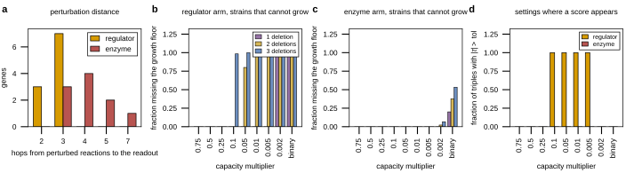

## 2026.09.18 - A model-only test of regulator against enzyme, and what it actually shows

### The question

The 008 Discussion argues that pervasive interaction in a REGULATOR panel measured at one
metabolic locus does not need the regulators to interact: a nonlinear map from the
perturbed layer to the measured one is enough. The hypothesis attached to that, ours and
not the literature's, has three parts: a regulator is more reaction steps from the readout
than an enzyme, each step can add curvature, and a regulator touches many reactions at
once so one measurement sums many unmeasured changes.

This script tests that IN A MODEL. Yeast9 + the pox1 faa1 faa4 chassis, readout = max
summed export of the five measured acids with growth held at half the base strain's
maximum, normalized so the base strain is 1. Regulator arm = the ten factors acting
through their Yeast9 targets (SGD regulatory + TFLink, factor to target); enzyme arm = ten
of the thirteen pathway genes acting on their own reactions. A deletion scales the
capacity of every reaction in its set by alpha; on a shared reaction the factors multiply.
**The perturbation model has no interaction term at all**, so anything eps or tau shows is
the network plus the choice of one readout.

### What it shows, and it is not what it was asked

- **At 0.75, 0.5, 0.25 both arms are an exact null.** About 70% of Yeast9's bounds are the
  +-1000 placeholder, so scaling them binds nothing. This is the model's parameterization,
  not a statement about composability.
- **Below that the regulator arm scores on every triple and the enzyme arm on none** (480
  against 0 over nine settings). But of those 480, **2 are graded**: in the rest at least
  one of the seven readouts the score is built from is exactly 0 because the strain missed
  the growth floor. tau is exactly -1 at 0.1 (triples fail), exactly +2 at 0.05 and 0.01
  (pairs fail too), and exactly 2 f_i f_j f_k at 0.005. The script computes
  `n_triples_interacting_graded` for exactly this reason, and the verdict says it.
- **The distance clause fails.** Regulator median 3 hops to the readout, enzyme median 4.
  A regulator's reaction set is the union over 125 to 605 Yeast9 target genes (323 to
  1,401 reactions) and a union that large nearly always touches something adjacent to the
  fatty acid exchanges; an enzyme acts on 2 to 18. The hop/|tau| Spearman flips sign
  between settings (-0.33 at 0.05, +0.52 at 0.01).
- The only nonzero enzyme-arm score anywhere is **FAS1 with FAS2**, which share reactions
  so their factors compound to alpha squared.

### Why this is worth keeping

It is a negative result with a named cause, and it says what a model would need to answer
the question: graded capacities instead of placeholder bounds, a readout that does not
collapse onto an LP feasibility boundary, and a map from a factor deletion to a
distribution of expression changes rather than an all-or-nothing scaling of every target.
The last is the step the Discussion already calls missing, and this is the cost of its
absence.

It is also a trap worth marking: read only through `n_triples_interacting`, this run says
"the regulator arm produces 480 interactions and the enzyme arm none", which would have
gone into the document as support for the hypothesis. It is an artifact of the growth
floor.

Written up as Supplementary Note 3 of `notes-tex/008-xue-ffa-epistasis`, with the caveat
list from `summary.json`. Related: [[experiments.008-xue-ffa.scripts.ffa_kegg_map]],
[[experiments.008-xue-ffa.scripts.interaction_graph_enrichment_analysis]].
