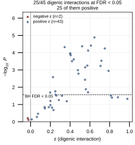
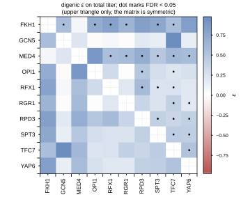
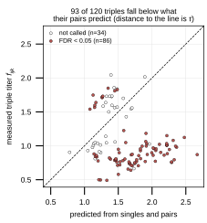
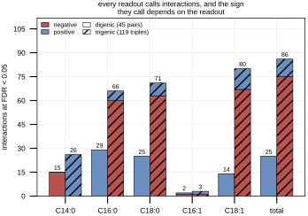
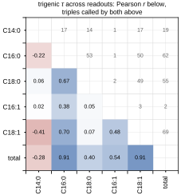
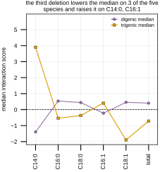

## 2026.09.16 - Supplementary panels: the digenic layer and the five species

The 008 perspective makes one claim on one readout under one null: on total fatty acid
titer, under the multiplicative model, the third deletion interacts and usually downward.
Both obvious follow-up questions were answerable from tables the four model scripts already
wrote, and nothing plotted them. This script does.

Source: `experiments/008-xue-ffa/scripts/supplementary_figure_panels.py`. Reads only
committed result CSVs, fits nothing. Recomputes Benjamini-Hochberg WITHIN each readout,
because the stored `fdr_corrected_p` pools all six.

### The digenic layer (Supplementary Fig. 1)

The pairs run the other way from the triples. On total titer 43 of 45 doubles are positive,
median +0.40, and 25 clear a 5% false discovery rate with every one of the 25 positive.
Every one of the ten factors is in at least one called pair (GCN5 in 1 of its 9, TFC7 in 8
of its 9), so the positive digenic signal is not one factor's doing.

Panel c is the one worth keeping: it plots each triple's measured titer against the titer
predicted from its singles and its pairs, so the distance to the diagonal IS tau. That comes
from the identity

```
tau_ijk = f_ijk - f_i f_j f_k - (eps_ij f_k + eps_ik f_j + eps_jk f_i)
```

which is Eq. 2 of the document and is verified numerically (max abs difference from the
Kuzmin form 4.4e-16). Ninety-three of 120 triples fall below their pair prediction.





### The five species (Supplementary Fig. 2)

Total titer is a sum, and the sum is not a faithful summary of its parts. Per-readout
counts and medians are written to `results/supplementary_readout_counts.csv`:

| readout | digenic called (pos) | trigenic called (pos) | digenic median | trigenic median |
|---|---|---|---|---|
| C14:0 | 15 (0) | 26 (26) | -1.398 | +3.900 |
| C16:0 | 29 (29) | 66 (6) | +0.537 | -0.537 |
| C18:0 | 25 (25) | 71 (8) | +0.440 | -0.366 |
| C16:1 | 2 (1) | 3 (2) | -0.222 | +0.407 |
| C18:1 | 14 (14) | 80 (13) | +0.459 | -1.896 |
| total | 25 (25) | 86 (11) | +0.403 | -0.717 |

Three things fall out. C14:0 reverses sign between the digenic and trigenic layer, all 15
digenic calls negative and all 26 trigenic calls positive. C16:1 is effectively silent at
this replicate depth, 2 and 3 calls, so any claim about it would be a claim about a readout
the design cannot resolve. And the summed total sits at r = 0.91 from C16:0 and C18:1 but at
r = -0.28 from C14:0, with the two most opposed species C14:0 and C18:1 at r = -0.41.
Summing reports the species carrying the most mass and cancels one that runs the other way,
which is the mechanism behind the main text's "31 positive consensus interactions exist
across the five species, none on their sum".





### Where these land

Supplementary Notes 2 and 3 of `notes-tex/008-xue-ffa-epistasis`, each with its figure.
Note 1 of the same SI writes out all four model expectations with numbered equations; it
cites this script only for the counts.
