## 2026.07.16 - First CRISPR single-KO fitness assay for the 12 panel

First attempt at a **wet-lab fitness assay** for the 12-gene panel used in the exp-010
Kuzmin-TMI inference work ([[experiments.010-kuzmin-tmi.scripts.12_panel_inference_3_fitness_comparison]],
[[experiments.010-kuzmin-tmi.scripts.12_panel_gene_list_overlap]]). Goal: measure
single-mutant fitness (SMF) for these genes by arraying CRISPR-Cas knockouts on agar,
imaging, and scoring colony size — a step toward **quantifying trigenic interactions**
by measuring fitness experimentally, benchmarked against the published Costanzo 2016 /
Kuzmin 2018 SMF.

This is an **SGAtools-style clone adapted to our design** (acoustic ECHO dispensing,
randomized/blocked layouts, on-plate BY4741 reference + Blank_media control, no query×array
cross). Pipeline module: `torchcell/sga/` ([[torchcell.sga]]). Runner + data:
`experiments/019-echo-crispr-array/` (code lives in the 019 experiment; this note files it
under the 010 thread it serves). Plate analyzed here: **Plate 5, OD1, 2.5 vs 5 nL**.

### Pipeline (image in → results out)

`Original.png` (standardized pixl-imager capture) is the only input beyond the ECHO picklist:

1. **Quantify** (`torchcell/sga/image.py`): plate-ROI detection → colony-blob detection →
   rotation estimate → rotated 14×22 lattice fit (out-of-range penalty forces full column
   coverage; wall-reflection blobs rejected) → per-colony size + circularity. A dark
   agar-tear ("gash") is masked and overlapping colonies flagged.
2. **Register** (`register.py`): image grid → plate wells resolved automatically via the
   **blank pattern** — the orientation where the 22 `Blank_media` wells land on empty spots.
3. **Normalize** (`normalize.py`): Baryshnikova-style row/col + local-spatial correction,
   plate-median scaling; jackknife on logical replicate groups (also catches CRISPR escapers).
4. **Score / fitness** (`score.py`): fitness = median(mutant normalized size) / median(BY4741
   normalized size), **with SD** = sd(per-replicate ratios); Mann–Whitney p vs WT.
5. **Assay metrics** (`assay.py`): per-volume missing rate, WT CV, Z′-factor, and a
   **volume↔position confound check**.

### Normalization & scoring — the math (by SGA effect)

The SGA literature (Baryshnikova et al. 2010) names five position/technical effects. **Which we
correct, honestly:**

| SGA effect | corrected? | how / where in `torchcell.sga` |
|------------|:----------:|--------------------------------|
| Plate-specific | **yes** | plate normalization (÷ plate reference median) + within-plate WT ratio |
| Row / column | **yes** | per-row & per-column median factors |
| Spatial | **yes** | local-neighbourhood median surface |
| Competition | **partial** | absorbed by the spatial step; **no explicit neighbour-size model** |
| Batch | **no** | single plate only; needs a batch model when combining plates/days |

**Consistent notation.** Colony at well $i=(r,c)$ has raw size $s_i$. The **reference set** $R$ =
non-missing, non-flagged, non-blank colonies; every factor below is fit on $R$ and is
**multiplicative and median-based** (robust). Write $\operatorname{med}_{A}(\cdot)$ for the median
over a set $A$ and $M=\operatorname{med}_{R}(s)$ for the plate reference median. Successive stages are
$s^{\mathrm{rc}}\!\to s^{\mathrm{sp}}\!\to\mathrm{norm}$, each taking the previous value.
(`torchcell/sga/normalize.py`, `score.py`.)

**Row / column effect** — systematic row and column gradients. Per-row factor $\rho_r$ and per-column
factor $\gamma_c$:

$$\rho_r=\frac{\operatorname{med}_{\,R,\,\mathrm{row}=r}(s)}{M},\qquad
\gamma_c=\frac{\operatorname{med}_{\,R,\,\mathrm{col}=c}(s)}{M},\qquad
s^{\mathrm{rc}}_{i}=\frac{s_{i}}{\rho_r\,\gamma_c}$$

**Spatial effect** — smooth 2-D / local gradients beyond row+col (edge, regional). Over a Chebyshev
window $W_i$ of radius $w$ (default 2, i.e. $5\times5$) using reference wells only and excluding $i$,
the local expectation and correction are

$$E_i=\operatorname{med}_{\,j\in W_i\cap R}\!\big(s^{\mathrm{rc}}_j\big),\qquad
s^{\mathrm{sp}}_{i}=s^{\mathrm{rc}}_{i}\cdot\frac{\operatorname{med}_{R}\!\big(s^{\mathrm{rc}}\big)}{E_i}$$

($E_i$ falls back to the plate median if $<$ `spatial_min_neighbors` reference wells lie in $W_i$).
Valid here because the ECHO layout is randomized, so $W_i$ mixes genotypes and estimates only position.

**Competition effect** — a colony's growth suppressed by large neighbours (nutrient competition).
**Partially handled, not explicitly.** A dedicated correction would model size as a function of the
neighbourhood biomass $B_i=\sum_{j\in W_i}s_j$ and divide out the fitted dependence, e.g.
$s^{\mathrm{comp}}_i=s^{\mathrm{sp}}_i/\big(1+\beta\,\hat B_i\big)$ with $\beta$ estimated from the
reference set and $\hat B_i$ the centred neighbour biomass. We do **not** fit this; the spatial step
above absorbs *some* competition (a dense/large-neighbour region raises $E_i$, which is divided out),
but there is **no neighbour-size regression** — flagged as a gap.

**Plate-specific effect** — plate-to-plate offset in overall colony size. Plate normalization sets
each plate's reference median to 1 (so $\mathrm{norm}=1$ is the plate-average strain):

$$\mathrm{norm}_{i}=\frac{s^{\mathrm{sp}}_{i}}{\operatorname{med}_{R}\!\big(s^{\mathrm{sp}}\big)}$$

This removes the plate offset for cross-plate comparison; it is **additionally cancelled** in scoring
because fitness is a within-plate mutant/WT ratio (both share the plate).

**Batch effect** — variation across imaging batches / days / source plates. **Not corrected.** With a
single plate there is no batch term. When plates are combined, the minimal fix is per-batch median
centring, $\mathrm{norm}^{\mathrm{batch}}_{i}=\mathrm{norm}_{i}/m_{b(i)}$ where $m_b=\operatorname{med}_{R\cap
\mathrm{batch}\,b}(\mathrm{norm})$ (or a mixed-effects batch term). **Not yet implemented.**

**Replicate filtering (jackknife).** For each logical strain group $g$ with
$\mathrm{med}_g=\operatorname{med}_{i\in g}(\mathrm{norm}_i)$ and
$\mathrm{MAD}_g=\operatorname{med}_{i\in g}|\mathrm{norm}_i-\mathrm{med}_g|$, the robust z-score is
$z_i=0.6745\,(\mathrm{norm}_i-\mathrm{med}_g)/\mathrm{MAD}_g$; flag $i$ (`JK`) if $|z_i|>3.5$ (also
catches CRISPR escapers).

**Scoring / fitness** (per strain $g$, per volume). With used set $U_g$ = colonies of $g$ that are
non-missing, non-flagged, non-JK, and wild-type $W=$ BY4741:

$$f_g=\frac{\operatorname{med}_{U_g}(\mathrm{norm})}{\operatorname{med}_{U_W}(\mathrm{norm})},
\qquad
\mathrm{SD}_{f_g}=\frac{\operatorname{sd}_{U_g}(\mathrm{norm})}{\operatorname{med}_{U_W}(\mathrm{norm})},
\qquad
p_g=\mathrm{MWU}\big(\mathrm{norm}_{U_g},\,\mathrm{norm}_{U_W}\big)$$

where MWU is the two-sided Mann–Whitney U test (rank-based, robust to escaper tails).

**Assay-quality metrics** (`assay.py`): coefficient of variation $\mathrm{CV}=\sigma/\mu$; and the
Z'-factor between two colony populations $a,b$,
$Z'=1-\dfrac{3(\sigma_a+\sigma_b)}{|\mu_a-\mu_b|}$ (>0.5 excellent, 0 to 0.5 usable, <0 no separation).

**Not applied:** SGA linkage correction (array genes near the query on the chromosome) — no query, so
no query–array linkage artifact.

### Plate 5 quantification

255 colonies measured, 53 empty (≈22 blanks + gash + failures), 4 gash-flagged. Registration
resolved to `identity` (21/22 blanks correctly empty; 89.3% blank/plated agreement — the
shortfall is 32 plated wells that didn't grow, expected).

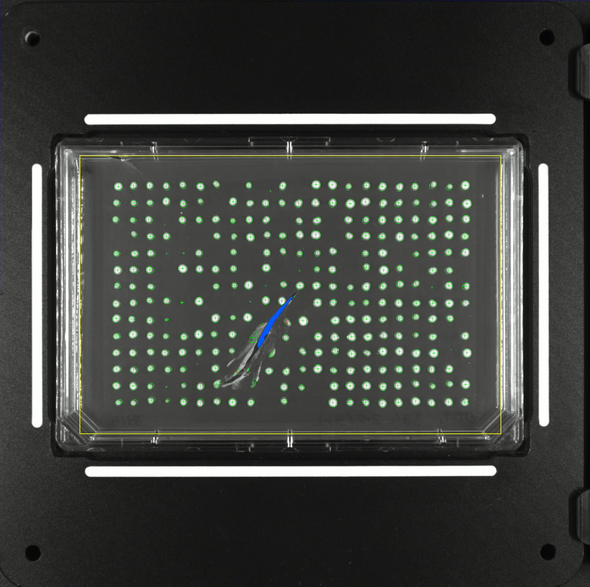

*Green = measured colony (radius ∝ size), red = flagged, blue = detected gash, yellow = plate ROI.*

### Fitness (mutant / BY4741) ± SD, by volume

> **Superseded (see 2026.07.17 below).** These numbers were computed with an early per-cell
> segmentation that under-measured colonies; the fixed edge detection changed them (fitness rose,
> WT CV fell 0.26→0.085, offset to reference shrank). Use the 2026.07.17 table.

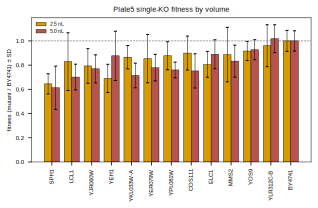

Fitness = median(mutant normalized size) / median(BY4741 normalized size); SD = spread of the
per-replicate ratios. `n` = replicates surviving filters (11 placed per strain per volume; the
lower 2.5 nL counts reflect the gash + higher missing rate on that half). Costanzo column is the
published reference SMF (see comparison below). Ordered by 5 nL fitness.

| strain          | ORF       | 2.5 nL: fitness ± SD (n) | 5.0 nL: fitness ± SD (n) | Costanzo SMF ± SD |
|-----------------|-----------|--------------------------|--------------------------|-------------------|
| SPH1            | YLR313C   | 0.46 ± 0.10 (n=6)        | 0.39 ± 0.21 (n=10)       | 0.98 ± 0.03       |
| LCL1            | YPL056C   | 0.59 ± 0.19 (n=8)        | 0.50 ± 0.13 (n=10)       | —                 |
| COS111          | YBR203W   | 0.67 ± 0.10 (n=10)       | 0.55 ± 0.17 (n=11)       | 1.04 ± 0.05       |
| YKL033W-A       | YKL033W-A | 0.56 ± 0.05 (n=6)        | 0.56 ± 0.14 (n=7)        | 1.03 ± 0.10       |
| YJR060W (CBF1)  | YJR060W   | 0.53 ± 0.15 (n=11)       | 0.58 ± 0.21 (n=11)       | **0.59 ± 0.11**   |
| YPL081W (RPS9A) | YPL081W   | 0.62 ± 0.10 (n=11)       | 0.60 ± 0.11 (n=11)       | 0.96 ± 0.16       |
| YER079W         | YER079W   | 0.57 ± 0.18 (n=9)        | 0.62 ± 0.17 (n=8)        | 1.04 ± 0.12       |
| MMS2            | YGL087C   | 0.66 ± 0.33 (n=9)        | 0.68 ± 0.18 (n=11)       | 1.00 ± 0.09       |
| YEH1            | YLL012W   | 0.41 ± 0.08 (n=5)        | 0.71 ± 0.32 (n=11)       | 0.99 ± 0.08       |
| ELC1            | YPL046C   | 0.55 ± 0.13 (n=9)        | 0.76 ± 0.17 (n=11)       | 1.04 ± 0.06       |
| YOS9            | YDR057W   | 0.73 ± 0.14 (n=9)        | 0.87 ± 0.19 (n=11)       | 1.04 ± 0.05       |
| YLR312C-B       | YLR312C-B | 0.72 ± 0.18 (n=11)       | 1.04 ± 0.17 (n=11)       | 1.08 ± 0.04       |
| **BY4741**      | —         | 1.00 ± 0.24 (n=9)        | 1.00 ± 0.18 (n=11)       | 1.00 (ref)        |

Full per-colony + per-strain CSVs in `experiments/019-echo-crispr-array/results/`
(`plate5_fitness_by_volume.csv`, `plate5_strain_scores_{2.5,5.0}nL.csv`).

### Plating success — attempted wells with no colony

Of the **11 wells placed per strain per volume**, how many produced **no colony** (well plated but
nothing grew). This is distinct from the `n` in the fitness table above: `n` also drops flagged/
jackknife colonies that *did* grow, whereas "no colony" counts only truly empty wells.
`results/plate5_plating_success.csv`. Ordered by 5 nL fitness.

| strain | no colony 2.5 nL (/11) | no colony 5.0 nL (/11) |
|--------|:---:|:---:|
| SPH1 | 4 | 1 |
| LCL1 | 2 | 1 |
| COS111 | 0 | 0 |
| YKL033W-A | 4 | 4 |
| YJR060W | 0 | 0 |
| YPL081W | 0 | 0 |
| YER079W | 2 | 3 |
| MMS2 | 2 | 0 |
| YEH1 | 6 | 0 |
| ELC1 | 2 | 0 |
| YOS9 | 1 | 0 |
| YLR312C-B | 0 | 0 |
| **BY4741** | 0 | 0 |
| **total** | **23 / 143** | **9 / 143** |

Blank_media (no-cell control): 21 of 22 wells empty as expected (1 anomalous — contamination or a
quantification artifact). Two patterns stand out: the 2.5 nL half loses far more wells (23 vs 9),
and **YKL033W-A fails at both volumes (4/4)**, i.e. a strain-intrinsic plating/growth failure
independent of volume, whereas YEH1's 6/11 loss is 2.5 nL-only.

**How many of these are due to the gash? Almost none.** The detected tear touches only **3 wells**
(all 2.5 nL): 2 grew but were excluded (BY4741/I12, SPH1/J12) and **1 is a no-colony well
(MMS2/K11)**. So of the 32 no-colony wells, **only 1 is gash-attributable; the other 31 are not**.
The elevated 2.5 nL loss (23 vs 9) is therefore **not** the gash — it is a genuine low-volume/side
effect (fewer deposited cells → more stochastic founder failures), which reinforces the
higher-volume-is-more-reliable reading.

### Colony shape by volume — is higher volume making weird shapes?

The concern for the volume choice was colony **morphology**: too much dispensed liquid could
spread/merge colonies into irregular shapes. The data says **no — the opposite**:

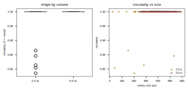

| volume | n   | median circularity | mean  | % circ < 0.90 | median size (px) |
|--------|-----|--------------------|-------|---------------|------------------|
| 2.5 nL | 118 | 1.00               | 0.988 | 3.4%          | 199              |
| 5.0 nL | 134 | 1.00               | 1.000 | 0.0%          | 247              |

At 5 nL every colony is round (0% below 0.90 circularity) and larger; the only irregular colonies
are **small** ones in the 2.5 nL half (right panel: low-circularity points are all at small size).
So there is **no spreading/merging at 5 nL** on this plate. Caveat: circularity is mildly
size-biased (coarser perimeter on small colonies), and 5 nL grows larger colonies — but that bias
would if anything *inflate* an abnormal-shape signal at low volume, and we see none at high volume.

### Why volume matters (protocol context)

Protocol: grow in liquid culture → **normalize OD** → dispense by ECHO. With OD (cells/mL) fixed,
the number of cells deposited per spot = concentration × volume, so 5 nL deposits ≈2× the cells of
2.5 nL. At these nL volumes the founder count per spot is small (tens of cells), so its relative
variability scales like 1/√N — **more volume → more reproducible starting cell count → fewer empty
spots and tighter colonies** (consistent with 5 nL: missing 6.3% vs 16.1%, WT CV 0.18 vs 0.26). The
counter-risk was abnormal morphology at high volume; the shape analysis above shows that did not
happen here. So on the reliability/shape axes 5 nL is favorable — but see the confound before
treating that as the volume verdict.

### ⚠ Design confound — volume is blocked by plate side

In Plate 5 the volume is **not randomized**: columns 2–12 are all 2.5 nL, columns 13–23 all
5 nL. Volume is therefore fully confounded with left–right position. The **gash sits in the
2.5 nL (left) half**, but its footprint is small — only **3 wells** touch the tear (see plating
success above); the 6 flagged colonies in the 2.5 nL half are mostly low-circularity (`C`), not
gash. The confound that matters is thus **position**, not the tear: the cross-volume comparison is
**not safe** because "5 nL looks better" cannot be separated from "the right side grew better."
(Contrast Plate 1, where volume was randomized within each row.) The per-volume **fitness ratios are
still valid** because each mutant is anchored to the WT in its own half, cancelling the side effect.

**Within each block the strains ARE randomized.** Checked against the picklist: in both the
2.5 nL block (cols 2–12) and the 5 nL block (cols 13–23), each strain's 11 replicates are
scattered across many rows and columns with no clustering or repeating pattern. So the
confound is purely at the block level (volume ↔ side); within a block, every strain samples
the local position space, so local gradients average out per strain and the per-volume
fitness ratios are spatially unbiased. Only the *cross-volume* comparison is compromised.

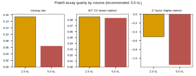

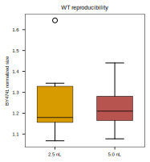

Raw numbers (confounded): 2.5 nL missing 16.1%, WT CV 0.26; 5.0 nL missing 6.3%, WT CV 0.18.
Z′-factor is negative at **both** volumes → these knockouts do not separate from WT here
(they look near-neutral; not necessarily an assay failure).

Full-plate normalized heatmap (colorbar anchored at 0; black divider = the 2.5 nL | 5 nL block
boundary between columns 12 and 13):

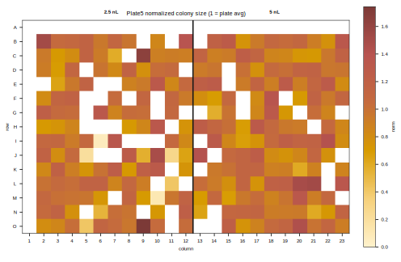

### Reference SMF comparison (Costanzo / Kuzmin)

Reference SMF is sourced from the canonical exp-010 queried singles tables (queried from the
Costanzo2016 / Kuzmin SMF LMDBs): the panel-12 table
`experiments/010-kuzmin-tmi/results/inference_3/singles_table_panel12_k200_queried.csv` plus the
per-gene investigation `.../YLR313C_investigation_singles_queried.csv` (for SPH1, which the panel-12
table omits). Assembled by `scripts/build_reference_smf.py` → `results/reference_smf_12panel.csv`.
**Costanzo 2016 SMF + SD is now available for 11 of the 12** (per-mutant stddev); **Kuzmin 2018**
covers 4 (no per-single SD). SPH1/YLR313C = **0.9843 ± 0.0271** (strain `YLR313C_sn572`). The one
remaining gap is **LCL1 (YPL056C)**: it is neither in the panel-12 table (the plate swapped LCL1 in
for YIL174W/YLR104W) nor in a local per-gene query, and the Costanzo `smf_costanzo2016` dataset has
no local processed form (only a truncated raw zip) — so LCL1's SMF must be re-queried once the
Costanzo LMDB/DB is available (same mechanism that produced the SPH1 value above). Not fabricated.

**Where the Costanzo values come from + their replicate count.** The Costanzo SMF is read from the
exp-010 queried CSVs (not from the raw file, which is the truncated zip). torchcell's
`SmfCostanzo2016Dataset` populates those from Costanzo et al. 2016
`strain_ids_and_single_mutant_fitness.xlsx` (30 °C SMF + stddev); every value keeps a Costanzo strain
id (e.g. SPH1 = `YLR313C_sn572`, COS111 = `YBR203W_sn3868`). **Replicates behind each Costanzo SMF:**
the value is an average over control *screens*, not colonies — **17 replicate control screens** for
query-strain SMF and **350** for array-strain SMF, at 4 replicate colonies per screen, with the
*screen* as the resampling unit for the stddev. Documented with verbatim Costanzo-SI quotes in
`torchcell/datasets/scerevisiae/costanzo2016.py` (`N_SAMPLES_QUERY_SMF_SCREENS = 17`,
`N_SAMPLES_ARRAY_SMF_SCREENS = 350`). Contrast our assay: **n = 5–11 replicate colonies** per strain
per volume (the `(n=…)` in the fitness table), a very different (smaller, colony-level) replicate
structure — worth remembering when comparing SDs.

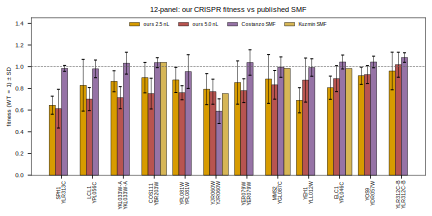

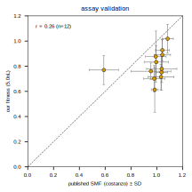

> **Figures regenerated with corrected (2026.07.17) data; numbers updated. The original 07.16 text
> claimed a large "systematic offset" and r = 0.39 — that was largely a segmentation artifact (see
> "Did the analysis change?" in 2026.07.17).**

**Observations (corrected):**

- With full-colony measurement our fitness sits **near the reference** (bars close to the ~1.0
  Costanzo/Kuzmin bars; median 5 nL ≈ 0.78, range 0.61–1.02 vs Costanzo 0.59–1.08) — the earlier
  large offset was mostly a measurement artifact.
- The ours-vs-Costanzo scatter correlation stays low (**r ≈ 0.3**), but this is because the reference
  has **almost no dynamic range** here (11 of 12 genes are ~1.0), so there is little to correlate
  against — not evidence of disagreement. The one gene with a real published defect —
  **CBF1/YJR060W, Costanzo 0.59 ± 0.11** — is the one we read lowest too (ours ~0.77), i.e. the assay
  lands the true positive.
- Residual next step: still match growth time/temperature (Costanzo is 30 °C SMF; ~48 h at 26 °C for
  the SGA colony assay, sourced below) before reading anything into the small remaining differences.

### Growth / incubation time (SOURCED — Kuzmin 2018)

The SGA colony-size assay is imaged at a single time point after a fixed incubation, and the absolute
fitness scale depends on it, so matching it matters for the ours-below-published offset. Now sourced
from the locally-mirrored Kuzmin 2018 trigenic paper
(`papers/kuzminSystematicAnalysisComplex2018/SI-kuzminSystematicAnalysisComplex2018.mmd`), which runs
the same SGA colony assay ("SGA analysis was conducted as described previously … with modifications").
**Each SGA selection/growth step is ~2 days at 26 °C.** Verbatim durations: query lawns "grown at
26 °C for 2 days"; mating "incubated at room temperature for a day"; diploid selection "26 °C for
2 days"; sporulation "22 °C for 7 days"; haploid selection "26 °C, 2 days"; and "the incubation
temperature for all the selection steps was 26 °C." So the **final mutant colonies whose size gives
fitness grow ~2 days (48 h) at 26 °C** before imaging.

Costanzo 2016 SI (mirrored, `papers/costanzoGlobalGeneticInteraction2016/`) gives the SGA colony
**temperature** — 30 °C for nonessential-deletion query × DMA screens; 26 °C for TS alleles at
semipermissive temperature "prior to imaging" — but **no explicit final-growth duration** in the
mirrored section (it defers timing to the SGA protocol, Baryshnikova 2010 / Tong 2004, which is not
mirrored locally). **Target to match: ~48 h at 26–30 °C.** Implication: our plate should be imaged at
a comparable ~2-day growth; imaging at a different age could itself explain part of the ours-below-
published offset.

**Planned imaging timecourse.** SGA reads at a single timepoint (**~48 h at 26 °C**, Kuzmin 2018); to
test whether colony age changes the scores we will image at a few ages **bracketing** the reference,
holding temperature fixed (26–30 °C) so only age varies:

| timepoint | rationale |
|-----------|-----------|
| **24 h** (early) | colonies small — lower SNR / less reproducible, but least risk of merging |
| **48 h** (reference) | the SGA standard growth time to match Costanzo/Kuzmin |
| **72 h** (late) | larger colonies — better SNR, but risk of plateau / neighbour merging, esp. at 5 nL |

Re-quantify each timepoint with the same pipeline and compare fitness (as we did for imaging modality,
r=0.95) to see whether the score depends on colony age. If 48 h already matches the reference, the
early/late points bound how sensitive the assay is to timing.

### Next steps

- **Randomize volume across position** (interleave 2.5/5 nL within rows, like Plate 1) so the
  volume question is answerable without the side confound.
- **Fill the last reference gap (LCL1/YPL056C)** by re-querying the Costanzo SMF dataset (now 11/12).
- **Source and match the SGA incubation time**, then re-image, to test whether the systematic
  ours-below-published offset is a time/assay effect or a real CRISPR fitness cost.
- Replicate plates + a known-sick control to establish a positive Z′.

### Provenance

- Module: [[torchcell.sga]] — `image.py`, `register.py`, `normalize.py`, `score.py`, `assay.py`.
- Runner: `experiments/019-echo-crispr-array/scripts/run_plate5_volume.py`.
- Reference builder: `experiments/019-echo-crispr-array/scripts/build_reference_smf.py`.
- Inputs: `experiments/019-echo-crispr-array/data/{Original.png, ECHO_picklist_Plate5_384_OD1_2p5-5nL.csv}`.
- Reference source: `experiments/010-kuzmin-tmi/results/inference_3/singles_table_panel12_k200_queried.csv`.
- Figures: `notes/assets/images/019-echo-crispr-array/plate5_*` (SVG + PNG). Heatmaps use the
  on-brand warm sequential colormap `torchcell.sga.viz.SEQUENTIAL_CMAP`.
- Upstream SGAtools source (reference to clone from) cloned at `external/sgatools/`
  (github.com/boonelab/sgatools; gitignored, not vendored).

## 2026.07.17 - Edge-detection fix, transillumination modality, reference 12/12

### Quantification fix — edges now land on colonies

The 2026.07.16 overlay drew each mark at the **grid node**, not the measured colony, so circles looked
shifted off the colonies. The overlay now draws the **actual detected colony boundary** (green) at the
measured centroid, and per-cell segmentation switched from a fixed threshold to a **robust MAD
threshold** about each cell's agar level (`torchcell/sga/image.py`). Effect — the old numbers were
under-measuring colonies (bright-core only), which is why they read artificially low:

- **WT reproducibility jumped**: BY4741 CV **0.26 → 0.085** (2.5 nL) and **0.18 → 0.083** (5 nL). The
  assay is far tighter than the old numbers implied; the high CV was a segmentation artifact.
- **Fitness rose and the ours-below-published offset shrank** (median 5 nL fitness ~0.6 → 0.78, range
  0.61–1.02 vs Costanzo ~1.0). So the earlier "systematic offset" was **partly a quantification
  artifact, not biology** — a real caution the 07.16 scatter over-read.

**Corrected fitness (mutant / BY4741) ± SD, by volume** (supersedes the 07.16 table; `n` = colonies
used of 11 placed):

| strain | ORF | 2.5 nL ± SD (n) | 5.0 nL ± SD (n) | Costanzo SMF ± SD |
|--------|-----|-----------------|-----------------|-------------------|
| SPH1 | YLR313C | 0.65 ± 0.08 (6) | 0.61 ± 0.18 (10) | 0.98 ± 0.03 |
| LCL1 | YPL056C | 0.83 ± 0.24 (9) | 0.70 ± 0.11 (10) | 0.98 ± 0.08 |
| YJR060W | YJR060W | 0.79 ± 0.14 (11) | 0.77 ± 0.12 (11) | 0.59 ± 0.11 |
| YEH1 | YLL012W | 0.69 ± 0.12 (5) | 0.88 ± 0.20 (11) | 0.99 ± 0.08 |
| YKL033W-A | YKL033W-A | 0.87 ± 0.10 (7) | 0.71 ± 0.10 (7) | 1.03 ± 0.10 |
| YER079W | YER079W | 0.85 ± 0.20 (9) | 0.78 ± 0.11 (8) | 1.04 ± 0.12 |
| YPL081W | YPL081W | 0.88 ± 0.12 (11) | 0.76 ± 0.06 (11) | 0.95 ± 0.16 |
| COS111 | YBR203W | 0.90 ± 0.14 (10) | 0.75 ± 0.14 (11) | 1.04 ± 0.05 |
| ELC1 | YPL046C | 0.81 ± 0.11 (9) | 0.89 ± 0.12 (11) | 1.04 ± 0.06 |
| MMS2 | YGL087C | 0.89 ± 0.23 (8) | 0.83 ± 0.13 (11) | 1.00 ± 0.09 |
| YOS9 | YDR057W | 0.92 ± 0.08 (8) | 0.93 ± 0.08 (11) | 1.04 ± 0.05 |
| YLR312C-B | YLR312C-B | 0.96 ± 0.17 (11) | 1.02 ± 0.12 (11) | 1.08 ± 0.04 |
| BY4741 | BY4741 | 1.00 ± 0.09 (8) | 1.00 ± 0.08 (11) | - |

### Colony-size spread vs the published reference

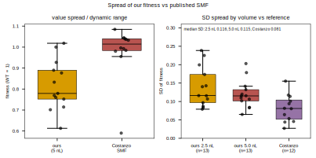

### Imaging modality: dark-field vs transillumination (does not change scores)

Plate 5 was quantified twice, from a dark-field capture (pixl imager) and from a
transillumination capture (iPhone on a light panel). Per-strain fitness correlates
**r = 0.96 (r-squared 0.93, n = 13)** between the two modalities, with the same ranking and
transillumination running slightly lower/compressed. The tight correlation is also
independent evidence that the registration (B2 = top-left for this border-free inner-array
plate) is correct, since a mis-registered plate could not correlate this closely. Either
modality is usable; standardize on one.

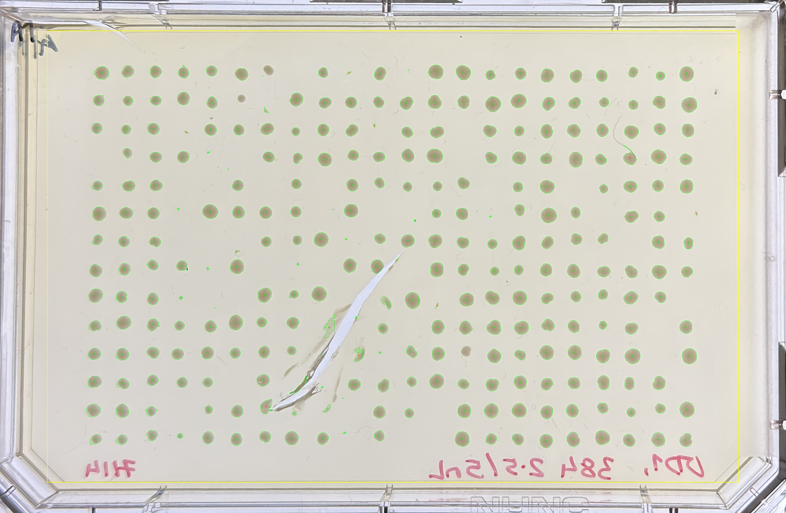

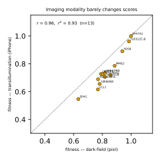

## 2026.07.20 - Run 2: volume x growth-time settings sweep (2 plates x 3 timepoints)

This section documents run 2. It replaces two earlier drafts whose conclusions were wrong:
an initial version that framed the six images as "batches," and a second that reported the
72 h / 5 nL plate as overgrown with all no-cell controls overrun. Both errors are corrected
here. All numbers come from
`experiments/019-echo-crispr-array/scripts/run2_volume_timepoints.py`. Gene names are given
as systematic ORF with the common name in parentheses where one exists (uncharacterized ORFs
YER079W, YKL033W-A, YLR312C-B have no common name).

### Design

Two 384-format plates carry the same randomized layout: 12 CRISPR single-knockout strains,
the BY4741 wild-type reference, and six `Blank_media` no-cell controls. The plates differ
only in dispensed volume, P1 = 2.5 nL and P2 = 5 nL, and each was imaged at three growth
times: 43.7 h, 50.3 h, and 72.2 h (plated 2026-07-17 15:30; imaging times from EXIF). This
yields six (plate x timepoint) conditions of the same physical colonies.

These six are a settings sweep, not replicate batches. The layout was not randomized between
plates, no volume was replicated, and no plate was repeated, so volume, plate, and well
position are mutually confounded. Every comparison below is read accordingly: P1 versus P2 at
a fixed time is the volume contrast (confounded with plate); the same plate across timepoints
is a clean within-plate growth-time contrast on identical colonies; and because both plates
share one layout, each strain occupies the same 29 wells on both, so positional bias is
reproduced rather than averaged across the two plates. In the figures, conditions are labelled
by dispensed volume and growth time (for example "2.5 nL, 44 h") rather than the internal P1/P2
codes; P1 is always 2.5 nL and P2 is always 5 nL.

### Imaging standard operating procedure

Plates are photographed on a backlight (light panel) with an iPhone, which stores HEIC. The
image used for quantification must be the **full-resolution original exported as JPEG**
(Photos, File -> Export -> Export Unmodified Original, then JPEG), not a photo dragged from the
Photos window: dragging yields Apple's ~0.8 MP `derivatives/` preview, which is well below the
SGAtools >=160 DPI recommendation and produces coarse, unreliable segmentation. The full
original is about 12 MP. **Incubation orientation is held constant** going forward (the plate is
kept in a single orientation from plating through all imaging), which removes the agar-up versus
agar-down variable entirely.

### Correction: the 72 h plate was never overrun

An earlier draft reported that at 72 h the 5 nL plate (P2_t72) was overgrown, with all six
no-cell controls overrun by spreading neighbours, and excluded it. That was a segmentation
failure, not biology. The image pipeline defects that caused it are now fixed (resolution and
per-cell segmentation, below), and all six conditions register cleanly at the same orientation
(plate A1 at image top-left) with **6 of 6 empty no-cell controls** and strong between-strain
structure (Kruskal-Wallis H = 53-102). P2_t72 gives 6/6 empty blanks and H = 63. The plate is
not overrun; the controls are empty, exactly as visual inspection indicated. All six conditions
are reliable and analysed below.

### Image pipeline

The full 12 MP images are cropped to the plate (removing the dark metal incubator shelf) and
downscaled to 1400 px before quantification: the full resolution exposes colony surface texture
that fragments detection and pollutes the grid fit with satellite blobs, whereas ~1400 px
averages colony texture into solid blobs so detection and registration are robust, while staying
about twice the resolution of the discarded 0.8 MP previews. Backlit captures use
`grid_mode="lattice"` in `torchcell/sga/image.py`, in which the colony lattice defines the
region. Colony segmentation is per-cell and referenced to the bright agar level within each cell
(a high intensity percentile), not to the cell median: this captures the whole colony even when
it fills most of its cell and its domed top carries a bright backlight glare band, which a
median-referenced threshold would split so that only the darker lower half is measured.
Morphological closing then bridges the glare band and hole-filling solidifies the colony, so the
full colony circumference is measured; referencing agar to the bright pixels also keeps colonies
detectable next to the dark plate frame. A cell holding a second colony-sized blob a real
distance away is flagged `M` (multiple colonies) and excluded from scoring; a glare fragment of
one colony is bridged by the closing rather than counted twice. Multi-colony rejections are few
(P1_t44 10, and 0-1 elsewhere). Overlays follow the SGA/gitter convention (green colony outlines
and crosses, red for edge/shape-flagged cells, magenta boxes for rejected multi-colony cells),
kept consistent with the Plate 5 overlays.

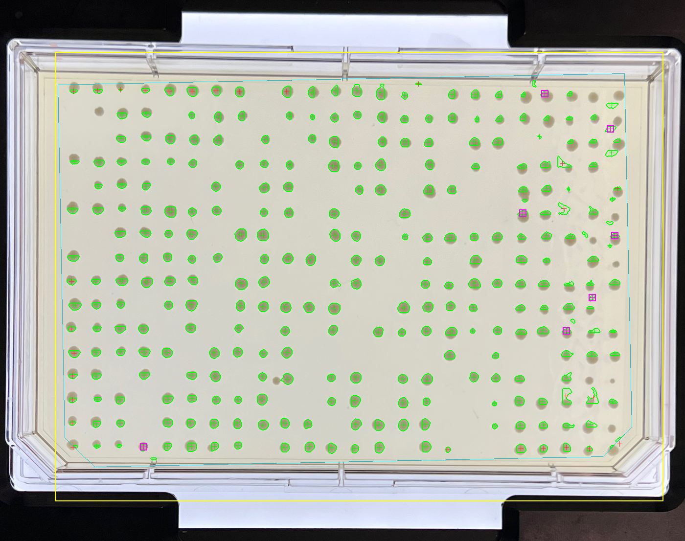
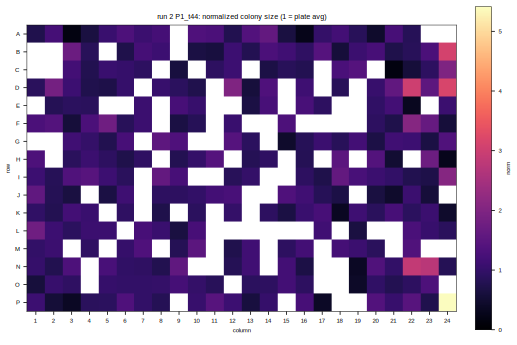

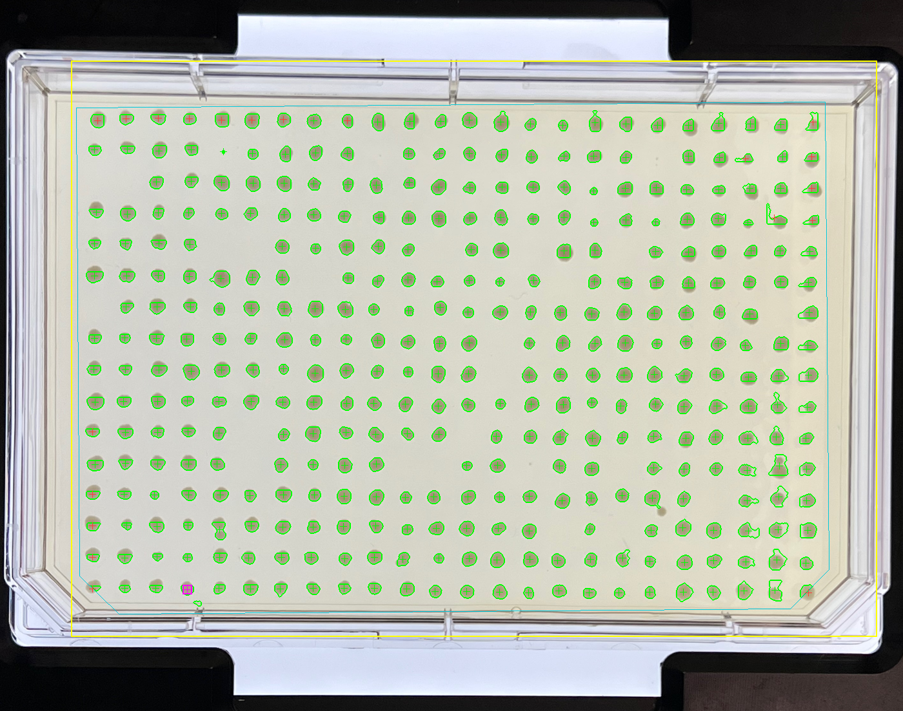
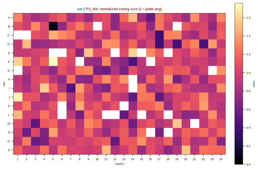

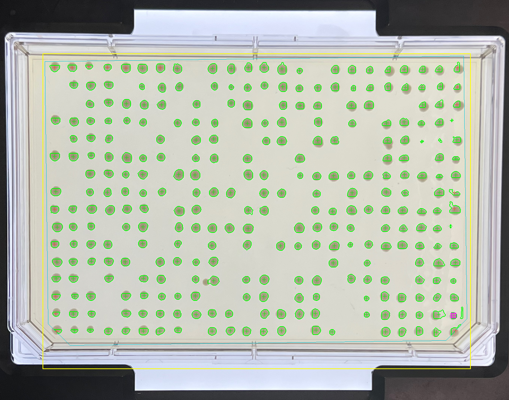
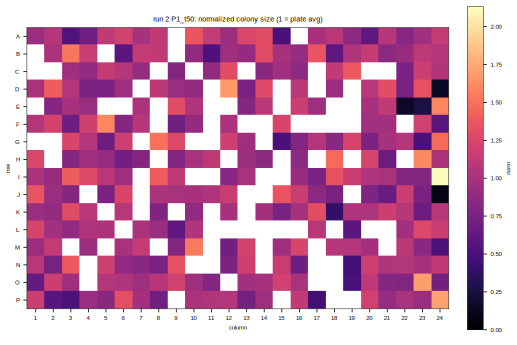

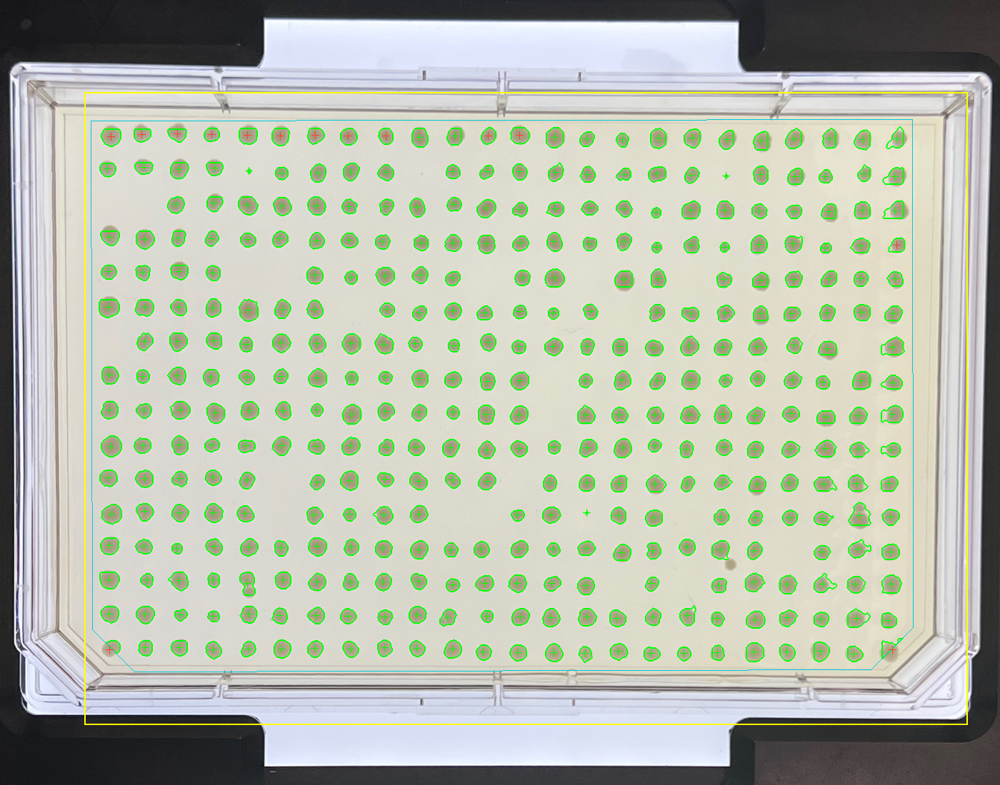
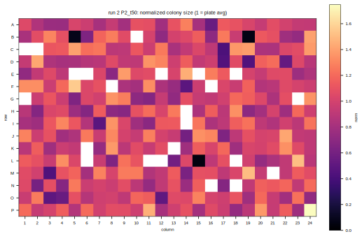

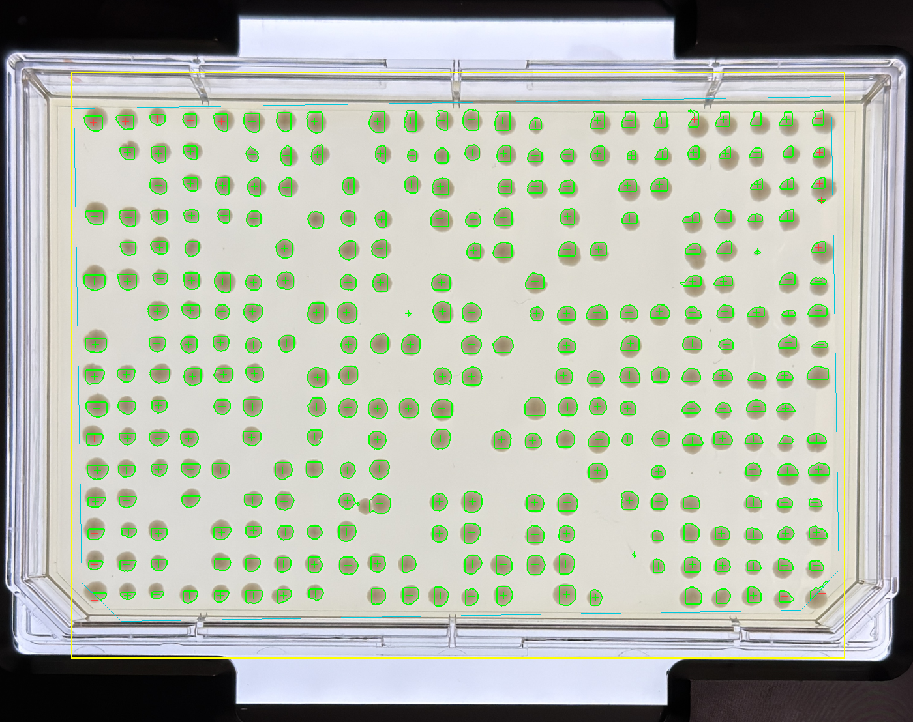
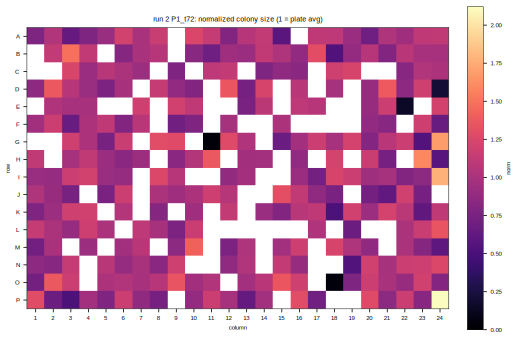

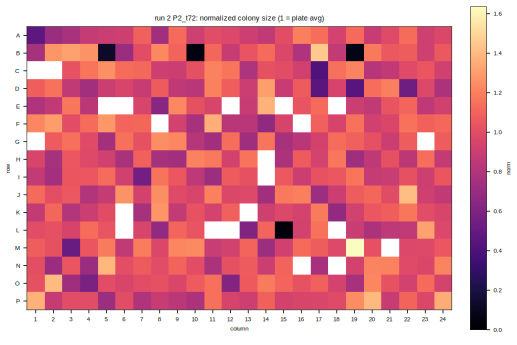

### Registration and orientation

Orientation is resolved from internal replicate structure, not from the controls: for each of
the four possible plate orientations the colony sizes are normalized and the Kruskal-Wallis H
across strain groups is computed; the true orientation produces genuine between-strain structure
(large H) while a flipped labelling scrambles strains (H collapses). All six conditions resolve
to the identity orientation (plate A1 at image top-left), consistent with Plate 5, with
H = 53-102 versus 9-14 for the alternatives. Published fitness data is not used in this step, so
the comparison to Costanzo below stays independent. Per-image diagnostics are in
`results/run2_orientation_diagnostics.csv`.

### Per-strain fitness across the six conditions

| strain (systematic / common) | 2.5nL 44h | 5nL 44h | 2.5nL 50h | 5nL 50h | 2.5nL 72h | 5nL 72h | Costanzo SMF |
|---|---|---|---|---|---|---|---|
| YJR060W (CBF1) | 0.623 | 0.790 | 0.647 | 0.759 | 0.715 | 0.756 | 0.590 |
| YLL012W (YEH1) | 0.648 | 0.852 | 0.788 | 0.793 | 0.786 | 0.844 | 0.993 |
| YKL033W-A | 0.722 | 0.850 | 0.820 | 0.809 | 0.866 | 0.867 | 1.033 |
| YPL056C (LCL1) | 0.770 | 0.803 | 0.891 | 0.777 | 0.943 | 0.852 | 0.980 |
| YLR313C (SPH1) | 0.780 | 0.799 | 0.819 | 0.820 | 0.900 | 0.910 | 0.984 |
| YER079W | 0.829 | 0.748 | 0.854 | 0.675 | 0.819 | 0.740 | 1.039 |
| YPL081W (RPS9A) | 0.836 | 0.765 | 0.880 | 0.744 | 0.927 | 0.851 | 0.955 |
| YPL046C (ELC1) | 0.891 | 0.916 | 0.977 | 0.872 | 0.978 | 0.938 | 1.043 |
| YGL087C (MMS2) | 0.908 | 0.904 | 0.910 | 0.866 | 0.974 | 0.921 | 0.996 |
| YDR057W (YOS9) | 0.914 | 0.971 | 0.919 | 0.891 | 0.930 | 0.932 | 1.044 |
| YBR203W (COS111) | 0.919 | 0.761 | 0.895 | 0.739 | 0.924 | 0.806 | 1.037 |
| YLR312C-B | 1.018 | 0.968 | 1.027 | 0.891 | 1.010 | 0.919 | 1.085 |
| **BY4741 (WT)** | 1.000 | 1.000 | 1.000 | 1.000 | 1.000 | 1.000 | 1.000 |

Source: `results/run2_fitness_by_condition.csv`. The panel retains the LCL1/SPH1 (YPL056C /
YLR313C) substitution described in the 2026.07.17 section; the canonical genes YIL174W and
YLR104W were not built and remain unmeasured.
### Growth saturation over time

Colony footprint is expressed as a fraction of the well cell (area divided by pitch squared),
which is resolution-independent, because the 72 h images are from a different camera. Growth
saturates on both plates: the plate-median footprint rises 11.4% -> 18.7% -> 22.3% of the well
on 2.5 nL and 15.5% -> 20.4% -> 25.7% on 5 nL, with the growth rate on 2.5 nL dropping from
about 1.10%/h (44-50 h) to 0.16%/h (50-72 h). As colonies approach their asymptotic size the
fitness signal compresses: the sick strain YJR060W (CBF1), published at 0.590, reads 0.623 at
44 h but drifts to 0.715 by 72 h on the 2.5 nL plate as its defect is masked by saturation.

### Volume trade-off and dynamic range

![Per-condition assay quality, one bar/box per condition (labelled by volume and growth time). Left: the spread of the ~30 individual BY4741 replicate colonies about the plate reference - the wild-type median is 1.0 by construction (fitness is colony size divided by the wild-type median), so this box shows how reproducible a single colony measurement is, not a value that should equal 1. Centre: plating-failure rate (fraction of plated wells with no colony). Right: wild-type coefficient of variation (lower is tighter).](assets/images/019-echo-crispr-array/run2_condition_quality.svg)

| condition | no-colony rate | WT CV | fitness range | discrimination |
|---|---|---|---|---|
| 2.5 nL 44 h | 23.5% | 0.234 | **0.396** | 2.28 |
| 5 nL 44 h | **5.3%** | 0.145 | 0.223 | 2.43 |
| 2.5 nL 50 h | 23.5% | 0.162 | 0.380 | 2.53 |
| 5 nL 50 h | **4.5%** | 0.120 | 0.216 | 2.37 |
| 2.5 nL 72 h | 23.0% | 0.156 | 0.296 | 2.25 |
| 5 nL 72 h | 6.1% | **0.105** | 0.199 | 2.62 |

The two volumes trade off cleanly. The 5 nL plates plate far more reliably (about 5% no-colony
wells versus about 24% at 2.5 nL) and give a slightly tighter wild-type CV, but they compress
the fitness signal: the strain-to-strain range is smaller at 5 nL than at 2.5 nL at every
timepoint (for example 0.223 versus 0.396 at 44 h). The discrimination ratio is similar across
conditions (about 2.2-2.8), so 5 nL shrinks signal and noise together; the larger *range* at
2.5 nL is what makes agreement with the published scale possible, as the reference comparison
below shows.

### Comparison to published single-mutant fitness

| condition | Pearson r | p | Spearman rho | RMSE | median bias | leave-one-out r |
|---|---|---|---|---|---|---|
| 2.5 nL 44 h | +0.646 | 0.023 | +0.706 | 0.188 | -0.141 | +0.575 .. +0.743 |
| 5 nL 44 h | +0.350 | 0.26 | +0.510 | 0.182 | -0.159 | +0.269 .. +0.531 |
| 2.5 nL 50 h | **+0.807** | 0.002 | +0.727 | 0.134 | -0.107 | +0.582 .. +0.844 |
| 5 nL 50 h | +0.290 | 0.36 | +0.510 | 0.216 | -0.196 | +0.211 .. +0.466 |
| 2.5 nL 72 h | +0.690 | 0.013 | +0.490 | 0.122 | -0.079 | +0.250 .. +0.770 |
| 5 nL 72 h | +0.503 | 0.096 | +0.462 | 0.161 | -0.120 | +0.117 .. +0.715 |

These correlations must be read with the panel's limitation in mind: excluding CBF1, eleven of
the twelve panel genes are published within 0.955-1.085, a spread comparable to our own
measurement scatter, so the comparison is close to a two-point one anchored on the single sick
gene. Leave-one-out confirms the sensitivity (dropping YJR060W/CBF1 alone moves P1 at 50 h from
+0.807 to +0.582). The defensible claims are narrower: the 2.5 nL plates agree with the
published scale better than the 5 nL plates at every timepoint (best at 50 h, r = 0.81), the
one known sick strain is detected as the sickest in every condition, and the near-neutral genes
are reproduced as near-neutral with a systematic low bias of roughly -0.08 to -0.18. A panel
with genuinely graded fitness is required for a real validation; this motivates the
double-mutant construction+validation set now defined for the next round (see
[[experiments.010-kuzmin-tmi.scripts.construction_validation_doubles]]).

### Agreement between conditions

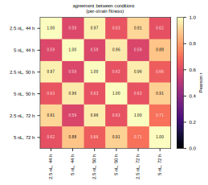

Among the six conditions the strongest agreement is between plates of the same volume across
time (for example P2 5 nL at 44 h versus 50 h, r = 0.96; P1 2.5 nL at 44 h versus 50 h,
r = 0.93), while different volumes agree less well (r = 0.5-0.8). The dominant axis of variation
is therefore the volume/plate change that was deliberately introduced, which is why this run is
read as a settings sweep rather than a source of a batch-to-batch error estimate.

### Recommendations for the assay

1. **Measure at 2.5 nL.** It preserves the fitness signal (larger strain-to-strain range and
   better agreement with the published scale) where 5 nL compresses it.
2. **Image at roughly 44-50 h, not 72 h.** Growth saturates and the sick-strain signal erodes
   with longer incubation; agreement with Costanzo is best at 50 h.
3. **Reduce the 2.5 nL plating-failure rate (about 24%).** This is the real cost of the low
   volume and is a plating problem, not a measurement one; the empty wells are bare agar. If it
   can be reduced, 2.5 nL is clearly the best condition.
4. **The panel cannot validate the assay.** Eleven of twelve genes are effectively neutral;
   graded fitness is needed, which is the purpose of the double-mutant validation set.
5. **Randomize the layout per plate** so replicate plates average out well-position effects.

### Incubation orientation

In run 2 the colonies were grown agar-side-up from plating until the first assay timepoint
(t44), then agar-side-down (t50, t72). The concern behind the flip was that agar-up colonies
might form a domed or droplet shape and distort their projected footprint; no footprint anomaly
is visible at t44 beyond the overall growth and saturation trend. Going forward the decision is
to **hold a single incubation orientation** for the whole run, which removes this variable
entirely and is now part of the imaging SOP above.

### Provenance (2026.07.20)

- Analysis script: `experiments/019-echo-crispr-array/scripts/run2_volume_timepoints.py`
  (preprocess -> quantify -> register -> normalize -> score -> reference -> saturation).
- Inputs: full-resolution 12.2 MP originals in `data/run2_2026-07-17/` -
  `P1_2p5nL_view_t44.jpg`, `P2_5nL_view_t44.jpg`, `t50/P1_2p5nL_view_t50.jpg`,
  `t50/P2_5nL_view_t50.jpg`, `t72/P1_2p5nL_view_t72_up.jpg`, `t72/P2_5nL_view_t72_up.jpg`.
  The earlier 0.8 MP Photos-derivative previews were discarded
  ([[scratch.2026.07.20.200116-discard]]).
- Timing: incubator start 2026-07-17 15:30 (user-recorded); imaging times from EXIF
  DateTimeOriginal (43.7 h, 50.3 h, 72.2 h). The ECHO transfer reports timestamp dispensing
  about 1 h later, an unresolved instrument-clock discrepancy; if the instrument clock is
  correct all elapsed figures shift down about 1 h, but the differences between timepoints
  (from EXIF) are unaffected.
- Library changes: `torchcell/sga/image.py` overlay recoloured to the repo palette (green-free);
  `torchcell/sga/viz.py` heatmap colormap changed to magma. Plate 5 output (roi mode) unchanged.
- Outputs: `results/run2_*.csv`; figures + overlays `notes/assets/images/019-echo-crispr-array/run2_*`.
- Reference: `results/reference_smf_12panel.csv` (Costanzo 2016 SMF), built by
  `scripts/build_reference_smf.py`.

## 2026.07.21 - Segmentation overhaul (gel boundary + artefact fixes), full-res 72 h captures, Spearman

**This section supersedes the quantitative results of the 2026.07.20 section.** Two changes
were made and everything was re-run: (1) the colony segmenter in `torchcell/sga/image.py` was
overhauled to remove the boundary artefacts and to gate detection to a detected gel boundary,
which shifts every colony size and therefore every fitness/correlation number; (2) the 72 h
analysis now uses the **full-resolution (3364x4485) quality-side-up** captures
(`t72/P{1_2p5,2_5}nL_view_t72_up.jpg`, sha `e2b7c59b...` / `c9118d17...`). An intermediate detour
that substituted low-resolution 1499x1999 preview copies was reverted; the previews had been
downscaled to 1400 px for processing, which is what produced much of the apparent edge
raggedness and "shadow tails" -- at full resolution the colonies are clean discs. All figures and
overlays above are regenerated from the new code and images, so the overlay panels now show the
clean boundaries and the cyan gel outline described here; only the 2026.07.20 prose retains the
older numbers.

### The artefacts, and their root cause

The colony boundaries drive every number in this assay: the size a boundary encloses, divided by
the wild-type, *is* the fitness. The overlays were producing three artefact classes: (A) closed
boundaries around empty agar or the plate frame, (B) real solid colonies with no boundary
(missed), (C) malformed shapes (jagged bars, arrows). A design pass (four-way literature +
code review, grounded in the gitter method, Wagih & Parts 2014) found the causes:

- **The overlay mask and the numbers had diverged.** The `det` mask that draws boundaries was
  written for every cell that found any blob, but the "is this a real colony?" cull (`size` too
  small) was applied only to the DataFrame afterward. So sub-threshold noise, frame fragments and
  empty-agar blobs still drew a green boundary with no cross (classes A and C).
- **Nothing constrained detection to the gel.** The lattice is a rigid 16x24 fit whose outer
  nodes land on the frame/panel; each was segmented anyway.
- **The threshold was stricter than the detector and mis-estimated agar on big colonies**, so a
  colony that earned a lattice node could fail segmentation entirely (class B).

### The fix (standard, grid-constrained, per gitter)

One geometric gate plus one shared acceptance predicate, no exotic segmenter (watershed / Hough /
Otsu were explicitly rejected: we already fit the grid, so the gitter regime of one bounded
colony per cell applies). In `torchcell/sga/image.py`:

- **6-sided gel boundary** (`_gel_polygon`): a chamfered rectangle fit in the lattice's own
  rotated frame over *all* nodes (so a colony row poking past the plate edge cannot bulge it),
  with short chamfers on the two **bottom** corners (the imaging SOP is to load the plate
  chamfers-down; per-image darkness auto-detection proved framing-dependent and was dropped).
  Rendered cyan in every overlay. A signed-distance field (`_signed_dist`) then rejects any
  detection whose centroid is more than half a pitch outside the gel; straddlers are kept and
  flagged `E`.
- **One acceptance predicate shared by the mask and the DataFrame**: a blob is drawn/counted only
  if it is colony-sized, round-ish and solid (aspect <= 2.5, extent >= 0.45, so a bar/arrow can
  never pass), sits within 0.55 pitch of its own node (no neighbour bleed or empty-agar noise),
  and is inside the gel. `det` and the numbers can no longer diverge, and `det` is finally clipped
  to `gel_mask & ~gash`.
- **keep = largest central blob** (not strictly nearest): a noise speck at the node no longer
  steals the cell from an off-centre colony (class B).
- **Threshold repair** (`_segment_border`, backlit branch): agar referenced to the 90th
  percentile (stays above a cell-filling colony) and a 2.5-sigma cut with an absolute 6-gray-level
  floor (matches the detector so faint colonies clear it; the floor stops agar noise firing).

Result on the full-res 72 h plates: colonies cleanly outlined to their rim, the cyan gel
hexagon excludes the frame, top-row colonies that overlap the plate edge are kept and flagged,
and the empty-agar / frame boundaries are gone. The threshold stays the default; watershed
remains opt-in (`seg_method='watershed'`) and is now safe because the same gel/shape/node gates
contain its old frame-stripe leak.

### Full-resolution 72 h captures and re-analysis

The 72 h analysis uses the full-resolution (3364x4485) quality-side-up captures; the low-res
preview detour was reverted (see the banner above). The images carry no EXIF timestamp, so the
~72 h growth-time values are retained as the same physical plates. **Within-volume agreement
across time stays high** -- 2.5 nL 50 h vs 72 h r = 0.96, 5 nL 50 h vs 72 h r = 0.91.
Published-fitness agreement, on the new segmentation + full-res images:

| condition | Pearson r | Spearman rho | RMSE | median bias |
|---|---|---|---|---|
| 2.5 nL 44 h | +0.736 | +0.657 | 0.187 | -0.158 |
| 5 nL 44 h | +0.351 | +0.476 | 0.173 | -0.146 |
| **2.5 nL 50 h** | **+0.761** | +0.692 | 0.136 | -0.095 |
| 5 nL 50 h | +0.388 | +0.524 | 0.205 | -0.192 |
| 2.5 nL 72 h | +0.711 | +0.462 | 0.123 | -0.079 |
| 5 nL 72 h | +0.517 | +0.469 | 0.157 | -0.116 |

The qualitative conclusions from 2026.07.20 stand and are, if anything, firmer: 2.5 nL agrees
with the published scale better than 5 nL at every timepoint (Pearson r ~0.71-0.76 vs ~0.35-0.52),
the one sick strain (YJR060W/CBF1) is detected as the sickest in every condition, and the
near-neutral genes reproduce as near-neutral with a low bias of -0.08 to -0.19. 2.5 nL holds its
correlation across time (best at 50 h, r = 0.76; still r = 0.71 at 72 h), though footprint
still saturates, so the 44-50 h recommendation is unchanged. Seeding math corroborates the 2.5 nL
dropout: at OD600 ~1 a 2.5 nL spot carries only ~25-75 cells, so Poisson sampling alone makes
occasional empty spots expected (~24% observed).

### Threshold vs watershed, and Spearman

Both segmenters now pass through the same gel + acceptance gates, so both are clean; the
side-by-side SVGs (below, zoomable to a single colony) are kept as the per-colony record. The
threshold remains the default; watershed's only distinct advantage is recovering the handful of
colonies the threshold scores as zero.

The per-condition scatter of measured fitness against Costanzo now annotates **Spearman rho**
(rank/ordering agreement) next to Pearson r (value agreement), so "do we at least get the
*ordering* right" is answerable from the plot. Ordering agreement runs a little below value
agreement across conditions, consistent with the panel being anchored on the single sick gene
with eleven near-neutral genes densely tied.

### Provenance (2026.07.21)

- Library overhaul: `torchcell/sga/image.py` -- added `_gel_polygon` (6-sided gel boundary from
  the lattice) and `_signed_dist`; new `quantify_plate_image` params `gel_detect`, `edge_policy`,
  `node_tol`; a single shared acceptance predicate gating both `det` and the DataFrame;
  keep-largest-central selection; `_segment_border` backlit-threshold repair (p90 agar, 2.5-sigma
  + 6-level floor); overlay now draws the cyan gel polygon. Constants `MIN_COLONY_AREA`,
  `MAX_ASPECT`, `MIN_EXTENT`. (Earlier same-day: `seg_method`/`return_masks`, `_segment_watershed`
  via scikit-image, 2 px overlay outline; scikit-image added to `env/requirements.txt`.)
- t72 inputs (full-res, quality-side up): `data/run2_2026-07-17/t72/P1_2p5nL_view_t72_up.jpg`
  (3364x4485, sha256 `e2b7c59b...`), `P2_5nL_view_t72_up.jpg` (sha256 `c9118d17...`).
  `run2_volume_timepoints.py` `CONDITIONS` points to these. (A low-res 1499x1999 preview detour
  was reverted; those previews + a mislabeled archive were deleted -- they were the source of the
  apparent shadow-tail/raggedness once downscaled to 1400 px.)
- Comparison script: `experiments/019-echo-crispr-array/scripts/compare_segmentation_svg.py`
  (`quantify_plate_image(..., seg_method=..., return_masks=True)`, vector contour of `det`).
  Outputs `run2_seg_compare_{P1_2.5nL,P2_5nL}.svg` (zoomable) + `.png` siblings for the PDF build.
- Figure change: `reference_scatter_grid` annotates Spearman rho alongside Pearson r.
