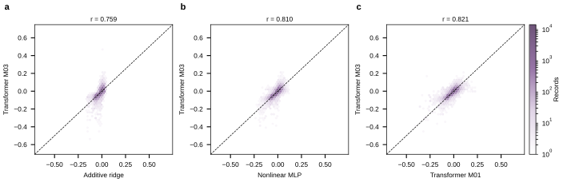

## 2026.09.01 - Additive Null Baselines for the 010 Trigenic Interaction Score

### Why

A colleague asked whether the 010 trigenic interaction predictions could be
matched by a simpler model, pointing at Visani, Verma and DeWitt, "Additive
baselines furnish no evidence for epistasis learning by MULTI-evolve"
(bioRxiv 2026.04.23.719915). That preprint shows a neural network claimed to
learn epistasis is reproduced almost exactly by a ridge additive model over
mutation indicators, so its engineering wins reduce to stacking beneficial
single mutations. Their standard is that a model claiming to learn interaction
must be benchmarked against a null with no capacity to represent interaction.

Prior traditional-ML baselines in this repo cover `002-dmi-tmi` (mixed doubles
and triples) and `smf-dmf-tmf-001` (fitness). Nothing had been run against the
010 triples-only build.

### Setup

Every baseline uses the same build, split, and label the transformer used, read
straight from the pinned build rather than through the loaders:

- build `$DATA_ROOT/data/torchcell/experiments/010-kuzmin-tmi/001-small-build`
- label `gene_interaction`, the Kuzmin adjusted trigenic interaction score tau
- 376,732 records, all perturbation count 3, over 4,352 genes
- split `index_seed_42.json`, train 301,386 / val 37,673 / test 37,673
- train label SD 0.063186, so the null MSE is about 0.00396 on val

The transformer numbers come from the three checkpoints' own re-evaluation runs
under `$DATA_ROOT/wandb-experiments`, not retyped.

Generating script:
[[experiments.010-kuzmin-tmi.scripts.additive_baseline_gene_interaction]]

An important caveat on what "additive" means here. In the protein setting the
phenotype is the multimutant readout, which single-mutant effects explain
directly. Here the label is already a residual: tau subtracts the single and
double mutant expectations by construction. So an additive-in-single-gene-effects
model is a stricter null than it is in the preprint. It has one large loophole,
addressed by B4 below: the Kuzmin design crosses a query double against an
array, and the 010 split is random over triples, so a per-gene model can absorb
per-query-pair screen structure.

### Held-out results, test split (37,673 triples)

| model | features | test Pearson | test Spearman | test MSE |
|---|---|---|---|---|
| B0 train mean | none | 0.000 | 0.000 | 0.004124 |
| B4 query pair only | recurring gene pairs, third gene ignored | 0.390 | 0.362 | 0.003493 |
| B3 hierarchical mean | pair mean backing off to gene mean | 0.390 | 0.362 | 0.003493 |
| B1 additive per-gene ridge | 4,352 gene indicators | 0.400 | 0.406 | 0.003460 |
| B2 additive + gene-pair ridge | + 420 recurring pairs | 0.406 | 0.412 | 0.003442 |
| B5 nonlinear MLP | same one-hot genes as B1 | 0.426 | 0.419 | 0.003386 |
| CGT M01 lzs9pcj3 | 9 graphs, learned embeddings | 0.443 | 0.426 | 0.003400 |
| CGT M02 yv4r30bi | 9 graphs, learned embeddings | 0.438 | 0.424 | 0.003439 |
| CGT M03 c7671wgj | 9 graphs, learned embeddings | 0.455 | 0.426 | 0.003315 |

B5 is three seeds, test Pearson 0.4251 / 0.4270 / 0.4253, mean 0.4258 with SD
0.0011. The three transformer runs are 0.4379 / 0.4434 / 0.4551, mean 0.4455
with SD 0.0088, so the transformer spread across training runs is eight times
the MLP's spread across seeds.

Ridge penalty was chosen on val over a nine-point grid and then reported on
test. B1 and B2 both selected alpha 30; B4 was flat in alpha and selected 0.01.
Every gene appearing in val or test also appears in train, so no baseline is
extrapolating to unseen genes.

### What this says about the colleague's question

The DeWitt pattern is present but weaker than in their case. It is not true that
the transformer collapses to an additive model, and it is not true that the gap
is large.

- A model with no capacity to represent gene interaction at all reaches 0.400
  test Pearson against the transformer's 0.438 to 0.455. That is 88 to 91
  percent of the transformer's correlation.
- In variance explained the honest framing is smaller still. The additive model
  explains r squared 0.160 of test label variance, the best transformer 0.207.
  The increment attributable to everything the transformer adds, nine
  interaction graphs, learned embeddings, eight transformer layers, is 0.047 of
  label variance.
- On MSE the best transformer reduces error 19.6 percent below the null, and
  the additive model already delivers 16.1 percent of that.
- Nonlinearity on the identical feature space, B5, closes roughly half the
  remaining gap. B5 sees no interaction graph at all yet reaches 0.426, and its
  MSE 0.003386 beats two of the three transformer checkpoints. So most of what
  is left after additivity is capacity, not biology from the graphs.
- B4 is the sharpest result. A model that only knows which recurring gene pair
  the triple contains, and never looks at the third gene, reaches 0.390 test
  Pearson. There are 420 such pairs, the largest observed 3,308 times, which is
  the Kuzmin query-double structure. So most of the ranking signal every model
  here shows is a per-query-double offset, not trigenic biology.

The fair summary for a colleague is that the transformer beats a no-interaction
null by a real but modest margin, roughly 0.045 Pearson and 0.047 of variance
explained, and that a large majority of all models' apparent skill on this split
is screen structure that an additive model captures for free. A gene-disjoint or
query-pair-disjoint split would test the biology and has not been run.

### The larger problem found while doing this

Applying the additive model to the 010 design space, the analogue of the
preprint's Figure 1, produced a result that turned out not to be about
additivity at all.

Scripts:
[[experiments.010-kuzmin-tmi.scripts.additive_vs_transformer_inference_space]],
[[experiments.010-kuzmin-tmi.scripts.inference_space_predictor_agreement]],
[[experiments.010-kuzmin-tmi.scripts.inference_run_consistency]]

Over `inference_3`, the 465,735,532-triple genome-wide space whose predictions
the panel-12 and panel-24 selection consumed, restricted to the 325,631,845
triples whose three genes all carry an additive coefficient:

- Pearson between the additive model and checkpoint c7671wgj is 0.0018.
- Top-100 and top-1000 selection overlap between the two is 0.0000.
- Stratifying by the training support of the least-observed gene does not
  rescue it. Even for triples whose rarest gene has 800 or more training
  observations, n = 867,669, the correlation is 0.036.

Over `inference_1`, a 4,370,595-triple space on a 526-gene panel, the same
comparison behaves completely differently. Additive against the three
checkpoints gives Pearson 0.548, 0.579 and 0.511.

The two spaces cannot both be right, and the resolution is that the same
checkpoint does not agree with itself across inference runs.

| comparison | n | Pearson |
|---|---|---|
| same triple, inference_2 vs inference_3 | 2,404 | 1.0000 |
| same triple, inference_1 vs inference_3 | 330 | 0.295 |
| per-gene mean prediction, inference_2 vs inference_3 | 1,274 genes | 0.800 |
| per-gene mean prediction, inference_1 vs inference_3 | 395 genes | 0.037 |
| per-gene mean prediction, inference_1 vs inference_2 | 179 genes | 0.167 |

`inference_2` and `inference_3` are byte-identical on shared triples, mean
absolute difference 0.000000, so they are the same pipeline. `inference_1`,
from the same checkpoint, is unrelated to them.

To decide which run handles gene identity correctly, the additive ridge
coefficient is an external anchor: it is fit on measured training data, keyed on
true systematic gene name, and independently validated at 0.400 test Pearson.
Correlating each run's per-gene mean prediction against it, restricted to the
167 genes all three runs score with at least 200 observations so the gene set is
not a confound:

| run | Pearson vs additive coefficient, 167 common genes |
|---|---|
| inference_1 | 0.576 |
| inference_2 | 0.231 |
| inference_3 | 0.174 |

So on identical genes, `inference_1` tracks real gene identity more than three
times as strongly as the runs that produced the selection. Over their own full
gene sets the separation is starker, 0.579 for `inference_1` against 0.048 for
`inference_2` and -0.008 for `inference_3`.

**Hypothesis (untested):** a gene index or embedding misalignment in the
`inference_2` and `inference_3` dataset build, which share a pipeline, would
produce exactly this signature, predictions that are self-consistent and stable
but detached from gene identity. The inference builds carry no `gene_set.json`
of their own, while the training build has one of 6,579 genes, so the index used
at inference time is reconstructed rather than loaded from the build. This has
not been verified and no cause has been confirmed.

### Seed instability in the selection tail, independent of the above

On `inference_1`, where predictions do track gene identity, the three
checkpoints still disagree substantially about which triples are extreme.
Pairwise Pearson between checkpoints is 0.524 to 0.560, no higher than each
checkpoint's 0.511 to 0.579 agreement with the additive model. Top-100 overlap
between two checkpoints is 0.21 to 0.35.

Two independent training runs of the same architecture on the same split
nominate largely different top-100 triples. Selection from a single checkpoint's
extreme tail is therefore not reproducible even without the inference problem.

### Follow-ups

- Verify or rule out the gene index hypothesis for `inference_2` and
  `inference_3` by re-scoring a small triple set through both build paths and
  comparing against `inference_1`.
- If confirmed, the panel-12 and panel-24 selections need regenerating, and
  `prediction_calibration_stats.csv` pins the affected parquet by sha256
  `806ef044...3550`.
- Run a query-pair-disjoint split to separate trigenic biology from screen
  structure, since B4 shows how much of the current metric is the latter.
- Report an ensemble or a seed-averaged ranking rather than one checkpoint's
  tail for any future selection.

## 2026.09.01 - Correction and Architecture Reading

### Correction

The section above attributed the gap between the nonlinear baseline B5 and the
transformer to the nine interaction graphs. That is wrong. Reading the model
shows the graphs never enter the forward pass in the 010 configuration, so no
part of any performance difference can be attributed to them.

### What the 010 transformer actually computes

Verified by reading `torchcell/models/equivariant_cell_graph_transformer.py`.

- **Per-sample input is the perturbed gene set and nothing else.** The
  `Perturbation` graph processor writes `perturbation_indices`, `pert_mask` and
  the label. With `node_embeddings: []`, `cell_graph["gene"].x` is a 6607 by 0
  tensor. Gene identity lives only in a free `nn.Embedding(6607, 180)`.
- **The encoder does not depend on the strain.** The forward pass builds its
  input from `gene_embedding(torch.arange(N))`, prepends a CLS token and
  unsqueezes to `[1, N+1, 180]`. That leading 1 is not the batch size. The eight
  transformer layers run on this single tensor, which contains nothing from
  `batch`. The repository states this itself in the `PerturbationGraphPropagation`
  docstring: the encoder runs at batch 1 on the wildtype graph, so `H_genes` and
  `h_CLS` are identical for every strain.
- **The nine graphs are a loss term only.** `attention_mask_config` and
  `perturbation_propagation_config` are not passed, so hard masking and graph
  propagation are both off, and attention carries no adjacency bias. The
  adjacency matrices are used only in a KL penalty added to the loss. In the
  010-era code that penalty also covered 7 of 9 graphs, because the config names
  `physical` and `regulatory` while the cell graph emits `physical_interaction`
  and `regulatory_interaction` and the code skipped unmatched names, and its
  weight was applied twice from one config key for an effective 1e-6.
- **So the model is a set function on three gene identities.** With the encoder
  output constant, prediction is `MLP([h_CLS || z_S])` where `z_S` is the mean
  over the perturbed genes of `g(Z_i + c_S)` and `c_S` is attention over the
  perturbed rows. That is the same construction as B5, with a richer pooling and
  about eight times the parameters.

Measured: setting the graph penalty weight from 1.0 to 0.0 changes test
predictions by at most 4.0e-6 across the three checkpoints, against a prediction
spread of about 0.02, which confirms the graphs do not affect the forward pass.
Script: `experiments/010-kuzmin-tmi/scripts/score_010_checkpoints_directly.py`.

### Parameter budget

| component | parameters |
|---|---|
| gene embedding table | 1,189,260 |
| encoder, 8 layers, strain-independent | 3,129,120 |
| perturbation transform, the strain-dependent step | 391,140 |
| readout head | 65,161 |
| CLS token | 180 |
| total | 4,774,861 |

Two thirds of the model does no per-sample work. The strain-dependent
computation is 456,301 parameters.

### Comparability audit

- **Reported numbers are test.** The transformer checkpoints are best-Pearson
  selected on validation, so their val numbers are an upward-biased maximum over
  epochs. The baselines select their ridge penalty or early-stopping epoch on
  validation too, so the test column compares like with like.
- **Transformer metrics come from the checkpoints' own re-evaluation runs.**
  `val|test/gene_interaction/{MSE,RMSE,Pearson}` are torchmetrics over the full
  37,673 records per split, in raw tau units.
  `val_sample|test_sample/Spearman_target_0` come from a separate plotting path
  capped by `plot_sample_ceiling`, which is 1e6 in the eval config so no
  truncation fires. In training configs that ceiling is 10,000, so a Spearman
  quoted from a training run would be over a random 10,000 of 37,673. CGT test
  Spearman is 0.426408 (M01), 0.424106 (M02), 0.426226 (M03).
- **One asymmetry, favoring the transformer.** The label standardization is fit
  on all 376,732 records, not on train only. The logged constants match the
  all-record mean and sd to nine digits and do not match the train-only values.
  The leak is two global scalars and the values differ by about 3e-4 in the mean,
  so the effect is small, but the baselines use train-only statistics and the
  transformer does not.

### Why per-record paired comparison is still missing

The stock eval cannot run on this build: the 010 LMDB stores
`perturbation_type: "deletion"` and the current pydantic schema admits only
`sga_kanmx_deletion` or `sga_natmx_deletion`, giving 204 validation errors on the
first batch. A checkpoint key rename was also needed, since
`EquivariantPerturbationTransform` became a ModuleList after these runs
(`experiments/010-kuzmin-tmi/scripts/remap_010_checkpoints.py`).

Bypassing the loader by rebuilding the gene index from the genome did not
reproduce the recorded metrics on the first attempt, so those predictions were
rejected rather than used. The index space the training runs used has not yet
been reproduced.

### Per-record comparison, now measured

The loader blocker was worked around by rebuilding the forward pass from the
architecture reading, which also verified that reading. Scripts:
[[experiments.010-kuzmin-tmi.scripts.score_010_checkpoints_directly]] and
[[experiments.010-kuzmin-tmi.scripts.paired_prediction_agreement]].

Prediction correlation on the 37,673 test records:

| | CGT M01 | CGT M02 | CGT M03 |
|---|---|---|---|
| B1 additive ridge | 0.752 | 0.726 | 0.759 |
| B2 additive plus pair | 0.759 | 0.734 | 0.765 |
| B4 query pair only | 0.729 | 0.706 | 0.735 |
| B5 embedding MLP | 0.788 | 0.784 | 0.810 |
| CGT M01 | | 0.788 | 0.821 |
| CGT M02 | 0.788 | | 0.804 |

- **The 010 transformer is not a relabeled additive model.** DeWitt reported
  r > 0.999 between the network and the additive fit; here it is 0.73 to 0.76.
  That is the opposite of the preprint's finding and it is what the null was fit
  to test.
- **Its non-additive content is largely seed noise.** Two training runs of the
  same architecture on the same split agree at 0.788 to 0.821, barely more than a
  checkpoint agrees with the additive model and no more than it agrees with the
  nonlinear baseline.
- **The models are wrong in the same places.** B1-to-checkpoint residual
  correlation is 0.907, 0.897, 0.918.
- **The advantage is real and bounded.** Paired bootstrap over records, 2,000
  resamples, Pearson gain over B1: M01 +0.043 [+0.023, +0.063], M02 +0.038
  [+0.019, +0.058], M03 +0.055 [+0.034, +0.074], B5 +0.025 [+0.017, +0.033]. All
  exclude zero.
- **Rankings diverge in the tail.** Top-100 overlap on most-negative predictions:
  B1 and M03 share 31, B5 and M03 share 45, B1 and B5 share 46. At K = 10,000
  every pair exceeds 0.91.

### Typeset version

Full write-up with the equations, the capacity table and the comparability
audit: `notes-tex/010-additive-baselines/010-additive-baselines.pdf`, built by
`make -C notes-tex/010-additive-baselines`.
