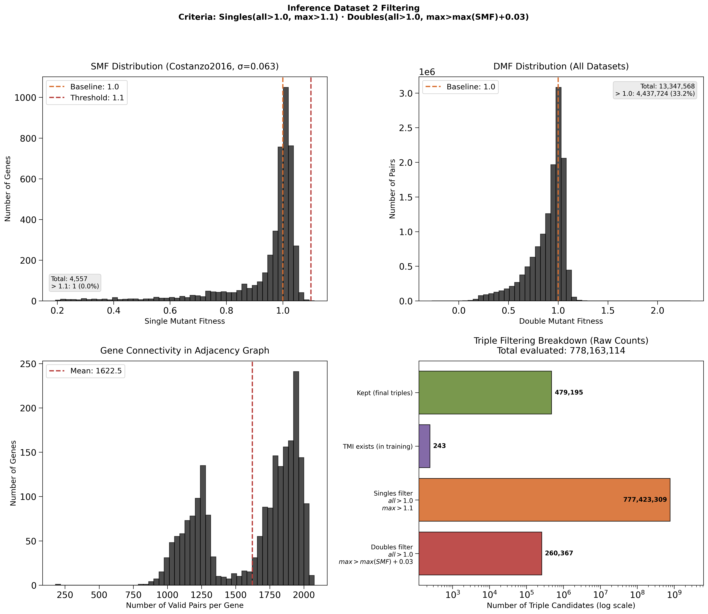
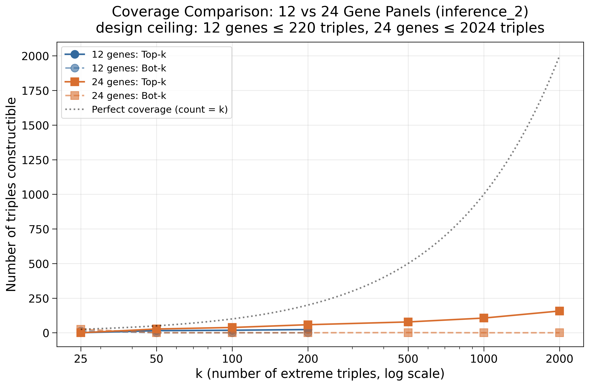
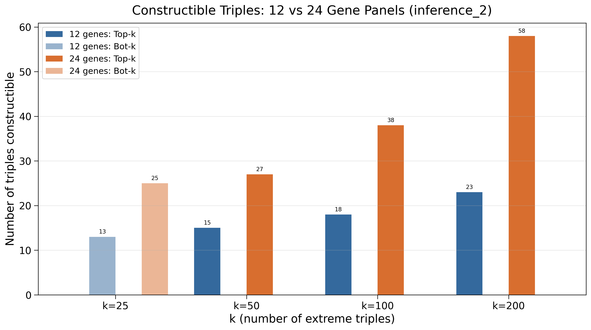
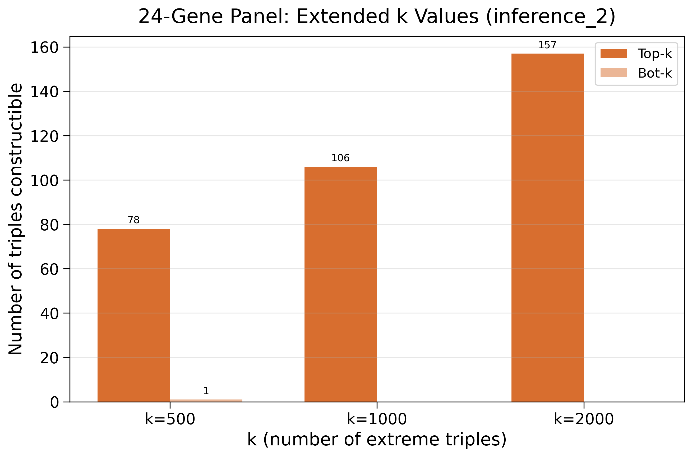
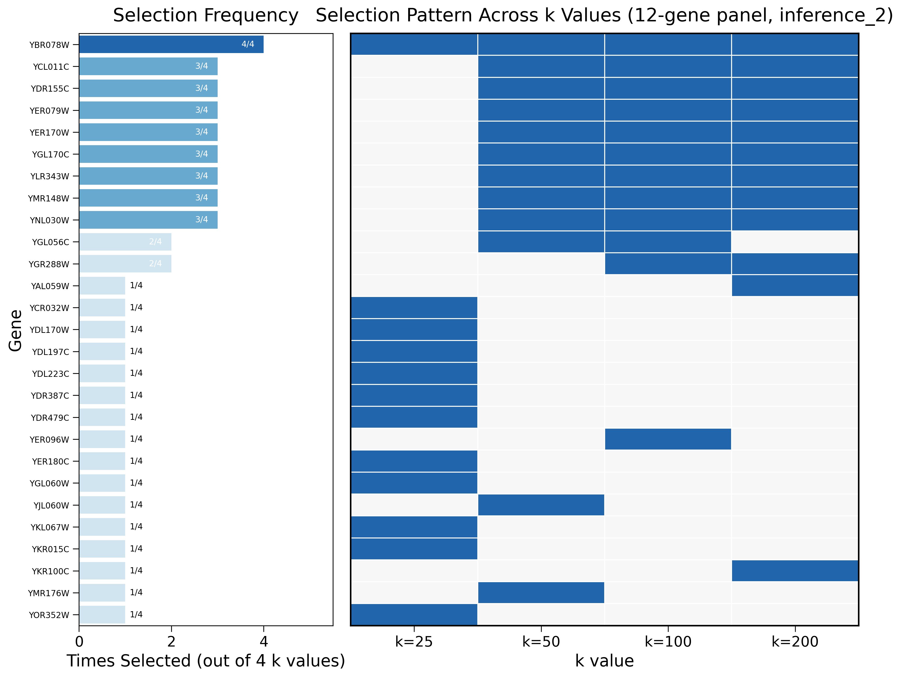
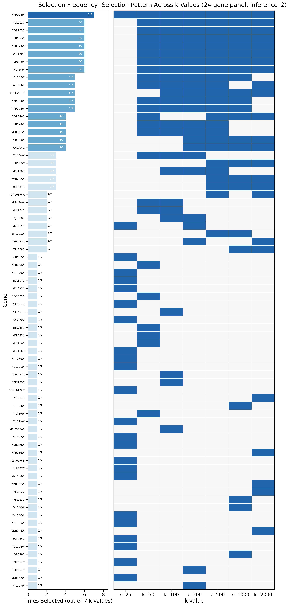

# Inference Dataset 2: Iterative (Orthogonal) Fitness Improvement

> Graduated from scratch notes (2026.01.28–30). This is the **first** inference-dataset
> attempt for 010; it proved **too restrictive** and was superseded by
> [[Inference Dataset 3|experiments.010-kuzmin-tmi.inference-dataset-3]].

## Goal

Build a second inference dataset (beyond `inference_1`) that identifies gene-deletion
combinations producing **iteratively increasing fitness** — targets for metabolic
engineering where sequential deletions compound a benefit.

**Scientific claim to demonstrate:**

$$f_{\text{WT}} < f_i < f_{ij} < f_{ijk}$$

Each step must be statistically significant given measurement noise.

## Statistical Framework

### Positive epistasis ≠ iterative improvement

A positive digenic interaction $\varepsilon_{ij} = f_{ij} - f_i f_j > 0$ does **not**
guarantee $f_{ij} > f_i$. Counter-example with $f_i = 1.1, f_j = 0.7$:

$$\varepsilon_{ij} = 1.0 - (1.1 \times 0.7) = 0.23 > 0, \quad \text{yet } f_{ij} = 1.0 < f_i = 1.1$$

So the iterative criterion must be stated on **absolute** fitness, not on $\varepsilon$/$\tau$:

$$f_i > f_{\text{WT}} \;\land\; f_{ij} > \max(f_i, f_j) \;\land\; f_{ijk} > \max(f_{ij}, f_{ik}, f_{jk})$$

### Empirical noise parameters

Mean per-measurement fitness stddev (from the torchcell datasets):

| Dataset         | Type | Mean σ     | Std of σ | Source file                                      |
|-----------------|------|------------|----------|--------------------------------------------------|
| SmfCostanzo2016 | SMF  | **0.0633** | 0.0508   | `torchcell/datasets/scerevisiae/costanzo2016.py` |
| DmfCostanzo2016 | DMF  | **0.0424** | 0.0373   | `torchcell/datasets/scerevisiae/costanzo2016.py` |
| TmfKuzmin2018   | TMF  | **0.0692** | 0.0481   | `torchcell/datasets/scerevisiae/kuzmin2018.py`   |
| TmfKuzmin2020   | TMF  | **0.0529** | 0.0318   | `torchcell/datasets/scerevisiae/kuzmin2020.py`   |

### Minimum detectable gap by replicate count

$\text{SE} = \sigma/\sqrt{n}$, $\text{SE}_\text{comb} = \sqrt{\text{SE}_1^2 + \text{SE}_2^2}$,
$\Delta_{\min} = t_{\text{crit}}(\alpha, \text{df}) \cdot \text{SE}_\text{comb}$ at $\alpha=0.05$.

| Replicates | Δmin (SMF vs WT) | Δmin (DMF vs SMF) | Δmin (TMF vs DMF) |
|------------|------------------|-------------------|-------------------|
| n = 4      | 0.074            | 0.076             | 0.068             |
| n = 8      | 0.042            | 0.048             | 0.043             |
| n = 16     | 0.028            | 0.032             | 0.029             |
| n = 24     | 0.022            | 0.026             | 0.024             |

### Why the thresholds ended up high (t-test + Bonferroni)

Worst-case σ ≈ 0.07, treating SE ≈ σ. Distinguishing WT/SMF/DMF/TMF is **4 hypothesis
tests**, motivating Bonferroni. Required absolute fitness floors:

| Scenario                              | Gap needed | SMF > | DMF > | TMF > |
|---------------------------------------|------------|-------|-------|-------|
| Conservative (two-tailed, Bonferroni) | ~0.24      | ~1.24 | ~1.48 | ~1.72 |
| Moderate (one-tailed, Bonferroni)     | ~0.18      | ~1.18 | ~1.36 | ~1.54 |
| Relaxed (one-tailed, no correction)   | ~0.16      | ~1.16 | ~1.32 | ~1.49 |

These floors are what made the dataset infeasible (see Outcome). They directly motivated
the **Jonckheere–Terpstra** single-test approach in inference-dataset-3, which needs no
Bonferroni and accumulates power across the ordered comparisons.

## Filtering Strategy (applied to existing SMF/DMF only)

TMF is **predicted by the model and validated experimentally** — never used for filtering.

- **Singles:** $f_i,f_j,f_k > 1.0$ (no deleterious backgrounds) and
  $\max(f_i,f_j,f_k) > 1.0 + \Delta_{\min}^{(1)}$.
- **Doubles:** $f_{ij},f_{ik},f_{jk} > 1.0$ and
  $\max(f_{ij},f_{ik},f_{jk}) > \max(f_i,f_j,f_k) + \Delta_{\min}^{(2)}$.
- **Triples:** generated from surviving genes/pairs; model predicts $\tau_{ijk}$.
  Experimental validation criterion: $f_{ijk} > \max(f_{ij}) + 0.029$ (n=16).

### Thresholds actually used

| Parameter       | Value                       | Rationale                              |
|-----------------|-----------------------------|----------------------------------------|
| Essential genes | Excluded (1,140)            | `GeneEssentialitySgdDataset`           |
| SMF source      | Costanzo2016 only           | Lowest noise (σ=0.063)                 |
| SMF baseline    | all > 1.0                   | Singles non-deleterious                |
| SMF threshold   | max > 1.10                  | ≥1 significant improvement             |
| DMF baseline    | all > 1.0                   | Doubles non-deleterious                |
| DMF gap         | max > max(singles) + 0.03   | Iterative improvement                  |

## Pipeline

Cannot enumerate ~45B triples ($6500^3/6$). Uses an **adjacency-graph + streaming**
approach: load SMF → load DMF and build adjacency (edge if pair passes filter) → emit
triples via mutual neighbors, streaming to parquet in batches, filtered against existing
TMI → LMDB → model inference (best `EquivariantCellGraphTransformer`, Pearson=0.4619) → top-τ
selection for construction.

### Data paths

| Component      | Path                                                                                    |
|----------------|-----------------------------------------------------------------------------------------|
| Triple parquet | `DATA_ROOT/data/torchcell/experiments/010-kuzmin-tmi/inference_2/raw/triple_combinations_list.parquet` |
| LMDB           | `DATA_ROOT/data/torchcell/experiments/010-kuzmin-tmi/inference_2/processed/lmdb/`        |
| Results        | `experiments/010-kuzmin-tmi/results/inference_dataset_2/`                                |

## Results

From slurm jobs 770 (generation) / 771 (LMDB):

- Candidates evaluated: **778,163,114**
- Final triples: **479,195**
- Essential genes excluded: 1,140; genes with SMF (non-essential): 4,557; valid pairs: 1,739,295
- 243 triples removed as already-in-TMI

## Outcome — too restrictive (→ inference-dataset-3)

The SMF > 1.10 threshold is far out in the tail of Costanzo2016 SMF:

```
SMF quantiles: 0.90→1.0305, 0.95→1.0395, 0.99→1.0550, 0.999→1.0857
```

Only **7 genes** clear SMF > 1.10. Consequently nearly all 479K triples share the same
dominating gene (YBR078W/ECM33), so the dataset **lacks diversity**. Likewise only 14,748 /
20.7M Costanzo DMF strains exceed 1.18, and only 716 / 301,798 Kuzmin TMF — the iterative
chain is barely supported by existing data. This infeasibility prompted the relaxed,
JT-test-based redesign.

## Early construction panel (superseded, 2026.01.29)

A first 12-gene construction list was drafted from this restrictive line before the
relaxation — dominated by the YBR078W/ECM33 background. It was **never built**; the final
panel is the inference-3 one. Kept here for the record (gene annotations):

| Systematic | Standard | Size | Localization | Function (brief) | Category |
|------------|----------|------|--------------|------------------|----------|
| YAL059W | ECM1 | 525 aa | Nucleus, cytoplasm | 60S ribosomal subunit export factor | Ribosome biogenesis |
| YBR078W | ECM33 | 358 aa | Cell wall, PM (GPI) | cell wall organization/biosynthesis | Cell wall organization |
| YCL011C | GBP2 | 427 aa | Nucleus, cytoplasm | poly(A+) mRNA export; translation repressor | mRNA export/translation |
| YDR155C | CPR1 | 162 aa | Cytoplasm | cyclophilin peptidyl-prolyl isomerase | Protein folding |
| YER079W | YER079W | 122 aa | Cytoplasm, nucleus | dubious ORF, unknown function | Unknown |
| YER170W | ADK2 | 199 aa | Mito matrix | mitochondrial adenylate kinase | Nucleotide metabolism |
| YGL170C | SPO74 | 149 aa | Spindle pole body | meiotic outer-plaque component | Sporulation |
| YGR288W | MAL13 | 617 aa | Nucleus | MAL-activator (maltose) TF; non-functional in S288C | Transcriptional regulation |
| YKR100C | SKG1 | 352 aa | Plasma membrane | cell-wall polymer composition | Cell wall integrity |
| YLR343W | GAS2 | 471 aa | Cell surface (GPI) | 1,3-β-glucanosyltransferase; spore wall (with Gas4) | Spore wall assembly |
| YMR148W | LDO16/OSW5 | 423 aa | Lipid droplets | LD organization (splice variant with YMR147W) | Lipid droplet organization |
| YNL030W | HHF2 | 103 aa | Nucleus (chromatin) | histone H4; hhf1 hhf2 double deletion lethal | Chromatin structure |

## Figures













## Source notes (graduated from)

- `scratch.2026.01.28.142530-inference-dataset-2.plan` — goal, pipeline, file plan
- `scratch.2026.01.28.142530-inference-dataset-2.setting-thresholds` — statistical framework
- `scratch.2026.01.28.142530-inference-dataset-2.fitness-noise-across-costanzo-kuzmin` — noise params
- `scratch.2026.01.28.142530-inference-dataset-2.wip-0` / `wip-1` — run results, restriction discovery
- `scratch.2026.01.30.134219-fitness-hypothesis-testing` — t-test/Bonferroni derivation
- `scratch.2026.01.29.151002-mutants-to-construct` — early (superseded) construction panel

## Related

- [[Inference Dataset 3|experiments.010-kuzmin-tmi.inference-dataset-3]] — the relaxed successor
- [[Gene interaction|phenotype.gene_interaction]] — $\varepsilon$/$\tau$ definitions
