# Inference Dataset 3: Relaxed Thresholds + Jonckheere–Terpstra Validation

> Graduated from scratch notes (2026.01.28 → 2026.06.04). This is the **active** inference
> dataset that produced the final 12-gene construction panel. Supersedes
> [[Inference Dataset 2|experiments.010-kuzmin-tmi.inference-dataset-2]].

## Motivation

Inference-dataset-2 was too restrictive: only **7 genes** clear SMF > 1.10 in Costanzo2016,
so its 479K triples collapse onto a single dominating gene (YBR078W) and lack diversity.
Inference-3 relaxes the floors and replaces 3 pairwise t-tests (which need Bonferroni) with
a **single Jonckheere–Terpstra (JT) test** for the ordered alternative.

## Relaxed thresholds

| Parameter | Inference 2       | **Inference 3** | Rationale                                           |
|-----------|-------------------|-----------------|-----------------------------------------------------|
| max(smf)  | > 1.10            | **> 1.04**      | JT needs only a 0.04 gap for ~96% power at n=8       |
| all(smf)  | > 1.00            | **> 0.90**      | Only ONE gene must drive the claim; others viable   |
| max(dmf)  | > max(smf)+0.03   | **> 1.08**      | Fixed = 1.04 + 0.04                                 |
| all(dmf)  | > 1.00            | **> 0.90**      | Only ONE pair must drive the claim                  |

```python
# generate_triple_combinations_inference_3.py
SMF_THRESHOLD = 1.04   # max(singles) must exceed
SMF_BASELINE  = 0.90   # all(singles) must exceed
DMF_THRESHOLD = 1.08   # max(doubles) must exceed
DMF_BASELINE  = 0.90   # all(doubles) must exceed
```

## Statistical justification: Jonckheere–Terpstra

- **Hypotheses:** $H_0: \text{WT}=\text{SMF}=\text{DMF}=\text{TMF}$ vs
  $H_1: \text{WT} \le \text{SMF} \le \text{DMF} \le \text{TMF}$.
- **Single ordered-alternative test** → no Bonferroni; accumulates evidence across all
  pairwise comparisons → higher power than separate t-tests.

Power analysis (SD=0.07, gap=0.04): n=4 → ~75% (marginal), **n=8 → ~96% (recommended)**,
n=16 → ~100%.

## Pipeline & outputs

Four SLURM steps, chained by `run_inference_3_pipeline.sh` (~2–3 days total):

1. **Generate triples** — `generate_triple_combinations_inference_3.py` → `inference_3/raw/triple_combinations_list.parquet`
2. **Build LMDB** — `inference_dataset_3.py` → `inference_3/processed/lmdb/`
3. **Model inference (4 GPUs, torchrun)** — `equivariant_cell_graph_transformer_inference_3.py` →
   `inference_3/inferred/*Pearson=0.4619*.parquet` (each rank writes a shard; rank 0 merges)
4. **Panel selection** — `select_12_and_24_genes_top_triples_inference_3.py` → `results/inference_3/`
   (greedy coverage of top-k extreme triples + local swap; does **not** re-check SMF/DMF)

Generation summary (2026-02-04, relaxed thresholds, essentials excluded = 1,140):

- Genes with SMF (after filtering): **4,557**; valid adjacency pairs: **5,458,004**
- Candidates evaluated: **4,703,030,264**; kept (not in TMI): **465,735,532**; rejected in-TMI: 11,048
- Rejected by singles threshold: 3,765,800,588; by doubles threshold: 471,483,096

All paths under `DATA_ROOT/data/torchcell/experiments/010-kuzmin-tmi/inference_3/`;
result tables/parquets under `experiments/010-kuzmin-tmi/results/inference_3/`.

## Final 12-gene construction panel

From `select_12_and_24_genes_top_triples_inference_3.py`; SMF = Costanzo2016 mean; Triples =
participation count in the panel-12 ranked set. Source CSV:
`results/inference_3/singles_table_panel12_k200_queried.csv`.

| Systematic    | Standard | SMF    | Triples | Functional category                    |
|---------------|----------|--------|---------|----------------------------------------|
| YBR203W       | COS111   | 1.0370 | 30      | Drug resistance / mitochondrial        |
| YDR057W       | YOS9     | 1.0435 | 46      | Protein quality control (ERAD)         |
| YER079W       | YER079W  | 1.0387 | 32      | Unknown function                       |
| YGL087C       | MMS2     | 0.9960 | 26      | DNA repair & genome stability          |
| YIL174W       | YIL174W  | 1.0915 | 38      | Dubious ORF (highest SMF in panel)     |
| YJR060W       | CBF1     | 0.5900 | 21      | TF / chromosome segregation ⚠ see bug  |
| YKL033W-A     | YKL033W-A| 1.0327 | 27      | Nucleotide metabolism                  |
| YLL012W       | YEH1     | 0.9925 | 25      | Lipid metabolism (steryl ester)        |
| YLR104W       | LCL2     | 1.0322 | 26      | ERAD / cell wall                       |
| YLR312C-B     | (merged)*| 1.0845 | 39      | Merged ORF ⚠ swap recommended          |
| YPL046C       | ELC1     | 1.0433 | 40      | Transcription & protein degradation    |
| YPL081W       | RPS9A    | 0.9550 | 16      | Translation / ribosome biogenesis      |

\* `YLR312C-B` is an SGD **merged ORF**, listed only as an alias of the adjacent gene
SPH1/`YLR313C` — see the investigation below.

### First 3 singles for assay development

Prioritized for fitness variety (assay dynamic range) + high triple count:

1. **YIL174W** (SMF=1.09, 38 triples) — highest SMF; tests detection of a ~9% beneficial gain.
2. **YJR060W** (SMF=0.59, 21 triples) — strong defect; positive control. 2-source disagreement
   (Costanzo 0.59 vs Kuzmin2018 0.75, spread/noise≈1.43) is itself worth measuring.
3. **YPL081W** (SMF=0.955, 16 triples) — mild defect; tests detection of a ~4.5% reduction.

**Deletion strategy:** match the source publications — **full ORF replacement** (start→stop)
with a marker cassette (KanMX/NatMX), not partial truncation, to reproduce their fitness
measurements and avoid residual/dominant-negative activity.

## Known issue: `max()`-across-strains aggregation bug

YJR060W (mean SMF=0.59) should have been blocked by `SMF_BASELINE=0.90` but appears in the
panel. Root cause: `load_smf_from_dataset()` takes `max()` across the multiple rows per gene
(2 markers × 2 temperatures). YJR060W's two strains disagree sharply:

| Strain            | Marker | Fitness | Std    |
|-------------------|--------|---------|--------|
| `YJR060W_dma2646` | KanMX  | 0.9230  | 0.0102 |
| `YJR060W_sn154`   | NatMX  | 0.5900  | 0.1138 |

`max()` picks 0.923 (> 0.90, passes); `mean()` (0.7565) would have excluded it. **YJR060W is
the only panel gene with strain disagreement** (Δ=0.333); all others are identical across
rows. Temperature was a red herring — preprocessing duplicates a single Excel value per
strain; the real variation is between strains. Same `max()` logic in `load_dmf_from_dataset()`
(plus cross-dataset max-merge) lets 8/66 panel doubles report queried DMF < 0.90.

**Secondary bug:** `build_gene_index()` in the queried-tables script *overwrites* instead of
aggregating, so the queried CSV reported the last-seen strain value (0.590) rather than the
KanMX value (0.923) that actually drove filtering.

**What to fix:** switch SMF/DMF per-gene/per-pair aggregation from `max()` → `mean()`; decide
cross-dataset DMF merge policy; aggregate (don't overwrite) in `build_gene_index()`; re-run
the full pipeline. Confirmed via `investigate_smf_max_vs_mean.py`
(`slurm/output/010-investigate-smf_819.out`).

## YLR312C-B investigation → swap recommended

`YLR312C-B` is an SGD **"ORF, Merged"** feature (`SGD:S000028570`) with **no discrete
protein** — it survives in genome R64-4-1 only as `Alias=SPH1,YLR312C-B` on the SPH1
(`YLR313C`) line. Key findings:

- **No overlap with SPH1.** chrXII: YLR312C-B legacy span 760,355–760,642; SPH1 760,750–762,342
  — a **~108 bp gap**. A KanMX KO of the YLR312C-B region does **not** delete SPH1 coding
  sequence (earlier "KanMX == SPH1 KO" claim **retracted**), but it **does remove most of
  SPH1's 3′ UTR** (extends to ~760,240).
- **Two distinct deletion strains:** `YLR312C-B_sn4563` (SMF 1.0845, the model's node) vs
  `YLR313C_sn572` = SPH1 ORF (SMF 0.9843). Both effectively neutral. SPH1's only significant
  panel digenic is × YPL046C/ELC1 (ε=+0.099, p=1.3e-16) — belongs to the **adjacent gene**,
  not touched by the YLR312C-B KO.
- **In-panel:** YLR312C-B shows **0/10** significant digenic interactions, yet contributes
  13/52 high-ranked top-constructible triples — i.e. those predictions are **uncorroborated
  by in-panel biology**. Genome-wide it is *not* inert (99/3,544 ≈ 2.8% significant Costanzo
  partners; normal bell-shaped ε profile, indistinguishable in shape from SPH1).

**Recommendation: swap it** — not for SPH1 entanglement (there is none) but because it is an
**interpretively ambiguous target**: a merged/deprecated feature with no discrete product,
whose KO removes SPH1's 3′ UTR, and which genome tooling (CHOPCHOP, ±1 kb flanking) cannot
resolve. For a real gene here, target SPH1 (`YLR313C`, 760,750–762,342) deliberately or a
clean replacement ORF. Dropping YLR312C-B costs its 13/52 top-constructible triples.

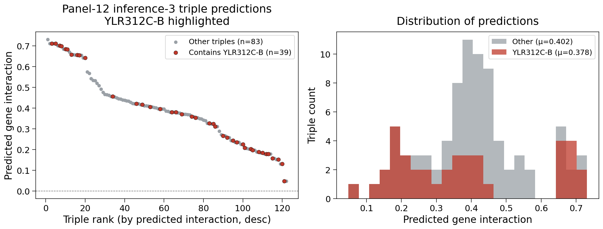

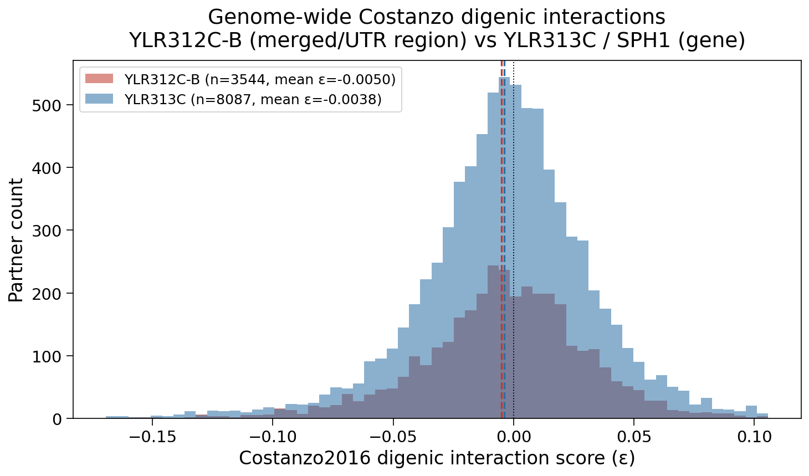

## Figures

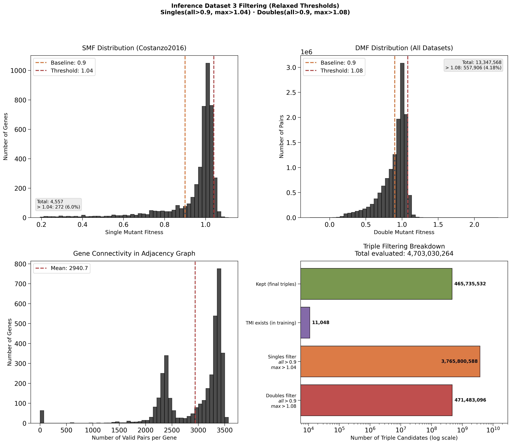

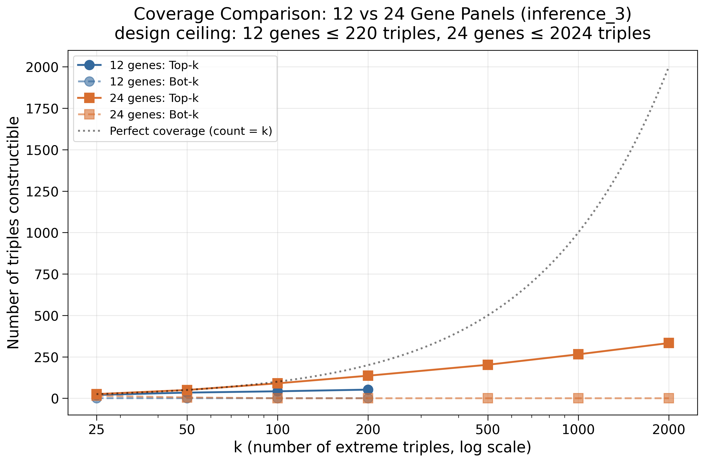

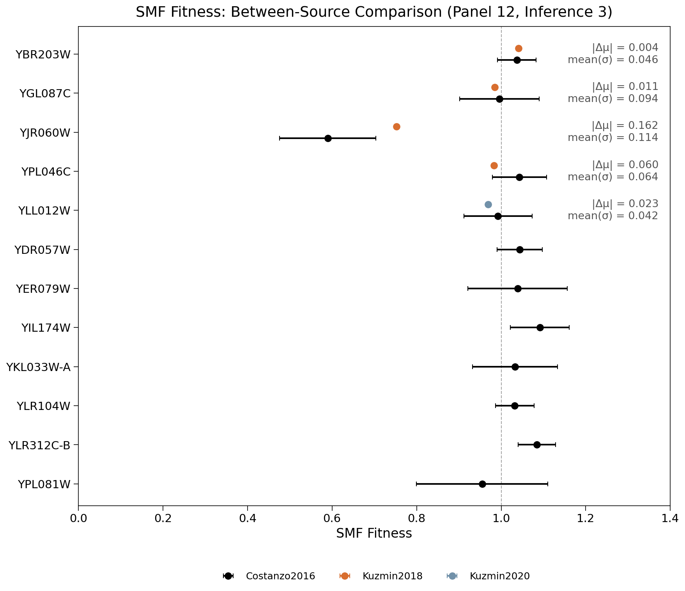

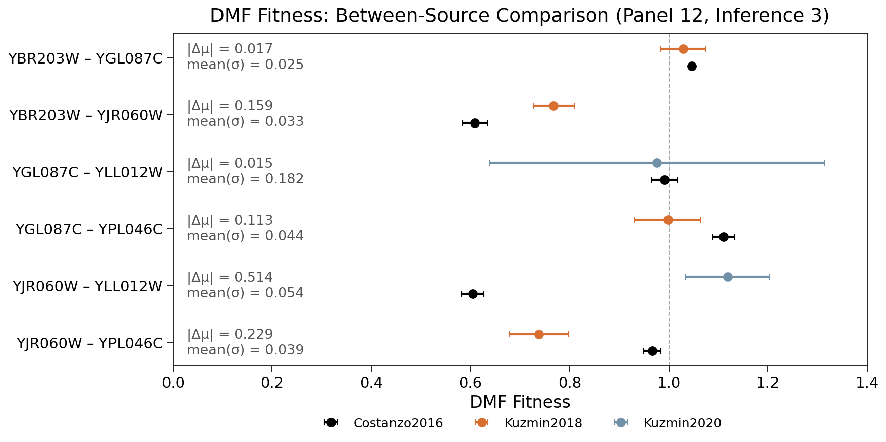

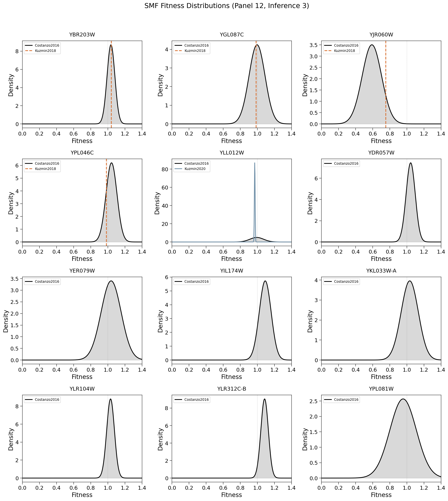

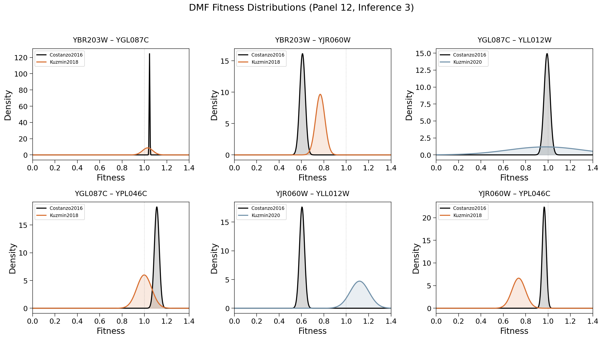

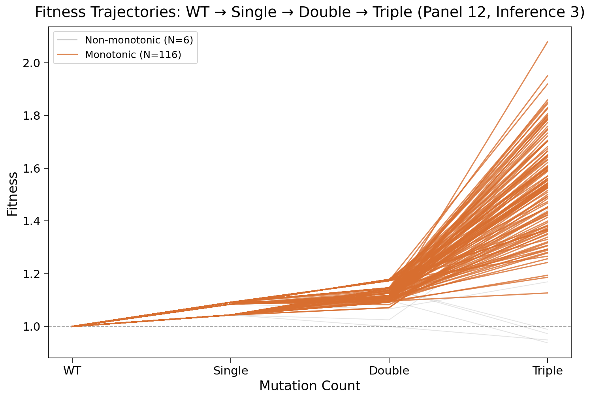

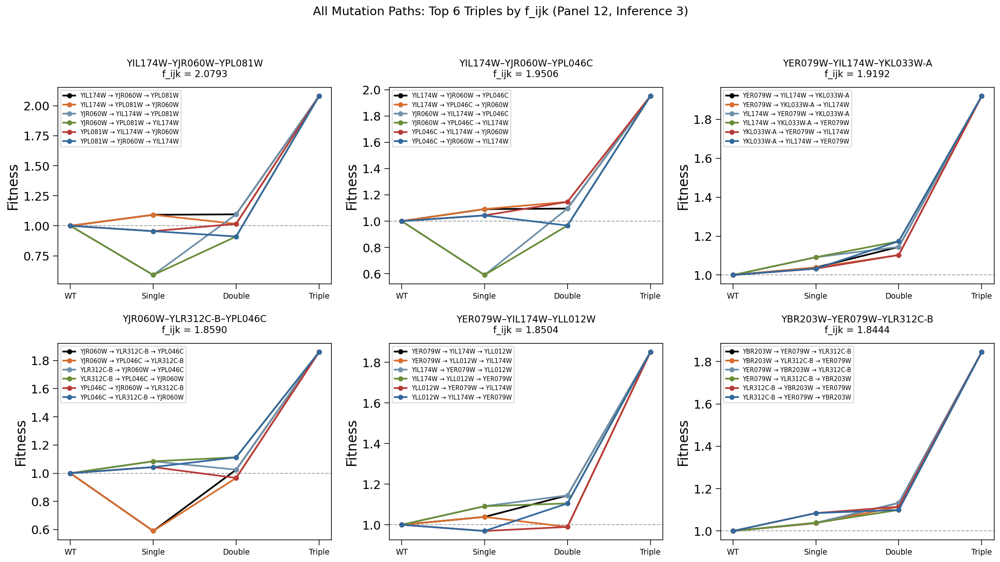

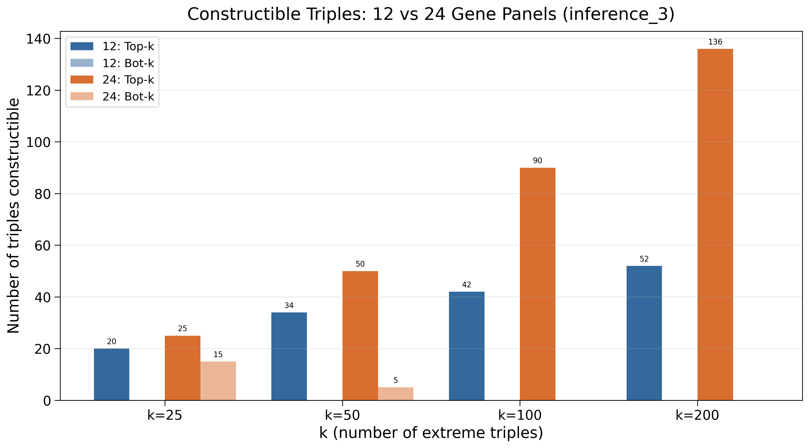

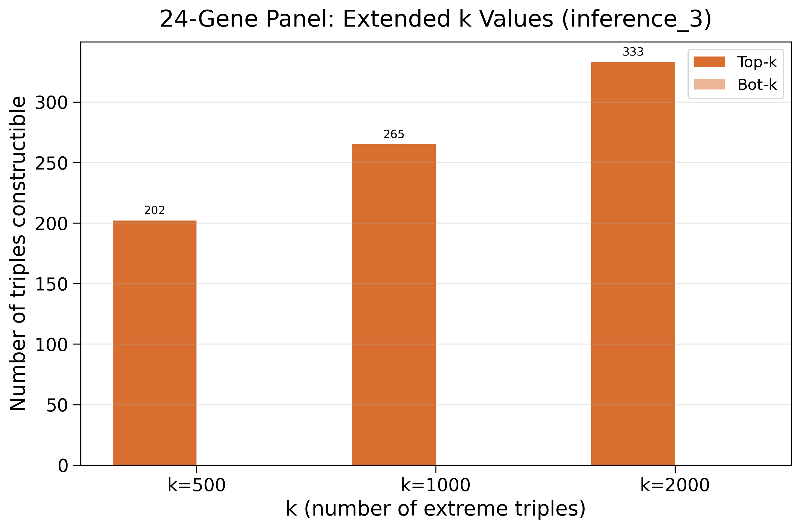

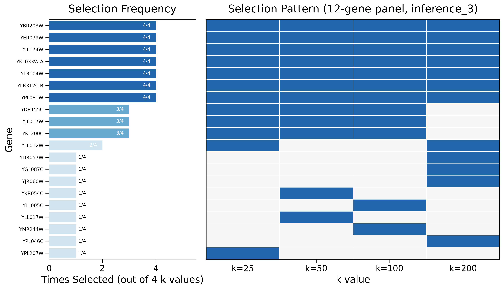

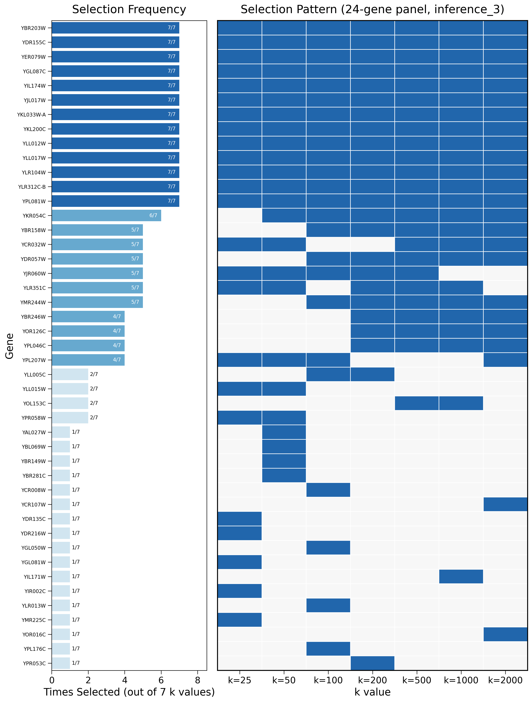

## Source notes (graduated from)

- `scratch.2026.01.28.142530-inference-dataset-3.wip-0` — pipeline, thresholds, JT power
- `scratch.2026.02.11.185417-010-inference-dataset-3-first-mutants-to-construct` — first 3 singles, deletion strategy
- `scratch.2026.02.11.193054-010-inference-dataset-3-table` — full annotated 12-gene panel
- `scratch.2026.02.12.103450-investigate-low-smf-inference-dataset-3` — max-vs-mean bug
- `scratch.2026.06.04.112028-010-inference-dataset-3-table-investigate-YLR313C-B` — YLR312C-B swap

## Related

- [[Inference Dataset 2|experiments.010-kuzmin-tmi.inference-dataset-2]] — the restrictive predecessor
- [[experiments.010-kuzmin-tmi.scripts.12_panel_inference_2_queried_data_tables]]
- [[Gene interaction|phenotype.gene_interaction]]
