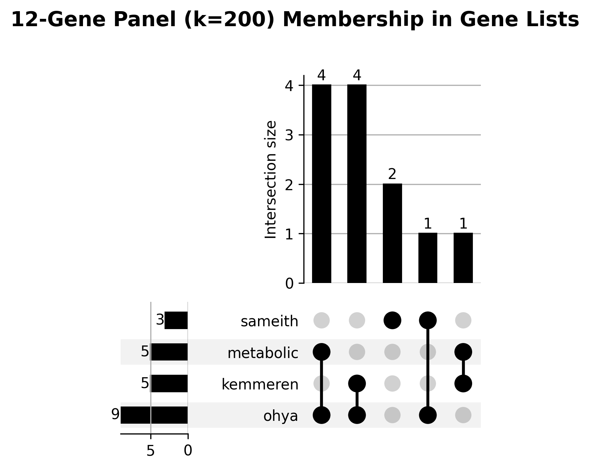
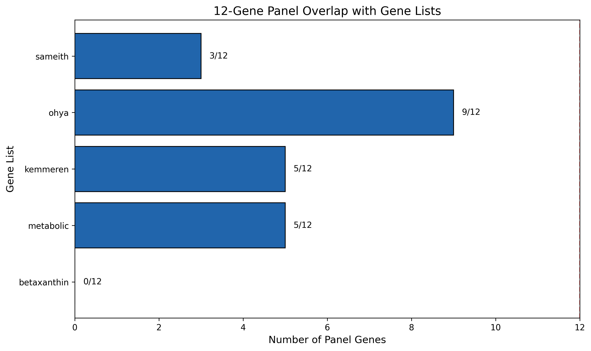

## Overview

Visualizes overlap between the 12-gene panel (k=200) and various curated gene lists using UpSet plots and bar charts. This analysis helps understand how our selected genes relate to genes with known biological properties.

## Gene Lists Compared

| List          | Source                        | Description                                            |
|---------------|-------------------------------|--------------------------------------------------------|
| `betaxanthin` | betaxanthin_genes.txt         | Genes involved in betaxanthin biosynthesis pathway     |
| `metabolic`   | expanded_metabolic_genes.txt  | Expanded set of metabolic pathway genes                |
| `kemmeren`    | kemmeren_responsive_genes.txt | Genes responsive in Kemmeren et al. expression studies |
| `ohya`        | ohya_morphology_genes.txt     | Genes affecting cell morphology (Ohya et al.)          |
| `sameith`     | sameith_doubles_genes.txt     | 82 genes with double mutant expression data            |

## Outputs

### UpSet Plot

Shows combinatorial membership - which genes belong to which combinations of lists.

### Bar Chart

Simple view of overlap counts per gene list.

## Interpretation

- **Sameith overlap**: Genes in both our panel AND Sameith's dataset have existing double mutant expression data for validation
- **Metabolic genes**: High overlap suggests panel captures metabolically important genes
- **Kemmeren responsive**: Genes that show expression changes when perturbed (good for detecting interactions)

## Dependencies

- Requires `gene_selection_results.csv` from [[select_12_and_24_genes_top_triples|experiments.010-kuzmin-tmi.scripts.select_12_and_24_genes_top_triples]]
- Requires gene list files from `experiments/006-kuzmin-tmi/results/inference_preprocessing_expansion/`
- Uses `upsetplot` library for UpSet visualization

## Related Scripts

- [[select_12_and_24_genes_top_triples|experiments.010-kuzmin-tmi.scripts.select_12_and_24_genes_top_triples]] - Produces the 12-gene panel this script analyzes
- [[select_12_experimental_table_reference|experiments.010-kuzmin-tmi.scripts.select_12_experimental_table_reference]] - Also uses Sameith overlap for experimental prioritization
