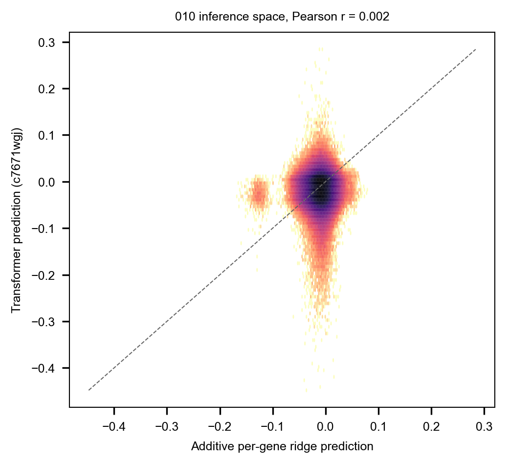

## 2026.09.01 - Additive Model vs the Transformer Over the 010 Design Space

The 010 analogue of Figure 1 of Visani, Verma and DeWitt (bioRxiv
2026.04.23.719915). Streams the 465,735,532-triple `inference_3` parquet scored by
checkpoint c7671wgj, scores the same triples with the additive per-gene ridge from
[[experiments.010-kuzmin-tmi.scripts.additive_baseline_gene_interaction]], and
reports the correlation between the two predictors, their top-K and bottom-K
selection overlap, and the correlation stratified by the training support of each
triple's least-observed gene.

Streaming is by row group with dictionary-decoded gene columns, so the 4 GB file is
read once without materializing it. Triples carrying a gene absent from the additive
fit have no additive prediction and are excluded, 140,103,687 of them.

Result: correlation 0.0018 over 325,631,845 comparable triples, and zero top-100
overlap. Support stratification does not explain it. That anomaly is what led to
[[experiments.010-kuzmin-tmi.scripts.inference_run_consistency]], which shows the
same checkpoint does not agree with itself across inference runs. Read the
correlation here as a symptom of that, not as a statement about additivity.

Findings: [[experiments.010-kuzmin-tmi.additive-baseline-analysis]]
